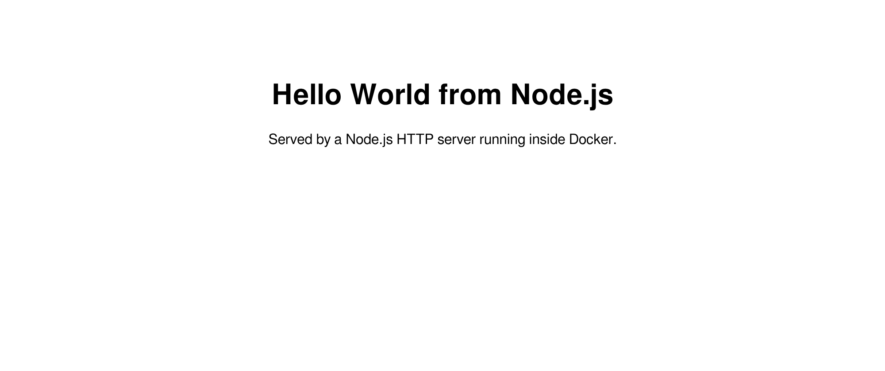
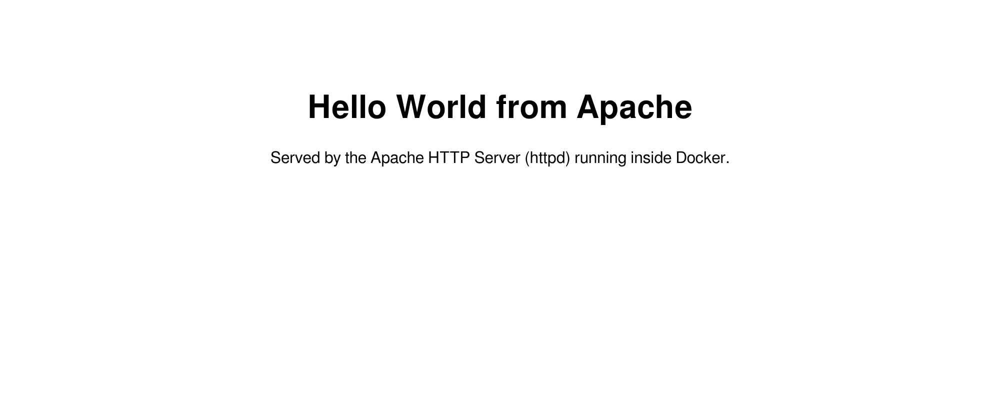
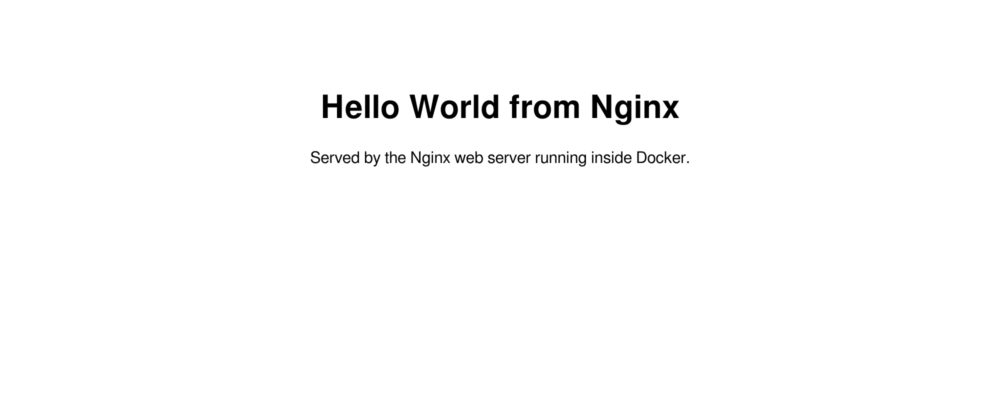

# Docker Fundamentals — Homework

Source task: **Docker Homework Tasks — Hello World Applications.** Six containerised "Hello World" web apps, each in its own folder with its own Dockerfile, built, run, and verified in a browser.

---

## Folder structure

Exactly the structure the task specified:

```
Docker_Fundamentals/
├── nodejs-app/      Node.js HTTP server            → port 3000
├── python-app/      Flask                          → port 5000
├── java-app/        Java HttpServer                → port 8081
├── Apache-app/      Apache httpd                   → port 8082
├── React-app/       Vite + React, served by Nginx  → port 3001
├── nginx-app/       Nginx                          → port 8083
└── screenshots/     Browser screenshots of all six
```

---

## Results — all six verified

| App | Image | Size | Host port | HTTP | Screenshot |
|---|---|---|---|---|---|
| Node.js | `nodejs-app:latest` | 232 MB | 3000 | 200 | [nodejs-app.png](screenshots/nodejs-app.png) |
| Python | `python-app:latest` | 208 MB | 5000 | 200 | [python-app.png](screenshots/python-app.png) |
| Java | `java-app:latest` | 454 MB | 8081 | 200 | [java-app.png](screenshots/java-app.png) |
| Apache | `apache-app:latest` | 175 MB | 8082 | 200 | [apache-app.png](screenshots/apache-app.png) |
| React | `react-app:latest` | 93.6 MB | 3001 | 200 | [react-app.png](screenshots/react-app.png) |
| Nginx | `nginx-app:latest` | 93.4 MB | 8083 | 200 | [nginx-app.png](screenshots/nginx-app.png) |

### `docker ps` — all six running at once

```
$ docker ps --format 'table {{.Names}}\t{{.Image}}\t{{.Status}}\t{{.Ports}}'
NAMES             IMAGE                   STATUS             PORTS
nginx-hello       nginx-app:latest        Up 5 seconds       0.0.0.0:8083->80/tcp, [::]:8083->80/tcp
react-hello       react-app:latest        Up 7 seconds       0.0.0.0:3001->80/tcp, [::]:3001->80/tcp
apache-hello      apache-app:latest       Up 8 seconds       0.0.0.0:8082->80/tcp, [::]:8082->80/tcp
java-hello        java-app:latest         Up 9 seconds       0.0.0.0:8081->8080/tcp, [::]:8081->8080/tcp
python-hello      python-app:latest       Up 9 seconds       0.0.0.0:5000->5000/tcp, [::]:5000->5000/tcp
nodejs-hello      nodejs-app:latest       Up 10 seconds      0.0.0.0:3000->3000/tcp, [::]:3000->3000/tcp
```

### HTTP verification

```
--- $ curl -s http://localhost:3000  (nodejs) ---
<h1>Hello World from Node.js</h1>
HTTP status: 200

--- $ curl -s http://localhost:5000  (python) ---
<h1>Hello World from Python</h1>
HTTP status: 200

--- $ curl -s http://localhost:8081  (java) ---
<h1>Hello World from Java</h1>
HTTP status: 200

--- $ curl -s http://localhost:8082  (apache) ---
<h1>Hello World from Apache</h1>
HTTP status: 200

--- $ curl -s http://localhost:3001  (react) ---
HTTP status: 200

--- $ curl -s http://localhost:8083  (nginx) ---
<h1>Hello World from Nginx</h1>
HTTP status: 200
```

### Screenshots

Real browser screenshots, captured with headless Chromium against each running container:

| Node.js | Python |
|---|---|
|  |  |

| Java | Apache |
|---|---|
|  |  |

| React | Nginx |
|---|---|
|  |  |

---

## 1. `nodejs-app` — Node.js

A plain Node HTTP server, no framework, so the image needs no `npm install` at all.

**Dockerfile**

```dockerfile
FROM node:22-alpine
WORKDIR /app
COPY package.json ./
COPY server.js ./
EXPOSE 3000
CMD ["node", "server.js"]
```

**Build and run**

```bash
docker build -t nodejs-app ./nodejs-app
docker run -d --name nodejs-hello -p 3000:3000 nodejs-app:latest
```

```
$ docker build -t nodejs-app ./nodejs-app
#9 naming to docker.io/library/nodejs-app:latest done
#9 DONE 1.2s
```

Open <http://localhost:3000> → **Hello World from Node.js**

---

## 2. `python-app` — Python / Flask

**Dockerfile**

```dockerfile
FROM python:3.12-slim
WORKDIR /app
COPY requirements.txt ./
RUN pip install --no-cache-dir -r requirements.txt
COPY app.py ./
EXPOSE 5000
CMD ["python", "app.py"]
```

`requirements.txt` is copied and installed **before** the application code. Docker caches each layer, so editing `app.py` does not re-run `pip install` — a rebuild goes from ~12 s to under a second. This is the single most useful Dockerfile habit.

`--no-cache-dir` stops pip keeping its download cache inside the image.

**Build and run**

```bash
docker build -t python-app ./python-app
docker run -d --name python-hello -p 5000:5000 python-app:latest
```

Open <http://localhost:5000> → **Hello World from Python**

---

## 3. `java-app` — Java

Java needs compiling, so this is a **two-stage** build: a full JDK to compile, a smaller JRE to run.

**Dockerfile**

```dockerfile
# Stage 1 - compile the Java source with a full JDK
FROM eclipse-temurin:21-jdk AS build
WORKDIR /src
COPY HelloWorld.java ./
RUN javac HelloWorld.java

# Stage 2 - ship only the compiled class on a smaller JRE
FROM eclipse-temurin:21-jre
WORKDIR /app
COPY --from=build /src/HelloWorld.class ./
EXPOSE 8080
CMD ["java", "HelloWorld"]
```

The `javac` compiler never reaches the final image — only `HelloWorld.class` is copied across with `COPY --from=build`.

The app uses the JDK's built-in `com.sun.net.httpserver.HttpServer`, so there is no Maven/Gradle dependency to resolve.

**Build and run**

```bash
docker build -t java-app ./java-app
docker run -d --name java-hello -p 8081:8080 java-app:latest
```

Note the port mapping: the app listens on **8080 inside** the container, published on **8081 on the host** to avoid clashing with the multi-stage app in the `Docker_Images` task.

Open <http://localhost:8081> → **Hello World from Java**

---

## 4. `Apache-app` — Apache HTTP Server

No application code — just static HTML dropped into the directory Apache already serves.

**Dockerfile**

```dockerfile
FROM httpd:2.4
COPY index.html /usr/local/apache2/htdocs/index.html
EXPOSE 80
```

Two lines. The `httpd` base image already has a correct `CMD`, so there is nothing to override. `/usr/local/apache2/htdocs/` is Apache's document root.

**Build and run**

```bash
docker build -t apache-app ./Apache-app
docker run -d --name apache-hello -p 8082:80 apache-app:latest
```

Open <http://localhost:8082> → **Hello World from Apache**

---

## 5. `React-app` — React (Vite), built in Docker

The most substantial of the six: a **real React application**, with dependencies installed and a production bundle built inside the image, then served as static files by Nginx.

**Dockerfile**

```dockerfile
# Stage 1 - install dependencies and produce the static production build
FROM node:22-alpine AS build
WORKDIR /app
COPY package.json ./
RUN npm install
COPY vite.config.js index.html ./
COPY src ./src
RUN npm run build

# Stage 2 - serve the built static files with Nginx
FROM nginx:alpine
COPY --from=build /app/dist /usr/share/nginx/html
COPY nginx.conf /etc/nginx/conf.d/default.conf
EXPOSE 80
CMD ["nginx", "-g", "daemon off;"]
```

**The Vite build actually running during `docker build`:**

```
#13 0.431 > react-hello-world@1.0.0 build
#13 0.431 > vite build
#13 0.648 vite v5.4.21 building for production...
#13 0.690 transforming...
#13 1.226 ✓ 30 modules transformed.
#13 1.296 rendering chunks...
#13 1.303 computing gzip size...
#13 1.309 dist/index.html                  0.33 kB │ gzip:  0.24 kB
#13 1.309 dist/assets/index-BORtQLi0.js  142.85 kB │ gzip: 45.91 kB
#13 1.309 ✓ built in 639ms
```

**Why this matters:** the result is **93.6 MB** — smaller than the plain Node.js app at 232 MB — even though it does far more. Node, npm and `node_modules` all live in the build stage and are discarded. The final image contains only Nginx plus a 143 KB JavaScript bundle.

`nginx.conf` adds `try_files $uri $uri/ /index.html;` so client-side routes do not 404 on refresh — the standard single-page-app configuration.

**Build and run**

```bash
docker build -t react-app ./React-app
docker run -d --name react-hello -p 3001:80 react-app:latest
```

**A note on verifying React.** `curl` on the page returns only the SPA shell, because React renders in the browser:

```
$ curl -s http://localhost:3001/
<!doctype html>
<html lang="en">
  <head>
    <script type="module" crossorigin src="/assets/index-BORtQLi0.js"></script>
    <title>React Hello World</title>
  </head>
  <body>
    <div id="root"></div>
  </body>
</html>
```

The text is in the JavaScript bundle, and appears once the browser executes it:

```
$ curl -s http://localhost:3001/assets/index-BORtQLi0.js | grep -o 'Hello World from React'
Hello World from React
```

The [screenshot](screenshots/react-app.png) is a real headless-Chromium render, which confirms it displays correctly.

Open <http://localhost:3001> → **Hello World from React**

---

## 6. `nginx-app` — Nginx

**Dockerfile**

```dockerfile
FROM nginx:alpine
COPY index.html /usr/share/nginx/html/index.html
EXPOSE 80
```

`/usr/share/nginx/html/` is Nginx's default document root. `nginx:alpine` is 93 MB against ~190 MB for the Debian-based `nginx:latest`.

**Build and run**

```bash
docker build -t nginx-app ./nginx-app
docker run -d --name nginx-hello -p 8083:80 nginx-app:latest
```

Open <http://localhost:8083> → **Hello World from Nginx**

---

## Reproducing everything

```bash
# Build all six
docker build -t nodejs-app ./nodejs-app
docker build -t python-app ./python-app
docker build -t java-app   ./java-app
docker build -t apache-app ./Apache-app
docker build -t react-app  ./React-app
docker build -t nginx-app  ./nginx-app

# Run all six
docker run -d --name nodejs-hello -p 3000:3000 nodejs-app:latest
docker run -d --name python-hello -p 5000:5000 python-app:latest
docker run -d --name java-hello   -p 8081:8080 java-app:latest
docker run -d --name apache-hello -p 8082:80   apache-app:latest
docker run -d --name react-hello  -p 3001:80   react-app:latest
docker run -d --name nginx-hello  -p 8083:80   nginx-app:latest

# Verify
docker ps
curl http://localhost:3000

# Clean up
docker rm -f nodejs-hello python-hello java-hello apache-hello react-hello nginx-hello
```

---

## What these six apps demonstrate

**Three shapes of Dockerfile.** Static sites (Apache, Nginx) just copy files onto a base image that already serves them. Interpreted languages (Node, Python) copy source and set a `CMD`. Compiled or built languages (Java, React) need a **build stage** whose toolchain is then thrown away.

**Layer caching is a design decision.** Copying `requirements.txt` / `package.json` before the source code means dependency installation is cached separately from code changes. Get this wrong and every one-character edit reinstalls everything.

**Image size follows from base image choice and multi-stage.** The spread here is 93 MB to 454 MB for apps that all print one line of text:

* `alpine` variants are ~5 MB versus ~75 MB for Debian-based ones.
* The React app is the second smallest **because** it is multi-stage — the entire Node toolchain is discarded.
* The Java app is the largest because a JRE is simply big; a `jlink` custom runtime or `eclipse-temurin:21-jre-alpine` would cut it substantially.

**`EXPOSE` is documentation, not a firewall rule.** It records which port the app uses; the actual publishing is `-p host:container` at run time. This is why `java-app` can `EXPOSE 8080` yet be reached on host port 8081.
