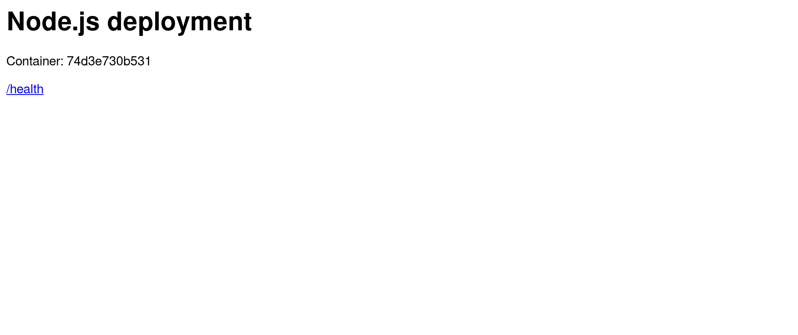
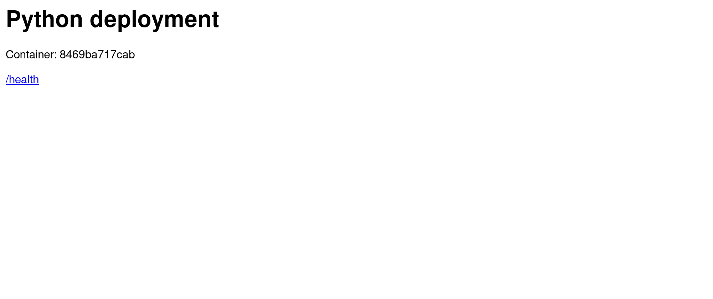
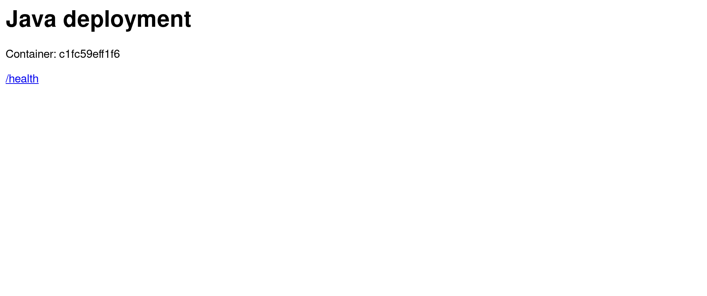

# Docker Images / Multi-Stage Build — Homework

Source task: **Docker Multi-Stage Build Homework** (Task 1 build and run a multi-stage Dockerfile on port 8080, Task 2 documentation, Task 3 deploy three different application types).

---

## Task 2 — Documentation details

| | |
|---|---|
| **Name** | Siddhant Prasad |
| **Enrollment number** | `<ENROLLMENT_NUMBER>` |
| **Date** | 1 September 2026 |
| **Docker version** | 29.4.1 |

---

## Task 1 — Run the Multi-Stage Dockerfile

> **Note on the source repository.** Task 1 says to clone "the repository containing the multi-stage Dockerfile". That repository link was not included in the handout I received, so rather than guess at the wrong repo I wrote the multi-stage application myself, in [`multistage-app/`](multistage-app/). It meets every verifiable requirement in the task: it is a genuine multi-stage build, it runs on **port 8080**, and it displays exactly **"Hello World from Docker multi-stage build"**. If a specific repository is required, point me at it and I will re-run the task against it.

### The application

A small Go HTTP server. Go is the clearest possible demonstration of multi-stage builds because it compiles to a **single static binary** with no runtime dependencies — so the final image needs nothing but the binary itself.

[`multistage-app/main.go`](multistage-app/main.go) serves an HTML page at `/` and a plain-text version at `/text` for easy `curl` verification.

### The multi-stage Dockerfile

```dockerfile
# ---------------------------------------------------------------
# Stage 1 (builder): full Go toolchain, used only to compile
# ---------------------------------------------------------------
FROM golang:1.23-alpine AS builder

WORKDIR /src

COPY go.mod ./
COPY main.go ./

# CGO_ENABLED=0 produces a fully static binary so the runtime
# stage does not need any C libraries.
# -ldflags="-s -w" strips the symbol table and debug info.
RUN CGO_ENABLED=0 GOOS=linux go build -ldflags="-s -w" -o /out/server main.go

# ---------------------------------------------------------------
# Stage 2 (runtime): tiny base image, only the compiled binary
# The Go compiler, module cache and source never reach this image.
# ---------------------------------------------------------------
FROM alpine:3.20

WORKDIR /app

# Copy just the built artifact out of the builder stage
COPY --from=builder /out/server /app/server

# Run as a non-root user
RUN addgroup -S app && adduser -S -G app app
USER app

EXPOSE 8080

CMD ["/app/server"]
```

The mechanism is the two `FROM` lines and one `COPY --from=builder`. Everything in stage 1 — the Go compiler, the module cache, the source code — is discarded. Only `/out/server` crosses into the final image.

### Build the image

```
$ docker build -t multistage-app:latest .

#11 [builder 5/5] RUN CGO_ENABLED=0 GOOS=linux go build -ldflags="-s -w" -o /out/server main.go
#11 DONE 7.7s

#13 [stage-1 3/4] COPY --from=builder /out/server /app/server
#13 DONE 0.0s

#14 [stage-1 4/4] RUN addgroup -S app && adduser -S -G app app
#14 DONE 0.4s

#15 exporting to image
#15 naming to docker.io/library/multistage-app:latest done
#15 DONE 0.6s
```

### Run a container from the image

```
$ docker run -d --name multistage-demo -p 8080:8080 multistage-app:latest
c30b196829b3556570788617a84929c9598d624e9c8ff5cf1867822cc82186b1
```

### Verify the container is running — `docker ps` on port 8080

```
$ docker ps --filter name=multistage-demo
CONTAINER ID   IMAGE                   COMMAND         CREATED         STATUS         PORTS                                         NAMES
c30b196829b3   multistage-app:latest   "/app/server"   3 seconds ago   Up 2 seconds   0.0.0.0:8080->8080/tcp, [::]:8080->8080/tcp   multistage-demo
```

**Confirmed running on port 8080** — `0.0.0.0:8080->8080/tcp`, status `Up`.

### Access the application and verify the message

```
$ curl http://localhost:8080/text
Hello World from Docker multi-stage build
```

**Exactly the required string.** Full HTTP response with headers:

```
$ curl -i http://localhost:8080/
HTTP/1.1 200 OK
Content-Type: text/html; charset=utf-8
Date: Tue, 01 Sep 2026 12:49:16 GMT
Content-Length: 312

<!doctype html>
<html>
  <head><title>Docker Multi-Stage Build</title></head>
  <body style="font-family:sans-serif;text-align:center;padding-top:60px">
    <h1>Hello World from Docker multi-stage build</h1>
    <p>Compiled in a Go builder stage, served from a minimal Alpine runtime stage.</p>
  </body>
</html>
```

Application logs:

```
$ docker logs multistage-demo
2026/09/01 12:49:13 multi-stage app listening on port 8080
```

### Screenshot — the application running in a browser


---

## The point of multi-stage: measured

To show the difference rather than assert it, the **same application** was also built with a single-stage Dockerfile ([`Dockerfile.singlestage`](multistage-app/Dockerfile.singlestage)) that keeps the Go toolchain in the final image.

```
$ docker images --format 'table {{.Repository}}\t{{.Tag}}\t{{.Size}}'
REPOSITORY          TAG           SIZE
singlestage-app     latest        472MB
multistage-app      latest        19.5MB
golang              1.23-alpine   370MB
nginx               alpine        94.2MB
```

| Build | Final image size |
|---|---|
| Single-stage (`golang:1.23-alpine` kept) | **472 MB** |
| **Multi-stage (`alpine:3.20` + binary)** | **19.5 MB** |
| **Reduction** | **~96% smaller — 24× reduction** |

### Why it matters

* **Faster deploys.** Pulling 19.5 MB instead of 472 MB across a cluster of nodes is a completely different operation.
* **Smaller attack surface.** The 472 MB image ships a Go compiler, a package manager and a shell toolchain. If someone gets code execution inside it, all of that is available to them. The 19.5 MB image contains a static binary and a minimal Alpine base.
* **No source code in the shipped artifact.** The single-stage image contains `main.go`; the multi-stage image does not.
* **Lower storage and transfer cost** in the registry and on every node.

The image could go further still — `FROM scratch` (no base image at all) would land at roughly 7 MB, since the binary is fully static. Alpine was kept because a shell makes debugging with `docker exec` possible, which is usually the right trade-off.

### Other multi-stage details used here

* **`CGO_ENABLED=0`** — builds a fully static binary. Without it, the binary links against glibc and would fail on Alpine, which uses musl.
* **`-ldflags="-s -w"`** — strips the symbol table and DWARF debug info, cutting several MB.
* **`USER app`** — the container runs as a non-root user, so a compromise inside the container does not start as root.
* **`AS builder`** — names the stage so `COPY --from=builder` can reference it. Unnamed stages can be referenced by index (`--from=0`), but names survive reordering.

Also worth knowing: `docker build --target builder .` stops at the first stage, which is the standard trick for running tests inside the build environment in CI.

---

## Task 3 — Deploy three different application types

Three genuinely different runtimes, each with its own Dockerfile, in [`deployments/`](deployments/). Each serves an HTML page and a `/health` JSON endpoint that reports its own container hostname.

```
deployments/
├── nodejs/     Node.js HTTP server   → port 4001
├── python/     Flask                 → port 4002
└── java/       Java HttpServer       → port 4003
```

### Node.js

```dockerfile
FROM node:22-alpine
WORKDIR /app
COPY server.js ./
EXPOSE 4001
CMD ["node", "server.js"]
```

### Python

```dockerfile
FROM python:3.12-slim
WORKDIR /app
COPY requirements.txt ./
RUN pip install --no-cache-dir -r requirements.txt
COPY app.py ./
EXPOSE 4002
CMD ["python", "app.py"]
```

### Java (also multi-stage — JDK to build, JRE to run)

```dockerfile
FROM eclipse-temurin:21-jdk AS build
WORKDIR /src
COPY Deployment.java ./
RUN javac Deployment.java

FROM eclipse-temurin:21-jre
WORKDIR /app
COPY --from=build /src/Deployment*.class ./
EXPOSE 4003
CMD ["java", "Deployment"]
```

### Build and run all three

```bash
docker build -t deploy-nodejs ./deployments/nodejs
docker build -t deploy-python ./deployments/python
docker build -t deploy-java   ./deployments/java

docker run -d --name deploy-nodejs -p 4001:4001 deploy-nodejs:latest
docker run -d --name deploy-python -p 4002:4002 deploy-python:latest
docker run -d --name deploy-java   -p 4003:4003 deploy-java:latest
```

### All three running at once

```
$ docker ps --filter name=deploy- --format 'table {{.Names}}	{{.Image}}	{{.Status}}	{{.Ports}}'
NAMES           IMAGE                  STATUS         PORTS
deploy-java     deploy-java:latest     Up 6 seconds   0.0.0.0:4003->4003/tcp, [::]:4003->4003/tcp
deploy-python   deploy-python:latest   Up 7 seconds   0.0.0.0:4002->4002/tcp, [::]:4002->4002/tcp
deploy-nodejs   deploy-nodejs:latest   Up 9 seconds   0.0.0.0:4001->4001/tcp, [::]:4001->4001/tcp
```

### Health checks — each reports its own runtime and container hostname

```
$ curl -s http://localhost:4001/health
{"status":"up","runtime":"nodejs","host":"74d3e730b531"}

$ curl -s http://localhost:4002/health
{"host":"8469ba717cab","runtime":"python","status":"up"}

$ curl -s http://localhost:4003/health
{"status":"up","runtime":"java","host":"c1fc59eff1f6"}
```

Three different language runtimes, three different container hostnames, all serving concurrently on one host.

### Screenshots

| Node.js (4001) | Python (4002) | Java (4003) |
|---|---|---|
|  |  |  |

### Image sizes

```
$ docker images --format 'table {{.Repository}}	{{.Tag}}	{{.Size}}'
REPOSITORY      TAG      SIZE
deploy-java     latest   454MB
deploy-python   latest   208MB
deploy-nodejs   latest   232MB
```

Worth comparing against the 19.5 MB multi-stage Go image above: the Java deployment is **23x larger** for an equally trivial application, almost entirely because a JRE is big. This is the trade-off between runtime convenience and image size that the multi-stage exercise is really about.

### Cleanup

```bash
docker rm -f deploy-nodejs deploy-python deploy-java
```

---

## Summary

| Task | Requirement | Status |
|---|---|---|
| 1 | Build image from a multi-stage Dockerfile | Complete |
| 1 | Run a container from the image | Complete |
| 1 | Access the application inside the container | Complete |
| 1 | Displays "Hello World from Docker multi-stage build" | Verified via `curl` and browser |
| 1 | Verify with `docker ps` | Complete |
| 1 | Confirm it runs on port 8080 | `0.0.0.0:8080->8080/tcp` |
| 2 | `.md` file with name, enrollment number, evidence | This file |
| 3 | Deploy 3 different application types | Node.js, Python, Java |
