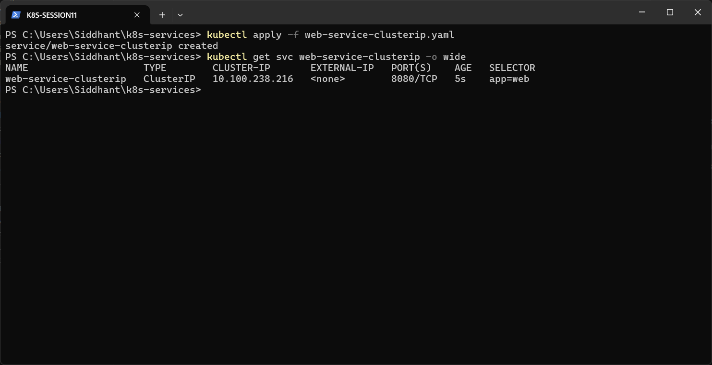
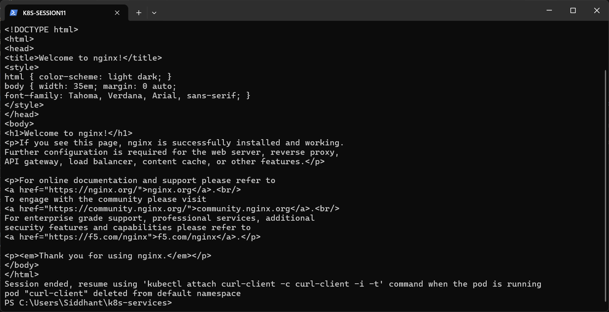

# ClusterIP Service

**ClusterIP** is the default Service type. It gets a virtual IP that can only be reached from **inside** the cluster, so it suits internal traffic between Pods (for example, frontend → backend).

Manifest: [`web-service-clusterip.yaml`](web-service-clusterip.yaml). It selects `app: web` and forwards port `8080` to container port `80`.

```powershell
kubectl apply -f web-service-clusterip.yaml
kubectl get svc web-service-clusterip -o wide
kubectl run curl-client --image=curlimages/curl -it --rm -- curl -s web-service-clusterip:8080
```

**Result:** the Service got cluster IP `10.100.238.216`. The temporary `curl-client` Pod reached it by its DNS name and got back the Nginx welcome page HTML.



