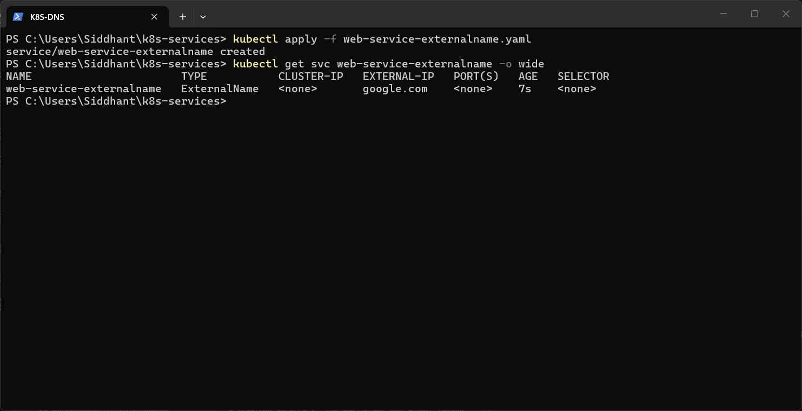
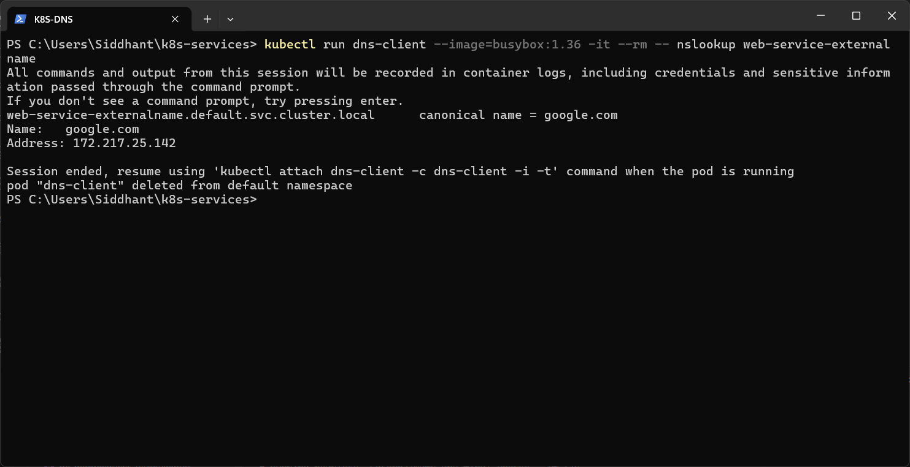

# ExternalName Service

An **ExternalName** Service maps a name inside the cluster to an **external DNS name** using a CNAME record. It has no selector, no Pods and no proxying. It lets apps use a stable in-cluster name for an outside dependency.

Manifest: [`web-service-externalname.yaml`](web-service-externalname.yaml). It points to `externalName: google.com` and has no selector.

```powershell
kubectl apply -f web-service-externalname.yaml
kubectl get svc web-service-externalname -o wide
kubectl run dns-client --image=busybox:1.36 -it --rm -- nslookup web-service-externalname
```

**Result:** `TYPE` is `ExternalName` and `EXTERNAL-IP` is `google.com`. DNS returned `web-service-externalname.default.svc.cluster.local canonical name = google.com`, which resolved to `172.217.25.142`.



