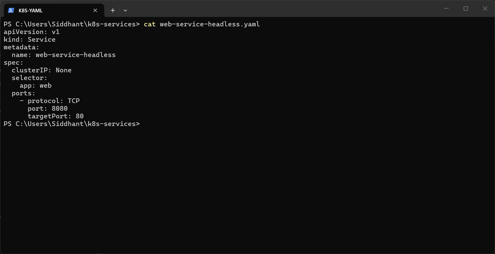
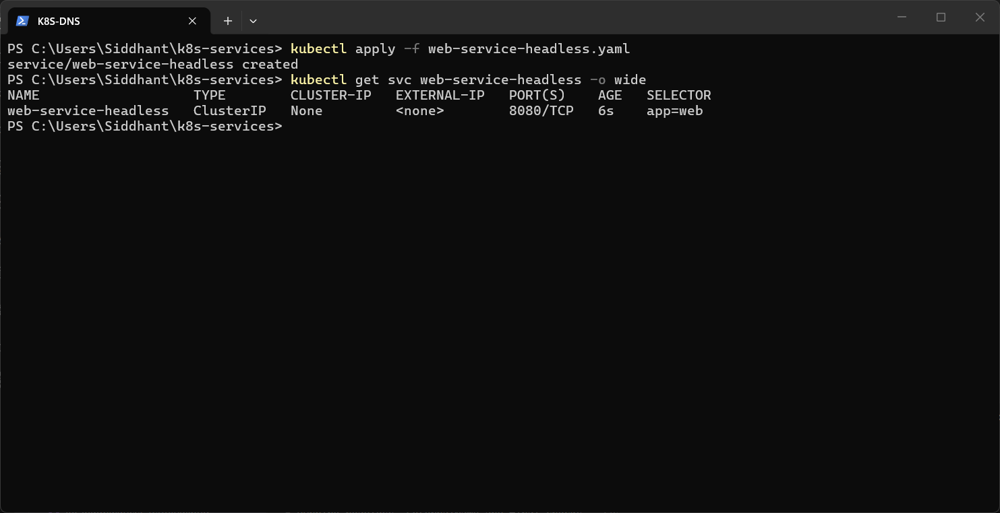
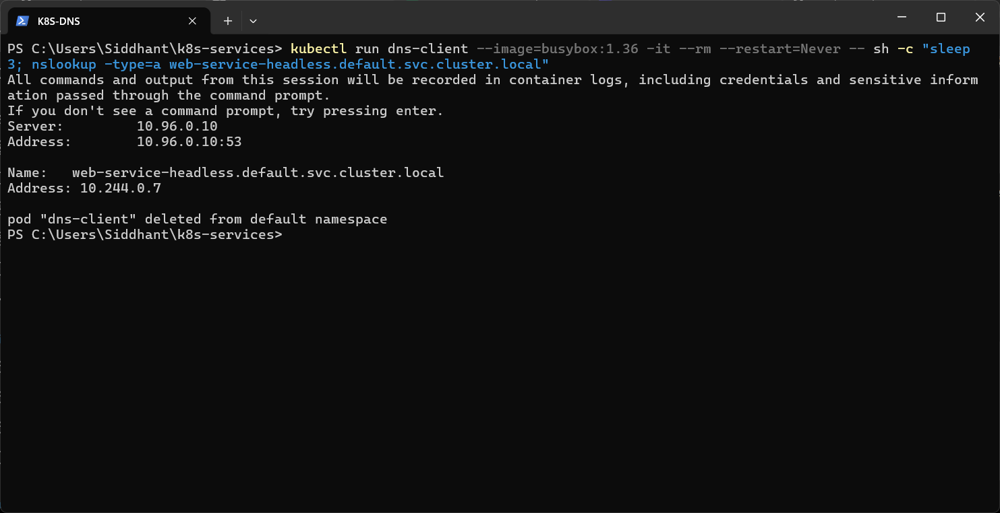

# Headless Service

A **Headless** Service sets `clusterIP: None`. It has no virtual IP and no kube-proxy load balancing. Instead, cluster DNS returns the **Pod IPs directly**. StatefulSets (for example, databases) use this so clients can reach individual Pods.

Manifest: [`web-service-headless.yaml`](web-service-headless.yaml). It selects `app: web` on port `8080` and forwards to container port `80`.



```powershell
kubectl apply -f web-service-headless.yaml
kubectl get svc web-service-headless -o wide
kubectl run dns-client --image=busybox:1.36 -it --rm --restart=Never -- sh -c "sleep 3; nslookup -type=a web-service-headless.default.svc.cluster.local"
```

**Result:** `CLUSTER-IP` is `None`. `nslookup` resolved `web-service-headless.default.svc.cluster.local` to `10.244.0.7`, which is the IP of the `web` Pod itself. No virtual Service IP is involved.

The lookup uses the fully qualified service name and asks only for A records, so busybox doesn't try other search domains or AAAA records. The `sleep 3` lets `kubectl` attach to the Pod before `nslookup` runs.



