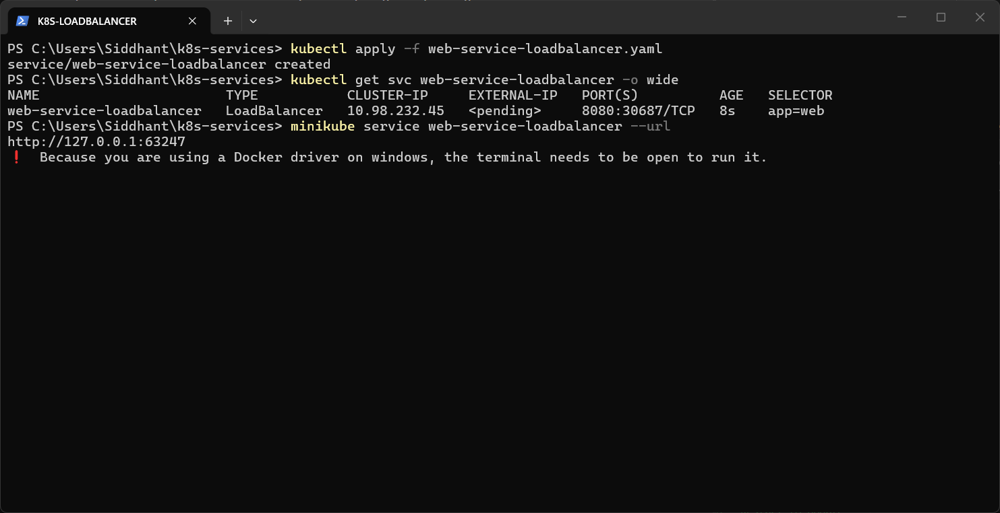
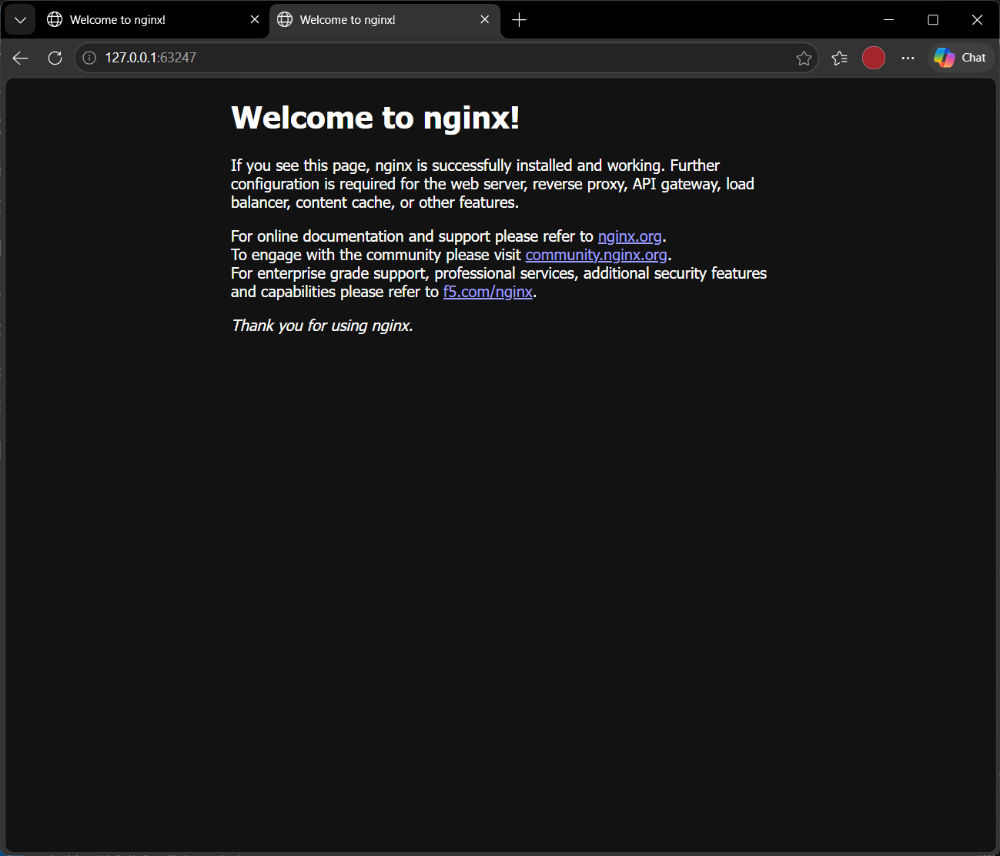

# LoadBalancer Service

**LoadBalancer** asks the cloud provider for an external load balancer with a public IP. It builds on NodePort and ClusterIP (it also got node port `30687`).

Manifest: [`web-service-loadbalancer.yaml`](web-service-loadbalancer.yaml). It maps port `8080` to container port `80`.

```powershell
kubectl apply -f web-service-loadbalancer.yaml
kubectl get svc web-service-loadbalancer -o wide
minikube service web-service-loadbalancer --url
```

**Result:** Minikube has no cloud provider, so `EXTERNAL-IP` stays `<pending>` unless `minikube tunnel` is running. That is expected, and no IP was faked. `minikube service --url` opened `http://127.0.0.1:63247` (terminal kept open), and the Nginx welcome page loaded in the browser.



