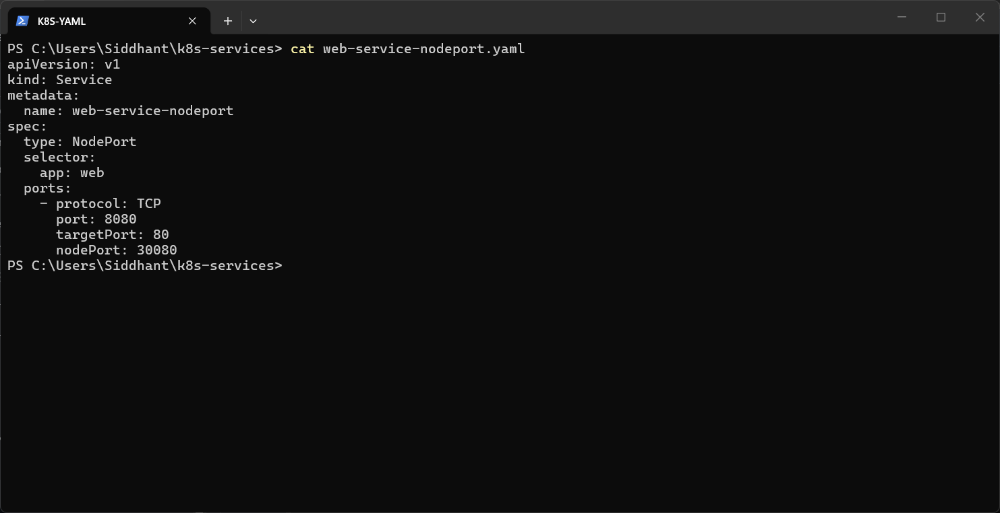
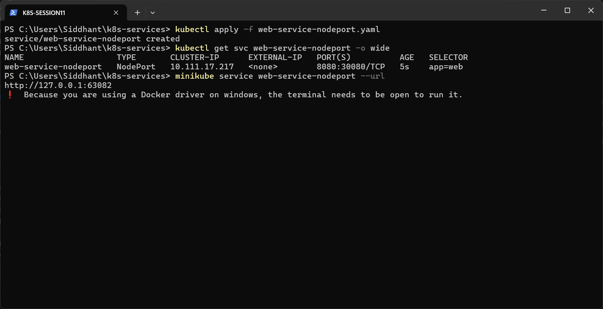
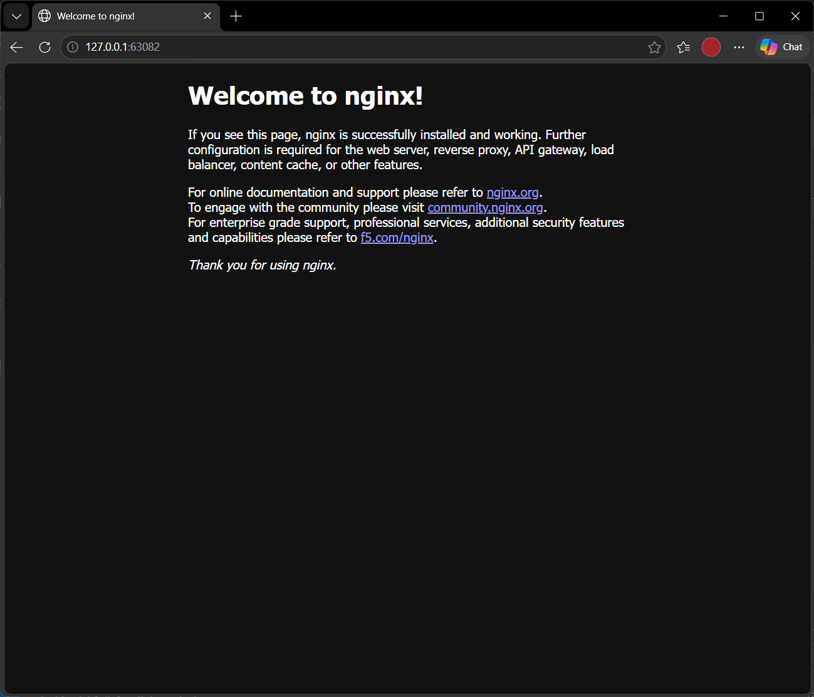

# NodePort Service

**NodePort** opens a fixed port (30000–32767) on every node, so the app can be reached from **outside** the cluster at `<NodeIP>:<nodePort>`. It also gets a ClusterIP.

Manifest: [`web-service-nodeport.yaml`](web-service-nodeport.yaml). It maps port `8080` to container port `80`, with node port `30080`.



```powershell
kubectl apply -f web-service-nodeport.yaml
kubectl get svc web-service-nodeport -o wide
minikube service web-service-nodeport --url
```

**Result:** `PORT(S)` shows `8080:30080/TCP`. Minikube with the Docker driver on Windows can't reach the node IP directly, so it opened a tunnel at `http://127.0.0.1:63082`. The terminal stayed open, and the Nginx welcome page loaded in the browser.



