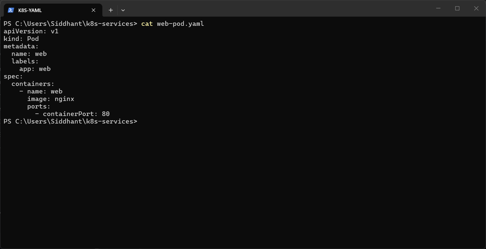
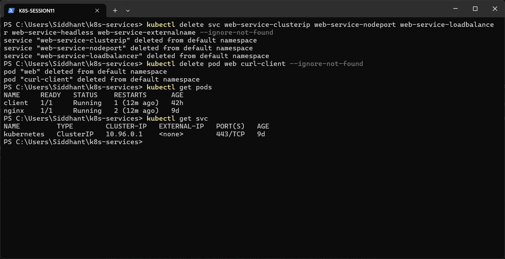
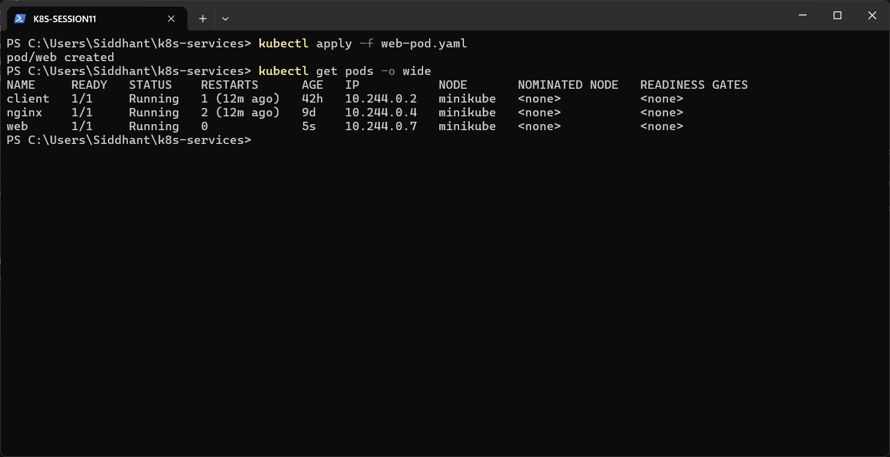
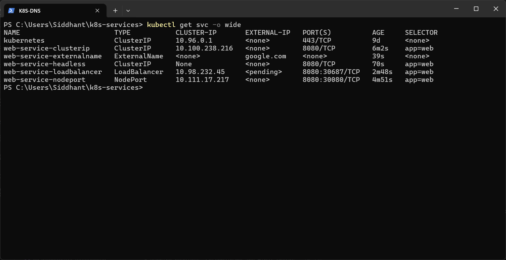
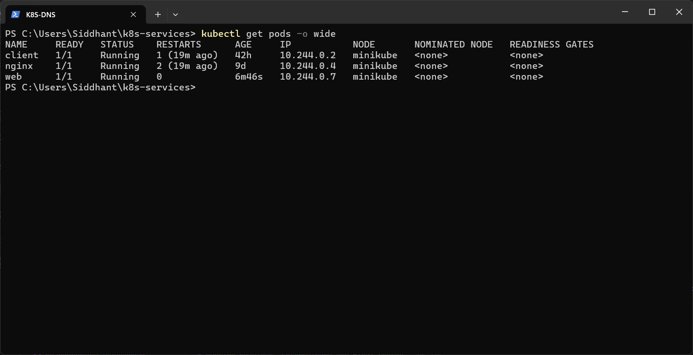

# Session 11 — Kubernetes Services

All five Service types were run on a Minikube cluster (Docker driver, Kubernetes v1.37.0) on Windows 11. Every Service except ExternalName points to **one** Nginx Pod named `web` (label `app: web`, Pod IP `10.244.0.7`).

| Service | Type | How it was verified |
|---|---|---|
| [web-service-clusterip](Clusterip/) | ClusterIP | `curl` from a temporary Pod inside the cluster returned the Nginx page |
| [web-service-nodeport](NodePort/) | NodePort `8080:30080` | `minikube service --url` → Nginx page opened in the browser |
| [web-service-loadbalancer](LoadBalancer/) | LoadBalancer | `minikube service --url` → Nginx page opened in the browser |
| [web-service-headless](HeadLess/) | ClusterIP `None` | `nslookup` returned the Pod IP directly |
| [web-service-externalname](ExternalName/) | ExternalName → google.com | `nslookup` returned a CNAME to google.com |

## Pod

[`web-pod.yaml`](web-pod.yaml)

## Final state

