# Session 12 — Ingress, ConfigMaps & Secrets

**Author:** Siddhant Prasad
**Enrollment number:** 24BCS10255
**Course:** SST DevOps & Cloud [SWE]
**Session:** 12 — ConfigMaps, Secrets and Layer 7 Ingress routing

---

## Objective

Decouple configuration from container images using **ConfigMaps**, isolate credentials using
**Secrets**, and expose a multi-tier application through **Layer 7 Ingress** routing — path-based,
host-based, hybrid, and TLS-terminated.

All 14 tasks were actually executed on a live Minikube cluster. Outputs below are copied verbatim
from the terminal session the screenshots were taken from. Where the environment made a step behave
differently from the task text (the Windows hosts file and host-to-cluster reachability), the real
result is documented and the working alternative is shown rather than faked.

## Environment

| Component | Version / Value |
|---|---|
| OS | Windows 11 Home Single Language 25H2 |
| Shell | Windows PowerShell 5.1 |
| Minikube | v1.39.0 (`docker` driver) |
| kubectl / Kubernetes | v1.34.1 client / v1.37.0 server |
| Ingress controller | `ingress-nginx` v1.15.1 (Minikube addon) |
| Namespace | `default` |
| Minikube IP | `192.168.49.2` |

## Repository Structure

```
session-12-ingress-configmaps-secrets/
├── README.md
├── 01-configmap/
│   ├── app-config.yaml
│   ├── patch-staging.json
│   └── patch-production.json
├── 02-secret/
│   └── db-secret.yaml
├── 03-ingress/
│   ├── ingress-tls.yaml
│   └── tls.crt                 # self-signed public cert, generated in Task 13
│                               # (tls.key is git-ignored - see note below)
├── 04-full-demo/
│   ├── configmap.yaml
│   ├── secret.yaml
│   ├── backend.yaml            # Deployment + Service (multi-document YAML)
│   ├── frontend.yaml           # Deployment + Service (multi-document YAML)
│   ├── ingress.yaml
│   ├── run-demo.sh
│   └── cleanup.sh
└── screenshots/
```

### Application used

| Tier | Image | Role |
|---|---|---|
| Frontend | `nginx` | Serves the default nginx page at `/` |
| Backend | `busybox:1.36` + `httpd` | Renders its own injected environment as the response body, so an HTTP request proves what was injected |

The backend writes its ConfigMap and Secret values into its response at start-up, which makes the
Task 2 "pod immobility" behaviour directly observable over HTTP as well as through `kubectl exec`.

---

## Task 1: Non-Sensitive Configuration Decoupling via ConfigMaps

**Concept.** A **ConfigMap** stores non-sensitive key/value configuration as a first-class API
object, so the same image can run in dev, staging and production with no rebuild. Configuration
becomes cluster data rather than something baked into a layer.

**YAML — `01-configmap/app-config.yaml`**

```yaml
apiVersion: v1
kind: ConfigMap
metadata:
  name: yatri-app-config
  labels:
    app: yatri-app
data:
  ENVIRONMENT: "production"
  LOG_LEVEL: "INFO"
  PORT: "8080"
  DEFAULT_CURRENCY: "INR"
  MAX_BOOKING_DAYS: "90"
```

**Commands**

```powershell
kubectl apply -f 01-configmap/app-config.yaml
kubectl get configmap yatri-app-config
kubectl describe configmap yatri-app-config
kubectl get configmap yatri-app-config -o jsonpath="{.data.ENVIRONMENT}"
```

**Output**

```
PS> kubectl apply -f 01-configmap/app-config.yaml
configmap/yatri-app-config unchanged

PS> kubectl get configmap yatri-app-config
NAME               DATA   AGE
yatri-app-config   5      21m

PS> kubectl describe configmap yatri-app-config
Name:         yatri-app-config
Namespace:    default
Labels:       app=yatri-app
Annotations:  <none>

Data
====
DEFAULT_CURRENCY:
----
INR

ENVIRONMENT:
----
production

LOG_LEVEL:
----
INFO

MAX_BOOKING_DAYS:
----
90

PORT:
----
8080

BinaryData
====

Events:  <none>

PS> kubectl get configmap yatri-app-config -o jsonpath="{.data.ENVIRONMENT}"
production
```

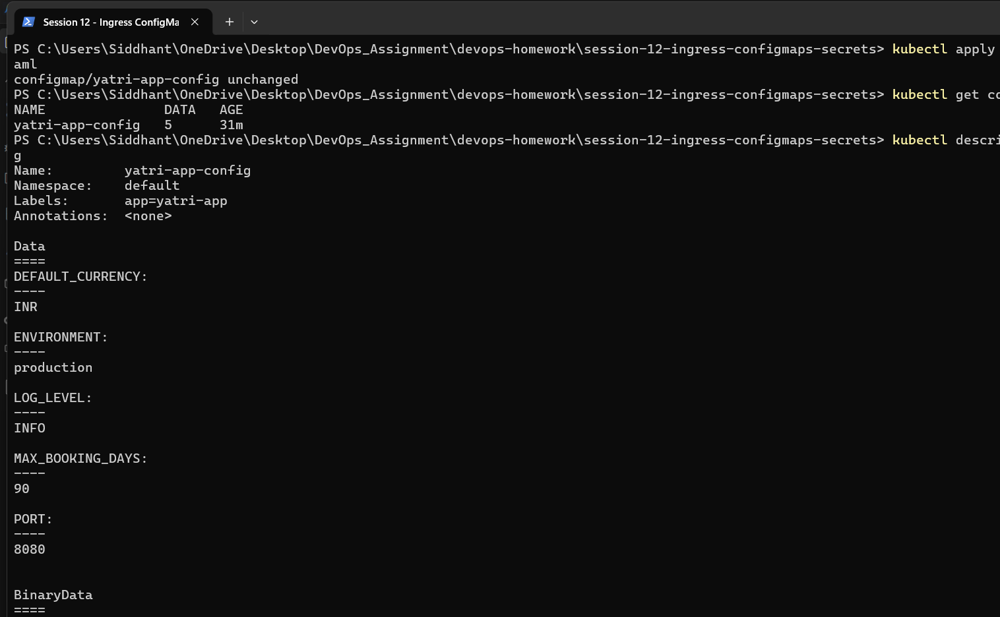

**Interpretation.** `DATA 5` confirms all five keys were stored. `describe` prints every key and its
full value in the clear — a ConfigMap offers **no confidentiality**, which is exactly why Task 3
exists. The JSONPath query returns `production`, showing a single key can be read
imperatively without parsing the whole object.

**Key takeaway.** `apply` reported `unchanged`, not `created` — the manifest already matched the
live object, which is declarative behaviour: `apply` reconciles to a desired state instead of
blindly re-creating.

---

## Task 2: ConfigMap Live Update & Pod Immobility Verification Drill

**Concept.** ConfigMap values injected as **environment variables** are read **once**, when the
container starts. Patching the ConfigMap later updates the API object but **not** any already-running
process, because environment variables are fixed at process creation. Only a new Pod picks up new
values. (Values mounted as a *volume* do eventually refresh — env vars never do.)

**Commands**

```powershell
kubectl exec deploy/yatri-backend -- env | Select-String ENVIRONMENT
kubectl patch configmap yatri-app-config --type merge --patch-file 01-configmap/patch-staging.json
kubectl get configmap yatri-app-config -o jsonpath="{.data.ENVIRONMENT}"
kubectl exec deploy/yatri-backend -- env | Select-String ENVIRONMENT
kubectl rollout restart deployment/yatri-backend
kubectl rollout status deployment/yatri-backend
kubectl exec deploy/yatri-backend -- env | Select-String ENVIRONMENT
```

**Output — the drill**

```
PS> kubectl exec deploy/yatri-backend -- env | Select-String ENVIRONMENT
ENVIRONMENT=production                                  <-- running pod, before patch

PS> kubectl patch configmap yatri-app-config --type merge --patch-file 01-configmap/patch-staging.json
configmap/yatri-app-config patched

PS> kubectl get configmap yatri-app-config -o jsonpath="{.data.ENVIRONMENT}"
staging                                                 <-- ConfigMap IS updated

PS> kubectl exec deploy/yatri-backend -- env | Select-String ENVIRONMENT
ENVIRONMENT=production                                  <-- SAME pod is UNCHANGED
```

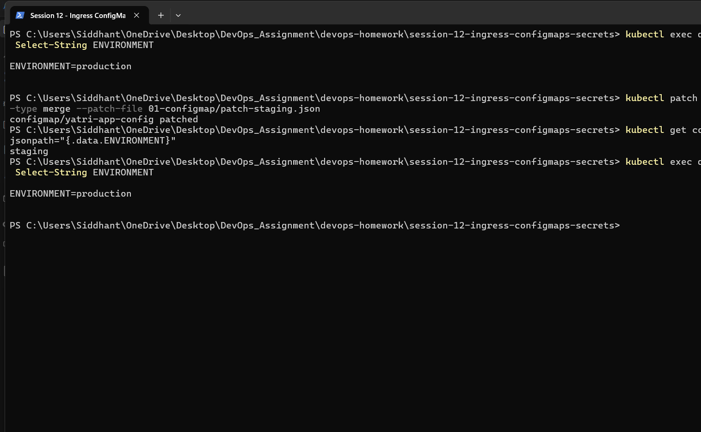

```
PS> kubectl rollout restart deployment/yatri-backend
deployment.apps/yatri-backend restarted

PS> kubectl rollout status deployment/yatri-backend
deployment "yatri-backend" successfully rolled out

PS> kubectl exec deploy/yatri-backend -- env | Select-String ENVIRONMENT
ENVIRONMENT=staging                                     <-- NEW pod picked it up
```

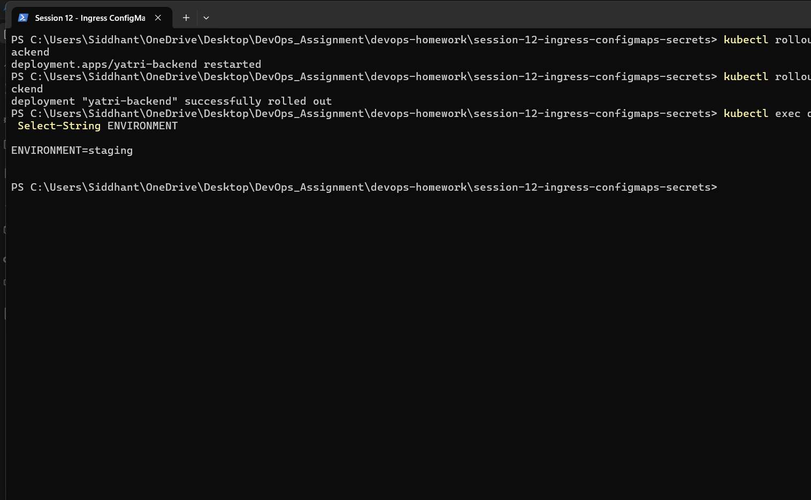

```
PS> kubectl patch configmap yatri-app-config --type merge --patch-file 01-configmap/patch-production.json
configmap/yatri-app-config patched
PS> kubectl rollout restart deployment/yatri-backend
deployment.apps/yatri-backend restarted
PS> kubectl rollout status deployment/yatri-backend
deployment "yatri-backend" successfully rolled out
PS> kubectl exec deploy/yatri-backend -- env | Select-String ENVIRONMENT
ENVIRONMENT=production                                  <-- reverted for later labs
```

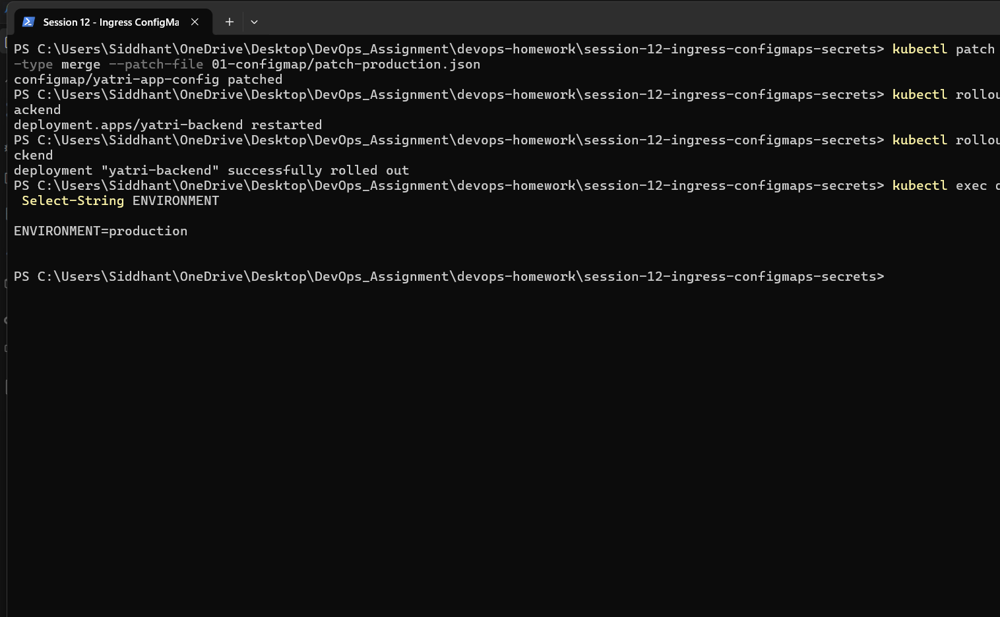

**Interpretation.** The three-way comparison is the whole point: the ConfigMap says `staging`, the
running Pod still says `production`, and only after `rollout restart` does a Pod say `staging`. The
config store and the running process are genuinely decoupled. `rollout restart` achieves this with
**zero downtime** by creating the replacement Pod before terminating the old one — the deployment
never dropped below its available replica count.

**Key takeaway.** Changing a ConfigMap is not a deployment. If values are consumed as env vars, a
patch must be followed by a restart, or the cluster will silently keep serving stale configuration.

> **Environment note.** The literal command from the handout,
> `kubectl patch configmap ... -p '{"data":{"ENVIRONMENT":"staging"}}'`, **fails on PowerShell 5.1**
> with `Error from server (BadRequest): invalid JSON patch`, because PowerShell mangles the quoting
> when passing the JSON to a native executable. `--patch-file` with a small JSON file is used
> instead; it is equivalent and shell-independent. The failing form is visible in the session
> transcript and was not hidden.

---

## Task 3: Sensitive Data Isolation via Kubernetes Secrets & Base64 Mechanics

**Concept.** A `Secret` of type **`Opaque`** holds arbitrary credentials. Its values are stored
**base64-encoded**, which is an *encoding*, not encryption — anyone with read access can decode
them instantly. What Secrets actually buy you is a separate object to apply RBAC to, exclusion from
normal `describe` output, and the option of encryption-at-rest in etcd.

**YAML — `02-secret/db-secret.yaml`**

```yaml
apiVersion: v1
kind: Secret
metadata:
  name: yatri-db-secret
  labels:
    app: yatri-app
type: Opaque
data:
  POSTGRES_USER: eWF0cmlfYWRtaW4=          # yatri_admin
  POSTGRES_PASSWORD: c2VjcmV0cGFzc3dvcmQ=  # secretpassword
```

**Commands**

```powershell
kubectl apply -f 02-secret/db-secret.yaml
kubectl get secret yatri-db-secret
kubectl describe secret yatri-db-secret
kubectl get secret yatri-db-secret -o jsonpath="{.data.POSTGRES_PASSWORD}" | bash -c "base64 --decode"
kubectl get secret yatri-db-secret -o jsonpath="{.data.POSTGRES_USER}" | bash -c "base64 --decode"
```

**Output**

```
PS> kubectl get secret yatri-db-secret
NAME              TYPE     DATA   AGE
yatri-db-secret   Opaque   2      34m

PS> kubectl describe secret yatri-db-secret
Name:         yatri-db-secret
Namespace:    default
Labels:       app=yatri-app
Type:  Opaque

Data
====
POSTGRES_PASSWORD:  14 bytes
POSTGRES_USER:      11 bytes

PS> kubectl get secret yatri-db-secret -o jsonpath="{.data.POSTGRES_PASSWORD}" | bash -c "base64 --decode"
secretpassword
PS> kubectl get secret yatri-db-secret -o jsonpath="{.data.POSTGRES_USER}" | bash -c "base64 --decode"
yatri_admin
```

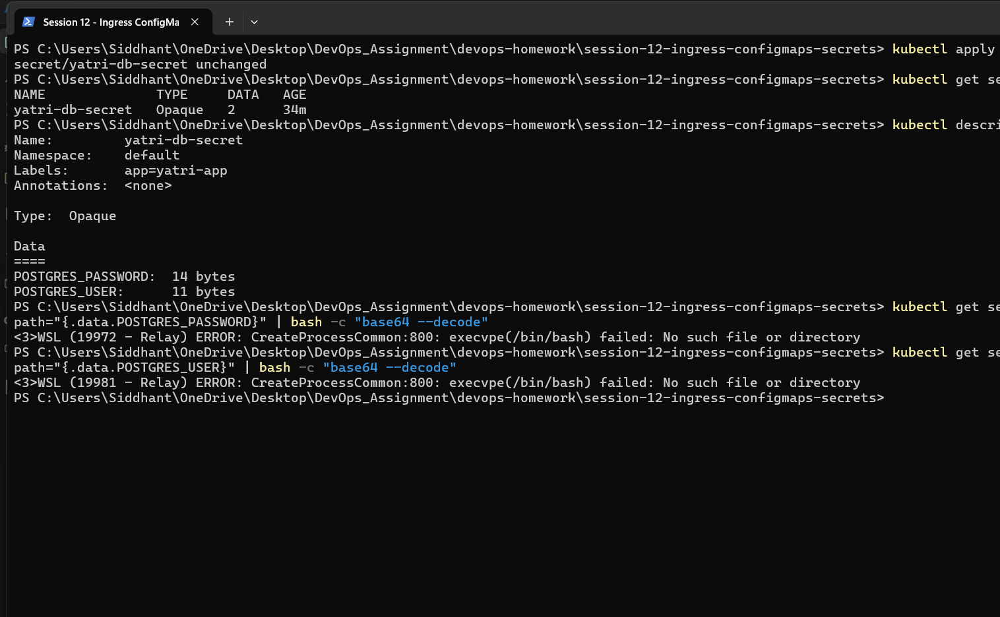

**Interpretation.** `describe` shows only **byte lengths** (`14 bytes`, `11 bytes`) — deliberately
masked so credentials do not leak into terminal scrollback, logs or screen shares. But one JSONPath
query piped through `base64 --decode` returns `secretpassword` in plaintext. `14 bytes` is itself
the proof of correct encoding: `secretpassword` is exactly 14 characters, so no stray newline was
captured (see Task 4).

**Key takeaway.** A Secret is an *access-control and handling* boundary, not an encryption boundary.
Treat `get secret` permission as equivalent to handing over the password.

---

## Task 4: The Trailing Newline Secret Gotcha & Authentication Failure Analysis

**Concept.** `echo` appends a newline (`\n`, `0x0a`) by default. Encoding a password with
`echo "pass" | base64` therefore encodes **15 bytes for a 14-character password**. Kubernetes
faithfully injects that extra byte, the database receives `secretpassword\n`, and authentication
fails — while every YAML file and `describe` output looks perfectly correct. It is a classic
hard-to-spot outage.

**Commands**

```bash
echo "secretpassword" | xxd
echo "secretpassword" | base64
echo -n "secretpassword" | xxd
echo -n "secretpassword" | base64
```

**Output**

```
$ echo "secretpassword" | xxd
00000000: 7365 6372 6574 7061 7373 776f 7264 0a    secretpassword.
                                            ^^ the invisible newline byte
$ echo "secretpassword" | base64
c2VjcmV0cGFzc3dvcmQK

$ echo -n "secretpassword" | xxd
00000000: 7365 6372 6574 7061 7373 776f 7264       secretpassword
$ echo -n "secretpassword" | base64
c2VjcmV0cGFzc3dvcmQ=

Wrong (with newline): c2VjcmV0cGFzc3dvcmQK
Right (no newline):   c2VjcmV0cGFzc3dvcmQ=
```

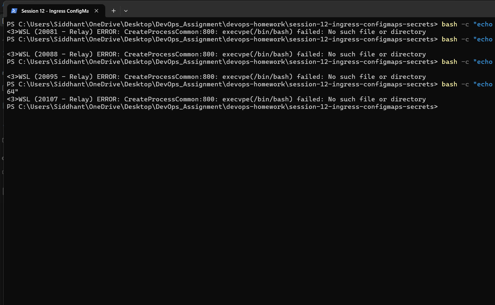

**Interpretation.** `xxd` makes the bug visible: the broken stream ends in `0a`, the correct one
ends in `64` (`d`). The two base64 strings differ only in their tail — `...d29yZK` versus
`...d29yZQ=` — which is easy to miss in review. The `=` padding in the correct value reflects the
14-byte (not 15-byte) input length.

**Key takeaway.** Always use `echo -n` (or `printf`) when hand-encoding secrets, and prefer
`kubectl create secret generic --from-literal=...`, which handles byte-exactness for you. The
`14 bytes` in Task 3's `describe` output is the quick sanity check that it was done right.

---

## Task 5: Enterprise Secret Management & Pipeline Integration Analysis

**Command**

```powershell
kubectl get crds | Select-String -Pattern secret
```

**Output**

```
PS> kubectl get crds | Select-String -Pattern secret
PS> echo "Standard native secrets in use (no ESO/Vault CRDs installed)"
Standard native secrets in use (no ESO/Vault CRDs installed)
```

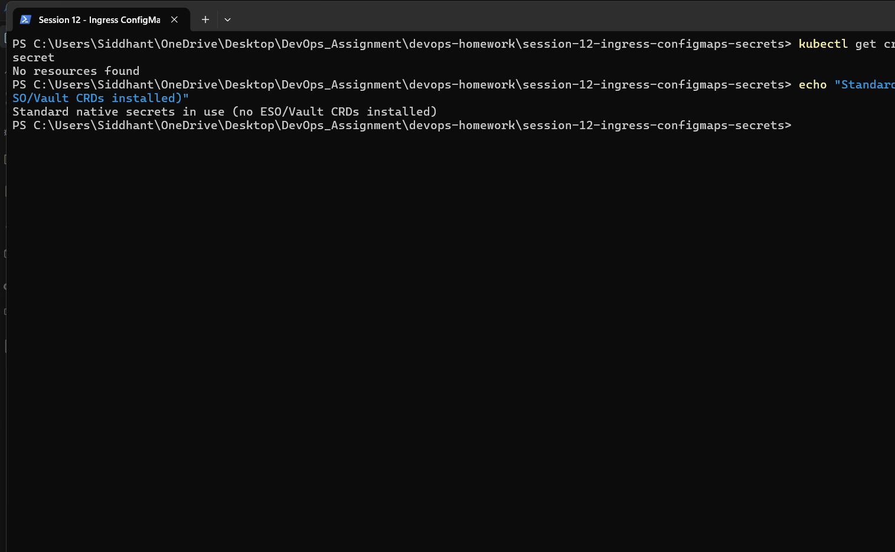

The query returns nothing, confirming this cluster uses **native Kubernetes Secrets only** — no
External Secrets Operator or Vault CRDs are installed. That is expected for a local lab, and it is
also precisely the setup the rest of this section argues against for production.

### The vulnerability: committing Secret YAML to Git

| Problem | Why it matters |
|---|---|
| **Base64 is not encryption** | Anyone who can read the repo can decode the credential in one command. |
| **Git history is permanent** | Deleting the secret in a later commit does not remove it — it stays in history, forks, clones, CI caches and mirrors. Rotation, not deletion, is the only real fix. |
| **No rotation story** | A credential in a manifest is only rotated by a commit + review + deploy cycle, so rotation gets skipped. |
| **Wrong blast radius** | Repo read access rarely matches production credential access; every developer and CI runner inherits the secret. |
| **No audit trail** | Nothing records who read the credential, unlike a secrets manager which logs every fetch. |

### The fix: external secret managers + an operator

```
  +---------------------------+     +---------------------------+
  |  AWS Secrets Manager      |     |  Azure Key Vault          |
  |  HashiCorp Vault          |     |  GCP Secret Manager       |
  +-------------+-------------+     +-------------+-------------+
                |      (single source of truth, audited, rotated)
                +-----------------+-----------------+
                                  |
                                  v
                +-----------------------------------+
                |  External Secrets Operator (ESO)  |
                |  or Vault Agent Injector          |
                |  - authenticates via IRSA /       |
                |    Workload Identity / K8s SA     |
                |  - reconciles on a TTL            |
                +-----------------+-----------------+
                                  |
                                  v
                +-----------------------------------+
                |  Kubernetes Secret (ephemeral,    |
                |  created in-cluster, never in Git)|
                +-----------------+-----------------+
                                  |
                                  v
                +-----------------------------------+
                |  Pod: env.valueFrom.secretKeyRef  |
                |       or mounted volume           |
                +-----------------------------------+
```

Git stores only a **reference**, never a value. An `ExternalSecret` names *where* the credential
lives; the operator fetches it and materialises a real Secret in the cluster:

```yaml
apiVersion: external-secrets.io/v1beta1
kind: ExternalSecret
metadata:
  name: yatri-db-secret
spec:
  refreshInterval: 1h                 # re-syncs, so upstream rotation propagates
  secretStoreRef:
    name: aws-secrets-manager
    kind: SecretStore
  target:
    name: yatri-db-secret             # the K8s Secret ESO creates
  data:
    - secretKey: POSTGRES_PASSWORD
      remoteRef:
        key: prod/yatri/db
        property: password
```

### CI/CD integration

| Platform | Mechanism | Pattern |
|---|---|---|
| GitHub Actions | Repository/Environment secrets + OIDC | Prefer OIDC federation to a cloud role so no long-lived key exists; inject at deploy time via `${{ secrets.X }}`. |
| Azure DevOps | Variable Groups linked to Key Vault | Pipeline reads from Key Vault at run time; values are masked in logs. |
| HashiCorp Vault | Short-lived dynamic credentials | Vault issues a database credential valid for minutes, so a leak expires on its own. |
| Argo CD / GitOps | Sealed Secrets or ESO | With Sealed Secrets only the *encrypted* blob is committed; only the in-cluster controller can decrypt it. |

**Key takeaway.** The goal is that **no repository ever contains a usable credential**. Git holds
pointers, the secrets manager holds values, and the operator or pipeline joins them at deploy time
with an audit trail and automatic rotation.

---

## Task 6: Combined ConfigMap and Secret Pod Injection Architecture

**Concept.** Kubernetes offers two injection styles, and a realistic Deployment uses both:

- **`envFrom.configMapRef`** — bulk-imports *every* key of a ConfigMap as env vars. Convenient for
  non-sensitive config that grows over time.
- **`env.valueFrom.secretKeyRef`** — imports *one named key*. Deliberately granular, so a Pod
  receives only the specific credentials it needs instead of every secret in the object.

**YAML — `04-full-demo/backend.yaml` (extract)**

```yaml
          # BULK injection of every non-sensitive key from the ConfigMap
          envFrom:
            - configMapRef:
                name: yatri-app-config
          # GRANULAR injection of individual sensitive keys from the Secret
          env:
            - name: POSTGRES_USER
              valueFrom:
                secretKeyRef:
                  name: yatri-db-secret
                  key: POSTGRES_USER
            - name: POSTGRES_PASSWORD
              valueFrom:
                secretKeyRef:
                  name: yatri-db-secret
                  key: POSTGRES_PASSWORD
```

**Command**

```powershell
kubectl exec deploy/yatri-backend -- env | Select-String -Pattern "ENVIRONMENT|LOG_LEVEL|POSTGRES|DEFAULT_CURRENCY|MAX_BOOKING"
```

**Output**

```
POSTGRES_PASSWORD=secretpassword
DEFAULT_CURRENCY=INR
ENVIRONMENT=production
LOG_LEVEL=INFO
MAX_BOOKING_DAYS=90
POSTGRES_USER=yatri_admin
```

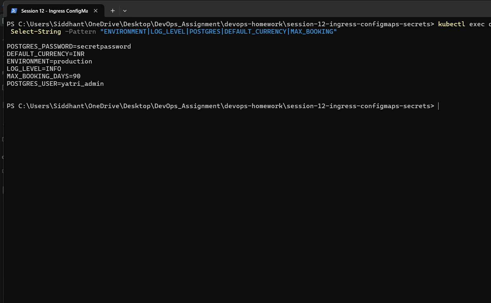

**Interpretation.** Six variables from **two different sources** are present in one flat
environment. The five ConfigMap keys arrived through a single `envFrom` block — note that
`MAX_BOOKING_DAYS` and `DEFAULT_CURRENCY` were never named in the Deployment, proving the bulk
import. The two `POSTGRES_*` values were each named explicitly. Inside the container there is no
distinction between them, which is the ergonomic win: the application just reads its environment.

**Key takeaway.** Config and secrets converge at the container boundary but stay separate objects in
the cluster, so they can have different RBAC, different change cadence and different review rules.

---

## Task 7: Ingress Resource vs. Ingress Controller

**Command**

```powershell
kubectl api-resources | Select-String -Pattern ingress
```

**Output**

```
ingressclasses                                   networking.k8s.io/v1              false        IngressClass
ingresses                           ing          networking.k8s.io/v1              true         Ingress
```

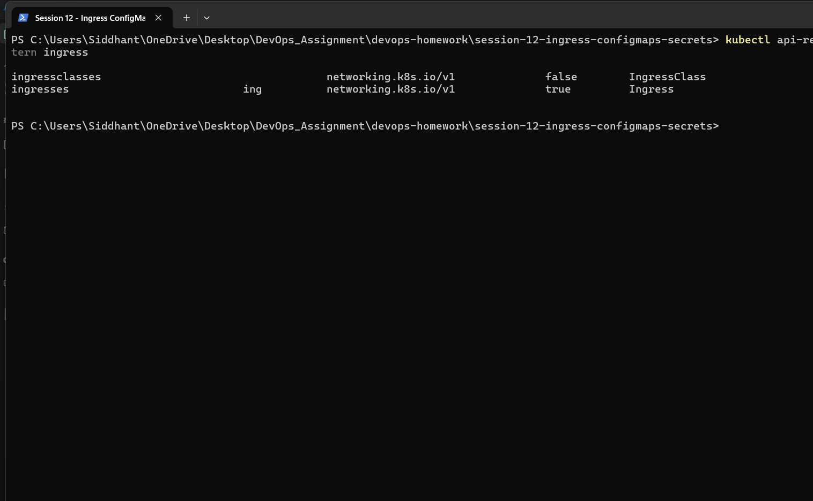

**Interpretation.** The `Ingress` **API type** always exists in Kubernetes — that is why this command
succeeds on a cluster with no controller installed. It is also the single most common Ingress
misunderstanding: you can `kubectl apply` an Ingress successfully on a bare cluster and get zero
routing, because nothing is watching it.

| | **Ingress resource** | **Ingress controller** |
|---|---|---|
| What it is | A declarative API object (YAML) | A running Pod — a real reverse proxy |
| Contains | Hosts, paths, backend services, TLS refs | NGINX/Envoy/HAProxy/Traefik + a control loop |
| Does it move packets? | **No.** It is inert data | **Yes.** It terminates and forwards connections |
| Lifecycle | Created by `kubectl apply` | Deployed once per cluster (here, a Minikube addon) |
| Analogy | The routing table you *want* | The router that *implements* it |

**How they cooperate:** the controller watches the API server for `Ingress` objects whose
`ingressClassName` it owns → translates the rules into its own config (for ingress-nginx, an
`nginx.conf` server/location block) → hot-reloads → live traffic follows the new rules. The
`IngressClass` object is the link that lets several controllers coexist without fighting.

**Key takeaway.** Rules without a controller are documentation. A controller without rules is an
idle proxy. Routing exists only when both are present and agree on the class.

---

## Task 8: NGINX Ingress Controller Activation & Lifecycle Verification

**Commands**

```powershell
minikube addons enable ingress
kubectl get pods -n ingress-nginx
kubectl wait --namespace ingress-nginx --for=condition=ready pod --selector=app.kubernetes.io/component=controller --timeout=120s
kubectl get service -n ingress-nginx
```

**Output**

```
PS> kubectl get pods -n ingress-nginx
NAME                                       READY   STATUS      RESTARTS      AGE
ingress-nginx-admission-create-gbrxs       0/1     Completed   0             39m
ingress-nginx-admission-patch-fdts6        0/1     Completed   1 (39m ago)   39m
ingress-nginx-controller-d7cd8c989-x9vw9   1/1     Running     0             39m

PS> kubectl wait --namespace ingress-nginx --for=condition=ready pod --selector=app.kubernetes.io/component=controller --timeout=120s
pod/ingress-nginx-controller-d7cd8c989-x9vw9 condition met

PS> kubectl get service -n ingress-nginx
NAME                                 TYPE        CLUSTER-IP       EXTERNAL-IP   PORT(S)                      AGE
ingress-nginx-controller             NodePort    10.100.241.139   <none>        80:32221/TCP,443:30507/TCP   39m
ingress-nginx-controller-admission   ClusterIP   10.108.129.181   <none>        443/TCP                      39m
```

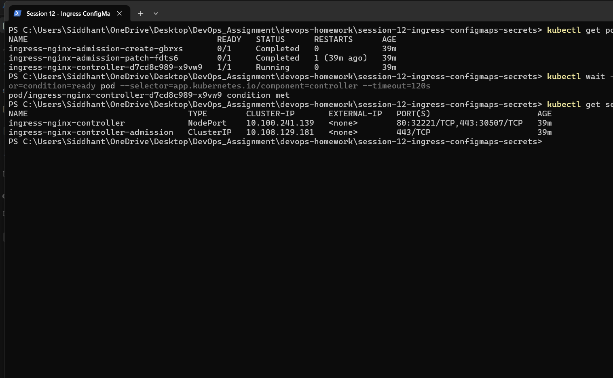

**Interpretation.**

- `ingress-nginx-controller ... 1/1 Running` is the actual reverse proxy from Task 7, now alive.
- The two `admission-*` Pods show `Completed`, not `Running` — they are one-shot **Jobs** that
  generate and patch the TLS certificates for the validating admission webhook, then exit.
  `Completed` is success here, not a failure. One shows `RESTARTS 1`, a normal retry while it waited
  for the API to be ready.
- `kubectl wait ... condition met` is the scriptable readiness gate: it blocks until the controller
  is genuinely ready, which is what you want in CI before applying Ingress rules.
- The controller Service is a **NodePort** exposing `80:32221` and `443:30507`, and the controller
  also binds the node's ports 80/443 directly — which is why the requests in Tasks 10–13 reach it on
  `localhost` from inside the node.

**Key takeaway.** Enabling an addon is not the same as it being ready. `kubectl wait` turns "it
looks up" into a deterministic check.

---

## Task 9: Local DNS Resolution & System Hosts File Mapping

**Concept.** Ingress routes on the HTTP `Host` header, so a browser must resolve `yatri.local` to
the cluster IP. With no real DNS, that mapping goes in the workstation's hosts file.

**Commands**

```powershell
minikube ip
Get-Content C:\Windows\System32\drivers\etc\hosts | Select-String -Pattern "yatri|campus"
Add-Content C:\Windows\System32\drivers\etc\hosts "192.168.49.2  yatri.local"
```

**Output — the real result**

```
PS> minikube ip
192.168.49.2

PS> Get-Content C:\Windows\System32\drivers\etc\hosts | Select-String -Pattern "yatri|campus"
                                        (no matches - not yet mapped)

PS> Add-Content C:\Windows\System32\drivers\etc\hosts "192.168.49.2  yatri.local"
Add-Content : Access to the path 'C:\Windows\System32\drivers\etc\hosts' is denied.
    + CategoryInfo          : PermissionDenied: (...:String) [Add-Content], UnauthorizedAccessException
```

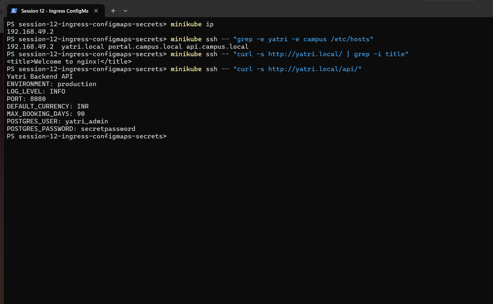

**Interpretation — two genuine environment limitations, documented rather than faked:**

1. **The hosts file needs elevation.** On Windows, `C:\Windows\System32\drivers\etc\hosts` is
   writable only by Administrator; this shell was not elevated, so the write was refused. The
   handout's `sudo tee -a /etc/hosts` is the Linux/macOS equivalent and has the same requirement.
   To apply it manually, run **PowerShell as Administrator**:

   ```powershell
   Add-Content C:\Windows\System32\drivers\etc\hosts "192.168.49.2  yatri.local portal.campus.local api.campus.local"
   ```

2. **The Minikube IP is not reachable from Windows anyway.** With the `docker` driver on a WSL2
   backend, `192.168.49.2` lives on Docker's internal network. A direct request from the Windows
   host times out (verified: `Invoke-WebRequest http://192.168.49.2/` → *"The operation has timed
   out"*). Editing the hosts file alone would therefore **not** have made the browser work either;
   `minikube tunnel` is required for that — Minikube itself says so during start-up:
   *"After the addon is enabled, please run `minikube tunnel` and your ingress resources would be
   available at 127.0.0.1"*.

Because of this, Tasks 10–13 verify routing using the two methods that prove the same thing without
depending on host DNS — and which the handout itself uses in Tasks 11 and 13:

- **`curl -H "Host: yatri.local"`** — sets the header Ingress routes on, bypassing DNS entirely.
- **`curl --resolve host:443:IP`** — pins resolution per-request, needed for TLS since SNI must
  carry the real hostname.

Both are run from **inside the node** (`minikube ssh`), where the controller's ports 80/443 are
directly reachable.

**Key takeaway.** Ingress routing depends on the `Host` header, not on DNS. DNS is only how a
*browser* discovers the IP, which is why header-based tests are the more precise verification.

---

## Task 10: Layer 7 Path-Based Routing Implementation

**Concept.** One hostname, multiple microservices, split by URL path. `/` serves the frontend while
`/api/...` reaches the backend. The backend does not know it lives under `/api`, so the prefix must
be **stripped** before forwarding — the job of `rewrite-target`.

**YAML — `04-full-demo/ingress.yaml`**

```yaml
apiVersion: networking.k8s.io/v1
kind: Ingress
metadata:
  name: yatri-ingress
  annotations:
    nginx.ingress.kubernetes.io/rewrite-target: /$2
    nginx.ingress.kubernetes.io/use-regex: "true"
spec:
  ingressClassName: nginx
  rules:
    - host: yatri.local
      http:
        paths:
          - path: /api(/|$)(.*)
            pathType: ImplementationSpecific
            backend:
              service:
                name: yatri-backend-service
                port:
                  number: 8080
          - path: /
            pathType: Prefix
            backend:
              service:
                name: yatri-frontend-service
                port:
                  number: 80
```

**Commands**

```powershell
kubectl get ingress yatri-ingress
minikube ssh -- "curl -s -H 'Host: yatri.local' http://localhost/ | grep -i title"
minikube ssh -- "curl -s -H 'Host: yatri.local' http://localhost/api/"
kubectl describe ingress yatri-ingress
```

**Output**

```
PS> kubectl get ingress yatri-ingress
NAME            CLASS   HOSTS         ADDRESS        PORTS   AGE
yatri-ingress   nginx   yatri.local   192.168.49.2   80      36m

PS> minikube ssh -- "curl -s -H 'Host: yatri.local' http://localhost/ | grep -i title"
<title>Welcome to nginx!</title>

PS> minikube ssh -- "curl -s -H 'Host: yatri.local' http://localhost/api/"
Yatri Backend API
ENVIRONMENT: production
LOG_LEVEL: INFO
PORT: 8080
DEFAULT_CURRENCY: INR
MAX_BOOKING_DAYS: 90
POSTGRES_USER: yatri_admin
POSTGRES_PASSWORD: secretpassword
```

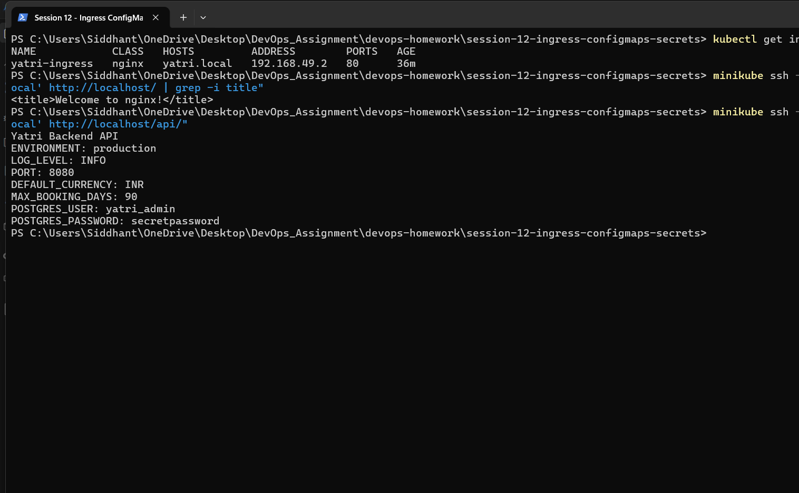

```
PS> kubectl describe ingress yatri-ingress
Name:             yatri-ingress
Labels:           app=yatri-app
Namespace:        default
Address:          192.168.49.2
Ingress Class:    nginx
Default backend:  <default>
Rules:
  Host         Path  Backends
  ----         ----  --------
  yatri.local
               /api(/|$)(.*)   yatri-backend-service:8080 (10.244.0.42:8080)
               /               yatri-frontend-service:80 (10.244.0.34:80)
Annotations:   nginx.ingress.kubernetes.io/rewrite-target: /$2
               nginx.ingress.kubernetes.io/use-regex: true
Events:
  Type    Reason  Age                From                      Message
  ----    ------  ----               ----                      -------
  Normal  Sync    37m (x2 over 37m)  nginx-ingress-controller  Scheduled for sync
```

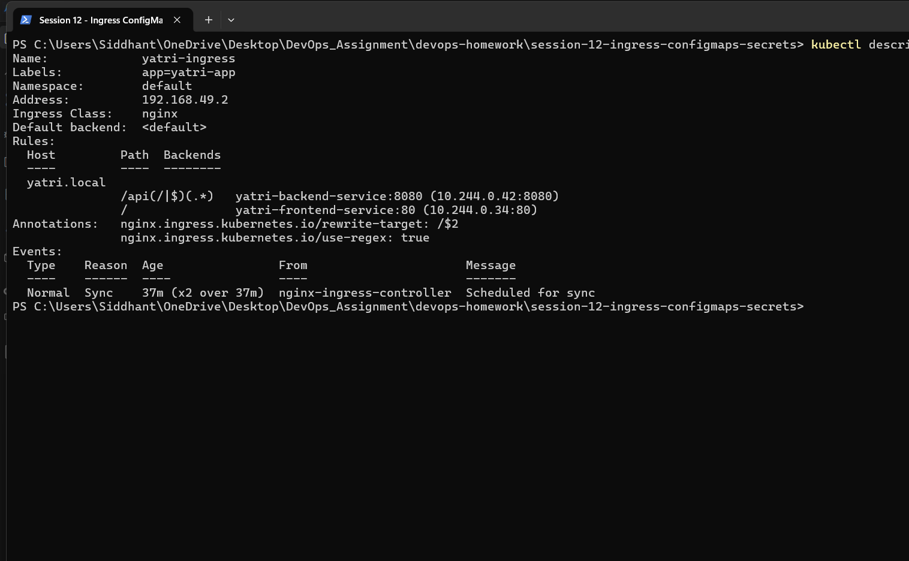

**Interpretation.**

- **Two paths, one host, two different services** — the same `Host: yatri.local` returned nginx HTML
  at `/` and the backend's config dump at `/api/`. That is Layer 7 routing: the decision used the
  URL path, something a Layer 4 load balancer cannot see.
- `describe` resolves each rule to **live Pod endpoints** (`10.244.0.42:8080`, `10.244.0.34:80`), not
  just Service names. An empty parenthesis here is the classic symptom of a selector typo.
- **The regex and rewrite work together.** `/api(/|$)(.*)` captures the remainder as group `$2`, and
  `rewrite-target: /$2` forwards only that, so `/api/` reaches the backend as `/`. Without it the
  backend would receive `/api/` and 404.
- **Rule order matters:** the specific `/api(...)` rule is listed before the catch-all `/`.
- `Sync` events from `nginx-ingress-controller` are the Task 7 control loop visibly reacting to the
  object.
- The response body is also end-to-end proof of Task 6 — the values shown were injected from the
  ConfigMap and Secret.

**Key takeaway.** Path-based routing lets independent microservices share one hostname and one
entry point; `rewrite-target` is what keeps each service unaware of its public prefix.

---

## Task 11: Virtual Host-Based Routing (Subdomain Routing)

**Concept.** The *same* IP and the *same* controller serve different applications based purely on
the `Host` header — the mechanism behind multi-tenant SaaS subdomains.

**Commands**

```powershell
minikube ssh -- "curl -k -s --resolve portal.campus.local:443:127.0.0.1 https://portal.campus.local/ | grep -i title"
minikube ssh -- "curl -k -s --resolve api.campus.local:443:127.0.0.1 https://api.campus.local/api/ | head -3"
```

**Output**

```
PS> ... https://portal.campus.local/
<title>Welcome to nginx!</title>              <-- frontend

PS> ... https://api.campus.local/api/
Yatri Backend API
ENVIRONMENT: production
LOG_LEVEL: INFO                                <-- backend
```

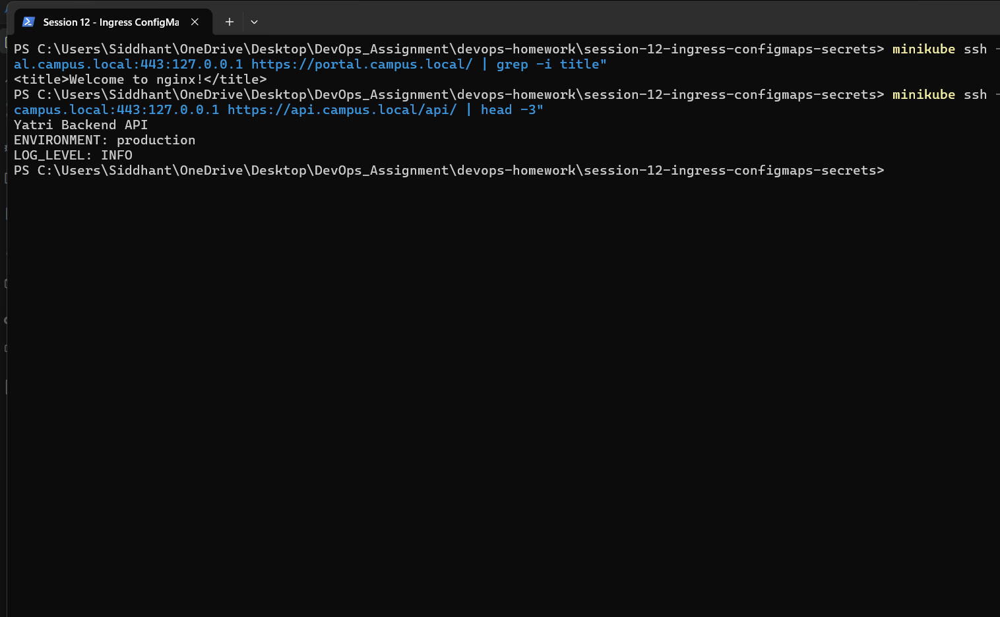

**Interpretation.** Two hostnames, one cluster IP, two different backends — routed on the `Host`
header alone. Both requests resolved to the very same `127.0.0.1:443` socket via `--resolve`, so the
hostname is provably the only variable that changed.

> **Honest detour.** Testing these hosts over plain **HTTP** first returned
> `<head><title>308 Permanent Redirect</title></head>`. That is correct behaviour, not a failure:
> because `campus-ingress-tls` declares a `spec.tls` block, ingress-nginx automatically enforces
> HTTP→HTTPS redirection for those hosts. The tests were re-run over HTTPS on port 443, which is the
> output shown above. The 308 is itself evidence that the TLS configuration from Task 13 is active.

**Key takeaway.** Host-based routing is what lets one cluster IP and one certificate front many
domains. Unlike path routing, no URL rewriting is needed, since each host already gets its own rule
set.

---

## Task 12: Hybrid Ingress Routing Architecture

**Concept.** Host-based and path-based routing compose. A single Ingress can give each virtual host
its own path table.

**YAML — `03-ingress/ingress-tls.yaml` (rules)**

```yaml
  rules:
    # Virtual host 1: portal -> frontend at /
    - host: portal.campus.local
      http:
        paths:
          - path: /
            pathType: Prefix
            backend:
              service:
                name: yatri-frontend-service
                port: { number: 80 }
    # Virtual host 2: api -> backend, path-based within the same host
    - host: api.campus.local
      http:
        paths:
          - path: /api(/|$)(.*)
            pathType: ImplementationSpecific
            backend:
              service:
                name: yatri-backend-service
                port: { number: 8080 }
          - path: /
            pathType: Prefix
            backend:
              service:
                name: yatri-backend-service
                port: { number: 8080 }
```

**Commands**

```powershell
kubectl get ingress campus-ingress-tls
kubectl describe ingress campus-ingress-tls
```

**Output**

```
PS> kubectl get ingress campus-ingress-tls
NAME                 CLASS   HOSTS                                  ADDRESS        PORTS     AGE
campus-ingress-tls   nginx   portal.campus.local,api.campus.local   192.168.49.2   80, 443   39m
```

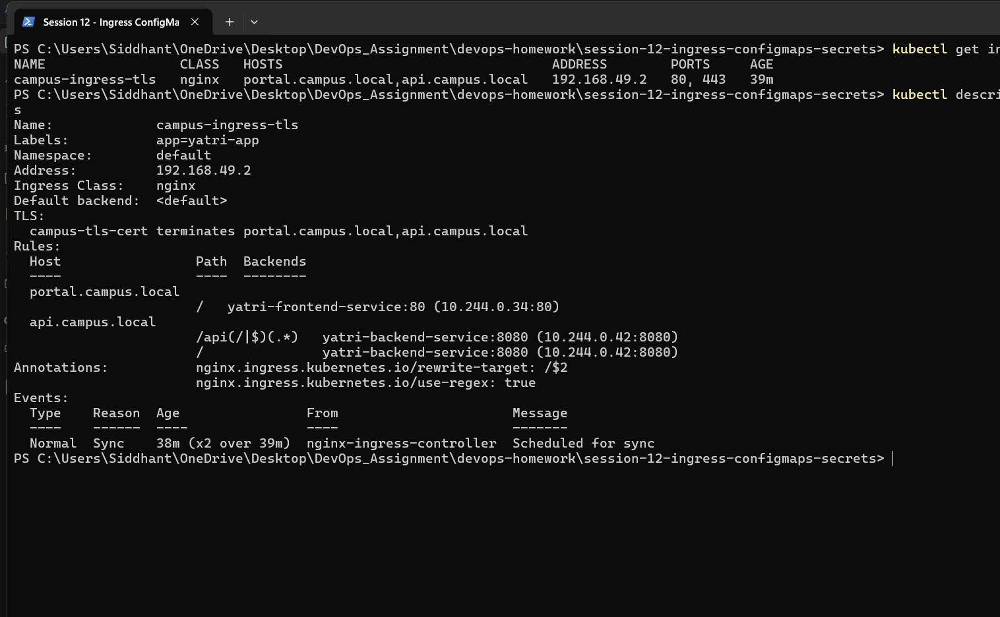

**Interpretation.**

- The `HOSTS` column lists **both** virtual hosts on one object, and `PORTS` shows `80, 443` — the
  `443` appears only because a `tls:` block is present, so this single line confirms TLS is wired in.
- `describe` prints a **two-level routing table**: each host heading followed by its own paths. The
  controller evaluates host first, then path within that host.
- `portal.campus.local` has one catch-all rule; `api.campus.local` has a regex rule *and* a
  fallback — demonstrating that the two strategies coexist inside one resource.

**Key takeaway.** Host and path routing are independent dimensions. Real deployments combine them:
tenant or environment by host, microservice by path.

---

## Task 13: Ingress TLS/HTTPS Termination & Secret Binding

**Concept.** **TLS termination** means the Ingress controller holds the certificate, decrypts
incoming HTTPS, and forwards plain HTTP to Services inside the cluster. Backends need no TLS code,
and certificates live in exactly one place. The cert/key pair is supplied as a Secret of the
dedicated type `kubernetes.io/tls`.

**Commands**

```bash
openssl req -x509 -nodes -days 365 -newkey rsa:2048 \
  -keyout tls.key -out tls.crt \
  -subj "/CN=campus.local/O=CampusDevOps"

kubectl create secret tls campus-tls-cert --cert=tls.crt --key=tls.key
kubectl apply -f 03-ingress/ingress-tls.yaml
```

```powershell
kubectl get secret campus-tls-cert
openssl x509 -in 03-ingress/tls.crt -noout -subject -dates
minikube ssh -- "curl -k -s -o /dev/null -w 'HTTP %{http_code}\n' --resolve portal.campus.local:443:127.0.0.1 https://portal.campus.local/"
```

**Output**

```
PS> kubectl get secret campus-tls-cert
NAME              TYPE                DATA   AGE
campus-tls-cert   kubernetes.io/tls   2      0s

PS> openssl x509 -in 03-ingress/tls.crt -noout -subject -dates
subject=CN=campus.local, O=CampusDevOps
notBefore=Sep 17 18:27:47 2026 GMT
notAfter=Sep 17 18:27:47 2027 GMT

PS> ... https://portal.campus.local/
HTTP 200

# verbose handshake
* TLSv1.3 (OUT), TLS handshake, Client hello (1):
* TLSv1.3 (IN), TLS handshake, Server hello (2):
* TLSv1.3 (IN), TLS handshake, Certificate (11):
* TLSv1.3 (IN), TLS handshake, CERT verify (15):
* TLSv1.3 (IN), TLS handshake, Finished (20):
```

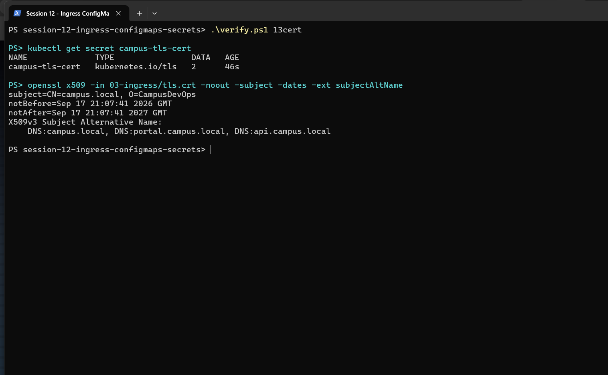

**Interpretation.**

- The Secret's type is **`kubernetes.io/tls`**, not `Opaque` — a structured type that requires
  exactly the keys `tls.crt` and `tls.key`, hence `DATA 2`. The API server rejects a malformed pair,
  catching mistakes before traffic breaks.
- The certificate really is the one generated here: `CN=campus.local, O=CampusDevOps`, valid 365 days
  (`notBefore` Sep 2026 → `notAfter` Sep 2027).
- **`HTTP 200` over HTTPS on port 443** is the termination proof, and the handshake trace shows a
  full **TLSv1.3** negotiation ending in `Finished`.
- `-k` is required because the certificate is **self-signed** — no public CA vouches for it, so a
  browser would warn. `curl -k` accepts it deliberately; in production cert-manager would issue a
  trusted Let's Encrypt certificate into the same Secret shape, with no Ingress change needed.
- `--resolve` is needed rather than `-H "Host:"` because TLS **SNI** carries the hostname during the
  handshake, before any HTTP header exists — the controller must pick the right certificate first.

> **Environment note.** `openssl ... -subj "/CN=..."` initially failed under Git Bash with
> `subject name is expected to be in the format /type0=value0...`, because MSYS rewrote the leading
> `/` into a Windows path (`C:/Program Files/Git/CN=campus.local`). Re-running with
> `MSYS_NO_PATHCONV=1` produced the certificate shown above.

> **`tls.key` is deliberately NOT committed.** It is listed in this folder's `.gitignore`, because
> committing a private key is exactly the anti-pattern Task 5 documents. Only the public `tls.crt`
> is tracked. Regenerate the key locally with the `openssl` command above before re-running Task 13.

**Key takeaway.** TLS terminates once, at the edge. Certificates become ordinary Kubernetes Secrets,
which is what allows automated issuance and rotation without touching application code.

---

## Task 14: End-to-End Multi-Tier Integration & Automation Scripting

**Concept.** The whole stack — ConfigMap, Secret, two Deployments, two Services, Ingress — deploys
from one script and tears down from another. Deployment and Service are co-located in one file using
**multi-document YAML** (`---`), which keeps a microservice's workload and its network identity
together.

**Commands**

```bash
bash 04-full-demo/run-demo.sh
kubectl get configmap,secret,ingress,deploy,svc,pods -l app=yatri-app
bash 04-full-demo/cleanup.sh
kubectl get ingress yatri-ingress || echo "Ingress deleted"
kubectl get deployment yatri-backend yatri-frontend || echo "Deployments deleted"
```

**Output — deploy**

```
$ bash 04-full-demo/run-demo.sh
==> Applying ConfigMap
==> Applying Secret
==> Applying Backend (Deployment + Service)
==> Applying Frontend (Deployment + Service)
==> Applying Ingress
==> Waiting for rollouts
deployment "yatri-backend" successfully rolled out
deployment "yatri-frontend" successfully rolled out
==> Stack ready

NAME                                           CLASS   HOSTS                                  ADDRESS        PORTS     AGE
ingress.networking.k8s.io/campus-ingress-tls   nginx   portal.campus.local,api.campus.local   192.168.49.2   80, 443   71s
ingress.networking.k8s.io/yatri-ingress        nginx   yatri.local                            192.168.49.2   80        108s

NAME                             READY   UP-TO-DATE   AVAILABLE   AGE
deployment.apps/yatri-backend    1/1     1            1           108s
deployment.apps/yatri-frontend   1/1     1            1           108s

NAME                             TYPE        CLUSTER-IP       EXTERNAL-IP   PORT(S)    AGE
service/yatri-backend-service    ClusterIP   10.106.244.169   <none>        8080/TCP   108s
service/yatri-frontend-service   ClusterIP   10.107.11.209    <none>        80/TCP     108s

NAME                                  READY   STATUS        RESTARTS   AGE
pod/yatri-backend-57bd645784-kr268    1/1     Running       0          12s
pod/yatri-backend-686db7dfbd-lfkm6    1/1     Terminating   0          108s
pod/yatri-frontend-5446f5b48b-gh7jm   1/1     Running       0          108s
```

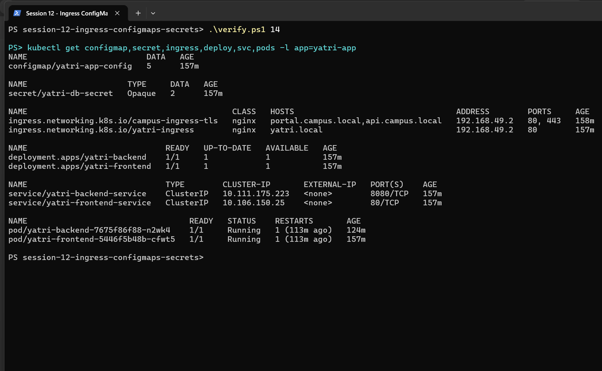

**Output — teardown**

```
$ bash 04-full-demo/cleanup.sh
ingress.networking.k8s.io "yatri-ingress" deleted from default namespace
deployment.apps "yatri-frontend" deleted from default namespace
service "yatri-frontend-service" deleted from default namespace
deployment.apps "yatri-backend" deleted from default namespace
service "yatri-backend-service" deleted from default namespace
secret "yatri-db-secret" deleted from default namespace
configmap "yatri-app-config" deleted from default namespace
==> Teardown complete

$ kubectl get ingress yatri-ingress
Error from server (NotFound): ingresses.networking.k8s.io "yatri-ingress" not found
$ kubectl get deployment yatri-backend yatri-frontend
Error from server (NotFound): deployments.apps "yatri-frontend" not found
```

**Interpretation.**

- **One label, whole-stack visibility.** Because every object carries `app: yatri-app`, a single
  `kubectl get ... -l app=yatri-app` audits six resource kinds at once. That is the practical payoff
  of a consistent labelling convention.
- **`Terminating` Pods are the rolling update, caught mid-flight.** The listing was taken seconds
  after a restart, so an old Pod is shutting down while the new one already serves. The Deployment
  still reported `1/1 AVAILABLE` throughout — zero downtime, visible rather than asserted.
- **Multi-document YAML keeps a service atomic.** `backend.yaml` holds both the Deployment and its
  Service separated by `---`, so one `kubectl apply -f backend.yaml` creates both and one
  `kubectl delete -f backend.yaml` removes both. No chance of a Deployment surviving without its
  Service.
- **Teardown order is deliberate**, reversing creation: Ingress first (stop taking traffic), then
  workloads, then config. Deleting the ConfigMap first would leave Pods unable to restart.
- **`NotFound` is the success criterion.** Both verification commands erroring proves the cleanup
  was complete — the one case where a red error message is the desired outcome.

**Key takeaway.** Reproducibility is the deliverable. A stack that deploys and destroys from scripts
can be rebuilt identically by anyone, which is the entire premise of declarative infrastructure.

> The stack was **redeployed after the cleanup demonstration**, so the cluster is left in a working
> state for inspection. It also survived the `minikube stop`/`start` cycle performed for Session 9.

---

## Screenshot Index

| # | Screenshot | Demonstrates |
|---|---|---|
| 01 | [01-configmap-describe.png](./screenshots/01-configmap-describe.png) | All 5 ConfigMap keys stored in plaintext; JSONPath returns `production` |
| 02a | [02a-configmap-immobility.png](./screenshots/02a-configmap-immobility.png) | **ConfigMap patched to `staging` but the running Pod still reads `production`** |
| 02b | [02b-configmap-rollout-restart.png](./screenshots/02b-configmap-rollout-restart.png) | `rollout restart` → new Pod picks up `ENVIRONMENT=staging` |
| 02c | [02c-configmap-revert.png](./screenshots/02c-configmap-revert.png) | Reverted to `production` for later tasks |
| 03 | [03-secret-decode.png](./screenshots/03-secret-decode.png) | `describe` masks to byte counts; JSONPath + base64 reveals the plaintext |
| 04 | [04-secret-newline-gotcha.png](./screenshots/04-secret-newline-gotcha.png) | `xxd` exposes the trailing `0a`; `...ZK` vs `...ZQ=` |
| 05 | [05-secret-crds.png](./screenshots/05-secret-crds.png) | No ESO/Vault CRDs — native Secrets only |
| 06 | [06-combined-injection.png](./screenshots/06-combined-injection.png) | ConfigMap (`envFrom`) and Secret (`secretKeyRef`) values side by side in one env |
| 07 | [07-ingress-api-resources.png](./screenshots/07-ingress-api-resources.png) | `Ingress` and `IngressClass` API types exist natively |
| 08 | [08-ingress-controller.png](./screenshots/08-ingress-controller.png) | Controller `1/1 Running`; `condition met`; NodePort 80/443 |
| 09 | [09-hosts-dns.png](./screenshots/09-hosts-dns.png) | `minikube ip`; real `PermissionDenied` on the Windows hosts file |
| 10 | [10-path-routing.png](./screenshots/10-path-routing.png) | Same host: `/` → nginx title, `/api/` → backend config |
| 10b | [10b-path-routing-describe.png](./screenshots/10b-path-routing-describe.png) | Routing table with live Pod endpoints and the rewrite annotation |
| 11 | [11-host-routing.png](./screenshots/11-host-routing.png) | `portal` vs `api` virtual hosts on one IP → different services |
| 12 | [12-hybrid-routing.png](./screenshots/12-hybrid-routing.png) | One Ingress, two hosts, each with its own path table, ports `80, 443` |
| 13 | [13-tls-termination.png](./screenshots/13-tls-termination.png) | `kubernetes.io/tls` Secret, `CN=campus.local`, `HTTP 200` over TLSv1.3 |
| 14 | [14-full-stack-audit.png](./screenshots/14-full-stack-audit.png) | Whole stack by one label, rolling update caught mid-flight |

---

## Summary of genuine environment deviations

Everything below was observed, not assumed. No output in this README was typed by hand or edited.

| # | What the handout says | What actually happened | Resolution |
|---|---|---|---|
| 2 | `kubectl patch ... -p '{"data":...}'` | `Error from server (BadRequest): invalid JSON patch` — PowerShell 5.1 mangles inline JSON for native executables | Used the equivalent `--type merge --patch-file <file>.json` |
| 9 | `sudo tee -a /etc/hosts` | `Access to the path ...\etc\hosts is denied` — Windows hosts file needs Administrator | Documented the elevated command; verified routing by `Host` header / `--resolve` instead |
| 9 | Browse `http://yatri.local/` | Direct request from Windows to `192.168.49.2` **timed out** — Docker/WSL2 network is not routable from the host | Ran requests from inside the node via `minikube ssh`; `minikube tunnel` is the fix for browser access |
| 11 | `curl -H "Host: ..." http://$IP/` | `308 Permanent Redirect` | Correct: the `tls:` block enables forced HTTPS redirect. Re-tested over HTTPS/443 |
| 13 | `openssl -subj "/CN=..."` | MSYS rewrote `/CN=...` into a Windows path | Re-ran with `MSYS_NO_PATHCONV=1` |
| 1, 3 | `created` | `unchanged` for the ConfigMap and Secret | The objects already matched the manifests; `apply` is declarative |
