# Session 10 – Kubernetes Core Objects

## Objective

This session demonstrates the five core Kubernetes workload objects, applied and verified on a real local Kubernetes cluster:

- **Pod** – the smallest deployable unit (demonstrated with two containers)
- **ReplicaSet** – maintains a desired number of identical Pod replicas
- **Deployment** – manages ReplicaSets declaratively for stateless workloads
- **StatefulSet** – runs workloads that need stable identity and persistent storage
- **DaemonSet** – runs one Pod on every eligible node

Every manifest in `k8s-core-objects/` is taken **verbatim** from the reference repository ([Nency-Ravaliya/devops-heros → session10-k8s-core-objects/k8s-core-objects](https://github.com/Nency-Ravaliya/devops-heros/tree/main/session10-k8s-core-objects/k8s-core-objects)), including the reference spelling `deamonset.yml`. Every command shown was actually executed and every screenshot is a capture of the real terminal session.

---

## Environment

| Component | Version / Value |
|---|---|
| OS | Windows 11 Home Single Language (10.0.26200) |
| Shell | Windows PowerShell 5.1 |
| Docker Desktop | 29.4.1 (client & server) |
| Minikube | v1.39.0 |
| Minikube driver | `docker` |
| kubectl (client) | v1.34.1 |
| Kubernetes (server/node) | v1.37.0 |
| Container runtime | containerd 2.3.4 |
| Node OS | Debian GNU/Linux 12 (bookworm), kernel 6.6.87.2-microsoft-standard-WSL2 |
| Cluster nodes | 1 (`minikube`, role `control-plane`) |
| Namespace used | `session10` |

The Minikube cluster was already running on the `docker` driver, so it was **not** recreated. Real environment output:

```
PS C:\Users\Siddhant\OneDrive\Desktop\session10-k8s-core-objects> minikube version --short
v1.39.0
PS C:\Users\Siddhant\OneDrive\Desktop\session10-k8s-core-objects> kubectl version --client=true -o yaml | Select-String gitVersion | Select-Object -First 1
  gitVersion: v1.34.1
PS C:\Users\Siddhant\OneDrive\Desktop\session10-k8s-core-objects> minikube status
minikube
type: Control Plane
host: Running
kubelet: Running
apiserver: Running
kubeconfig: Configured
PS C:\Users\Siddhant\OneDrive\Desktop\session10-k8s-core-objects> kubectl get nodes -o wide
NAME       STATUS   ROLES           AGE   VERSION   INTERNAL-IP    EXTERNAL-IP   OS-IMAGE                         KERNEL-VERSION                             CONTAINER-RUNTIME
minikube   Ready    control-plane   10d   v1.37.0   192.168.49.2   <none>        Debian GNU/Linux 12 (bookworm)   6.6.87.2-microsoft-standard-WSL2 (amd64)   containerd://2.3.4
```

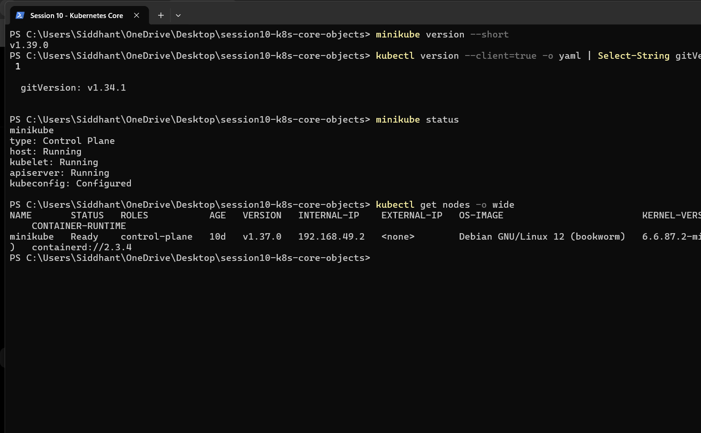

> **Note on version skew:** the kubectl client is v1.34.1 while the cluster runs v1.37.0. This is a supported skew and produced no errors, but it explains small output differences from the reference, e.g. this kubectl prints `pod "x" deleted from session10 namespace` and `kubectl get pvc` includes the newer `VOLUMEATTRIBUTESCLASS` column.

### Why a dedicated namespace was used

The `default` namespace of this cluster already contained a standalone Pod named `web` carrying the label `app=web` (left over from a previous session). The reference ReplicaSet uses exactly `selector.matchLabels: app: web`, so applying it in `default` would have caused the ReplicaSet to **adopt** that unrelated Pod, create only 2 new Pods instead of 3, and take ownership of a Pod that was never part of this assignment.

To keep the objects cleanly separated **without altering a single line of the reference manifests or their labels**, the whole assignment was run in a dedicated namespace, made the default for the current context:

```powershell
kubectl create namespace session10
kubectl config set-context --current --namespace=session10
```

This is why every command below appears exactly as specified (no `-n` flags) while remaining fully isolated. To switch back:

```powershell
kubectl config set-context --current --namespace=default
```

---

## Repository Structure

```
session10-k8s-core-objects/
├── README.md
├── k8s-core-objects/
│   ├── pod.yml
│   ├── replicaset.yml
│   ├── deployment.yml
│   ├── statefulset.yml
│   └── deamonset.yml
├── supporting/
│   └── mysql-headless-service.yml     # supporting resource only (see section 4)
└── screenshots/
    ├── 00-environment.png
    ├── 20-final-verification.png
    ├── pod/
    │   ├── 01-pod-apply.png
    │   ├── 02-pod-get.png
    │   ├── 03-pod-describe.png
    │   └── 04-pod-logs.png
    ├── replicaset/
    │   ├── 05-replicaset-apply.png
    │   ├── 06-replicaset-pods.png
    │   ├── 07-replicaset-describe.png
    │   └── 08-replicaset-self-healing.png
    ├── deployment/
    │   ├── 09-deployment-apply.png
    │   ├── 10-deployment-status.png
    │   ├── 11-deployment-pods.png
    │   └── 12-deployment-scaling.png
    ├── statefulset/
    │   ├── 13-statefulset-apply.png
    │   ├── 14-statefulset-pods.png
    │   ├── 15-statefulset-pvc.png
    │   └── 16-statefulset-describe.png
    └── deamonset/
        ├── 17-daemonset-apply.png
        ├── 18-daemonset-pods.png
        └── 19-daemonset-describe.png
```

The five files in `k8s-core-objects/` are byte-for-byte identical to the reference repository (verified by MD5 against the raw GitHub content). `supporting/` holds the one extra resource that Kubernetes needs to fully demonstrate the reference StatefulSet — it is **not** a core object and is explained in section 4.

---

## 1. Pod

### Concept

A **Pod** is the smallest deployable unit in Kubernetes. You do not run a container directly on a cluster; you run a Pod that *wraps* one or more containers. All containers in a Pod:

- are always scheduled together onto the **same node**,
- share one **network namespace** — a single Pod IP, so they reach each other over `localhost`,
- share the Pod's lifecycle and can share volumes.

This is why a Pod — not a container — is the unit of scheduling: it is the smallest thing the scheduler can place on a node.

This reference Pod holds **two containers**, the classic **sidecar** shape:

- `app` — an `nginx` container, the main workload.
- `logger` — a `busybox` container running an endless loop that echoes `log` every 5 seconds, standing in for a log-shipping/monitoring helper that lives beside the main app.

### YAML — `k8s-core-objects/pod.yml`

```yaml
apiVersion: v1
kind: Pod
metadata:
  name: mypod
spec:
  containers:
    - name: app
      image: nginx
    - name: logger
      image: busybox
      command: ["sh", "-c", "while true; do echo log; sleep 5; done"]
```

### Commands

```powershell
kubectl apply -f k8s-core-objects/pod.yml
kubectl get pods
kubectl get pod mypod
kubectl get pod mypod -o wide
kubectl get pod mypod -o jsonpath="{.spec.containers[*].name}"
kubectl describe pod mypod
kubectl logs mypod -c logger
kubectl logs mypod -c app
```

### Output / Verification

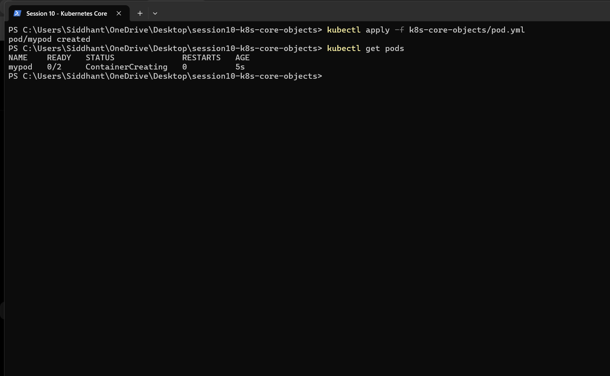

```
PS ...> kubectl apply -f k8s-core-objects/pod.yml
pod/mypod created
PS ...> kubectl get pods
NAME    READY   STATUS              RESTARTS   AGE
mypod   0/2     ContainerCreating   0          5s
```

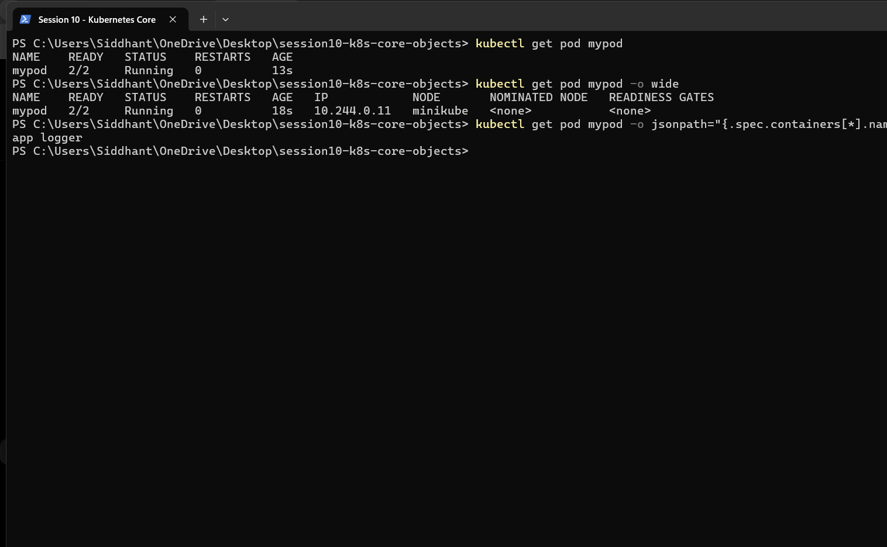

```
PS ...> kubectl get pod mypod
NAME    READY   STATUS    RESTARTS   AGE
mypod   2/2     Running   0          13s
PS ...> kubectl get pod mypod -o wide
NAME    READY   STATUS    RESTARTS   AGE   IP            NODE       NOMINATED NODE   READINESS GATES
mypod   2/2     Running   0          18s   10.244.0.11   minikube   <none>           <none>
PS ...> kubectl get pod mypod -o jsonpath="{.spec.containers[*].name}"
app logger
```

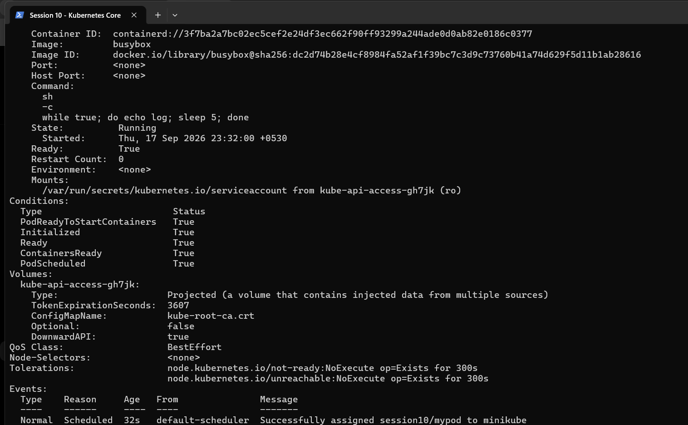

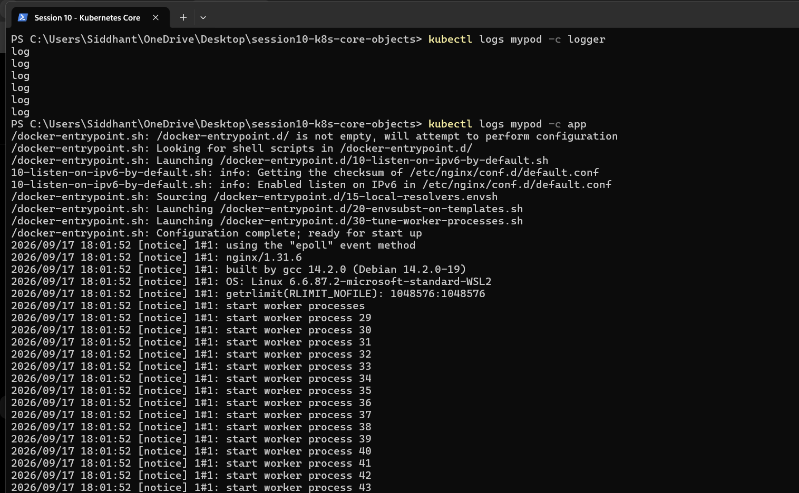

```
PS ...> kubectl logs mypod -c logger
log
log
log
log
log
log
PS ...> kubectl logs mypod -c app
/docker-entrypoint.sh: Configuration complete; ready for start up
2026/09/17 18:01:52 [notice] 1#1: nginx/1.31.6
2026/09/17 18:01:52 [notice] 1#1: OS: Linux 6.6.87.2-microsoft-standard-WSL2
2026/09/17 18:01:52 [notice] 1#1: start worker processes
```

### Explanation

- The `READY` column reads **`2/2`**, not `1/1`. That is the single clearest proof that one Pod is running two containers and both passed their readiness check.
- `kubectl get pod mypod -o wide` reports exactly **one IP, `10.244.0.11`, and one node, `minikube`** — for the whole Pod. Both containers share that address; there is no second IP.
- The jsonpath query returns `app logger`, confirming the two container names from the manifest.
- `kubectl logs` **requires** `-c <container>` here, because the Pod is multi-container. Without it kubectl cannot know which container's stream to show. `-c logger` shows the repeated `log` lines produced by the busybox loop; `-c app` shows nginx's own startup log (nginx 1.31.6), proving the two containers have independent log streams.
- `kubectl describe pod mypod` lists two separate `Containers:` blocks, each with its own image, image ID, state and restart count.

### Key takeaway

A Pod is a *shared execution context*, not a synonym for "a container". Containers inside it are co-located, co-scheduled, share the network identity, and are addressed individually with `-c`.

---

## 2. ReplicaSet

### Concept

A **ReplicaSet** keeps a stated number of identical Pods running. Its controller runs a continuous reconciliation loop: count the Pods matching the selector, compare with `replicas`, then create or delete Pods to close the gap.

- **`replicas: 3`** — the desired state.
- **`selector.matchLabels`** — how the ReplicaSet *identifies* the Pods it owns. It is a label query, not a name list.
- **`template`** — the Pod blueprint used to create replacements. Its `metadata.labels` **must** match the selector, otherwise newly created Pods would not be recognised as owned and the controller would create Pods endlessly.
- **Self-healing** — because ownership is by label and the loop never stops, deleting a Pod simply creates a deficit that is immediately corrected.

### YAML — `k8s-core-objects/replicaset.yml`

```yaml
apiVersion: apps/v1
kind: ReplicaSet
metadata:
  name: myapp-rs
spec:
  replicas: 3
  selector:
    matchLabels:
      app: web
  template:
    metadata:
      labels:
        app: web
    spec:
      containers:
        - name: web
          image: nginx
```

### Commands

```powershell
kubectl apply -f k8s-core-objects/replicaset.yml
kubectl get rs
kubectl get rs myapp-rs
kubectl get pods -o wide
kubectl describe rs myapp-rs

# self-healing
kubectl get pods -l app=web
$victim = kubectl get pods -l app=web -o jsonpath="{.items[0].metadata.name}"
kubectl delete pod $victim
kubectl get pods -l app=web
```

### Output / Verification

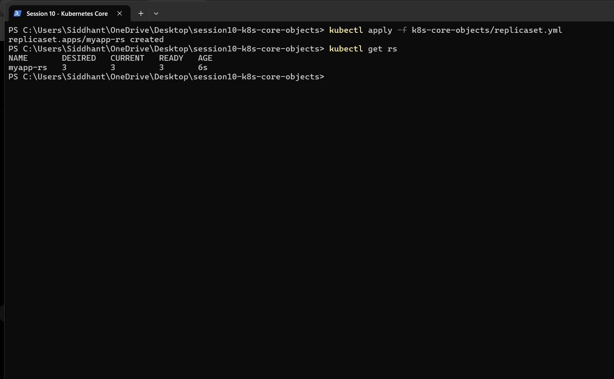

```
PS ...> kubectl apply -f k8s-core-objects/replicaset.yml
replicaset.apps/myapp-rs created
PS ...> kubectl get rs
NAME       DESIRED   CURRENT   READY   AGE
myapp-rs   3         3         3       6s
```

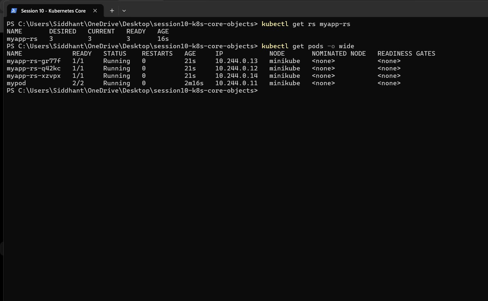

```
PS ...> kubectl get pods -o wide
NAME             READY   STATUS    RESTARTS   AGE     IP            NODE       NOMINATED NODE   READINESS GATES
myapp-rs-gr77f   1/1     Running   0          21s     10.244.0.13   minikube   <none>           <none>
myapp-rs-q42kc   1/1     Running   0          21s     10.244.0.12   minikube   <none>           <none>
myapp-rs-xzvpx   1/1     Running   0          21s     10.244.0.14   minikube   <none>           <none>
mypod            2/2     Running   0          2m16s   10.244.0.11   minikube   <none>           <none>
```

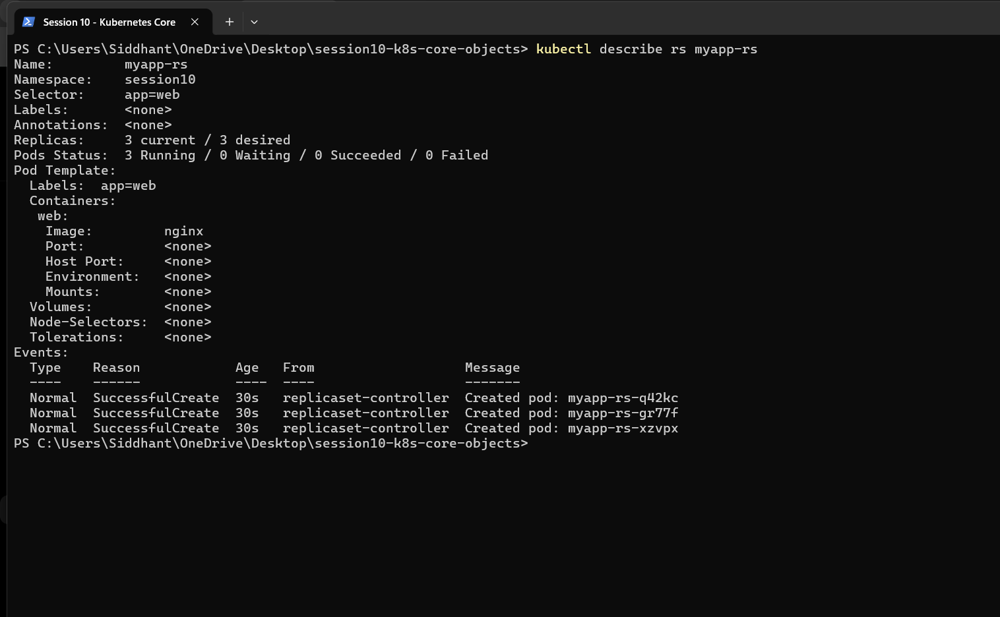

```
PS ...> kubectl describe rs myapp-rs
Name:         myapp-rs
Namespace:    session10
Selector:     app=web
Replicas:     3 current / 3 desired
Pods Status:  3 Running / 0 Waiting / 0 Succeeded / 0 Failed
Pod Template:
  Labels:  app=web
  Containers:
   web:
    Image:         nginx
Events:
  Type    Reason            Age   From                   Message
  ----    ------            ----  ----                   -------
  Normal  SuccessfulCreate  30s   replicaset-controller  Created pod: myapp-rs-q42kc
  Normal  SuccessfulCreate  30s   replicaset-controller  Created pod: myapp-rs-gr77f
  Normal  SuccessfulCreate  30s   replicaset-controller  Created pod: myapp-rs-xzvpx
```

#### Self-healing demonstration

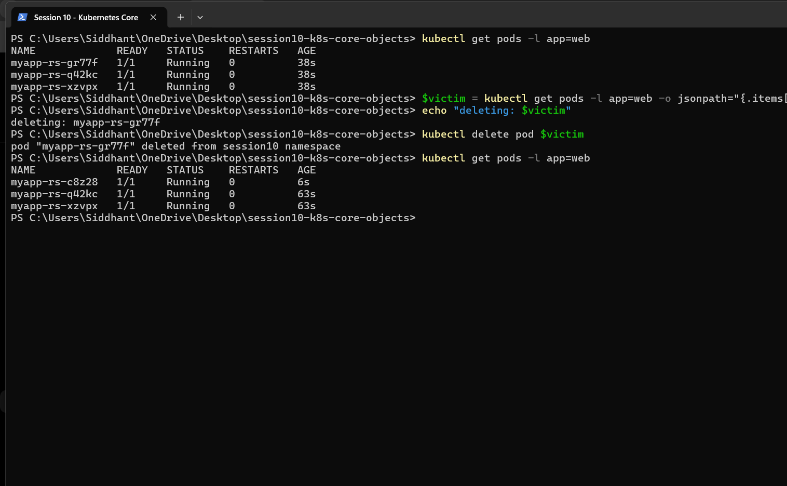

```
PS ...> kubectl get pods -l app=web
NAME             READY   STATUS    RESTARTS   AGE
myapp-rs-gr77f   1/1     Running   0          38s
myapp-rs-q42kc   1/1     Running   0          38s
myapp-rs-xzvpx   1/1     Running   0          38s
PS ...> echo "deleting: $victim"
deleting: myapp-rs-gr77f
PS ...> kubectl delete pod $victim
pod "myapp-rs-gr77f" deleted from session10 namespace
PS ...> kubectl get pods -l app=web
NAME             READY   STATUS    RESTARTS   AGE
myapp-rs-c8z28   1/1     Running   0          6s
myapp-rs-q42kc   1/1     Running   0          63s
myapp-rs-xzvpx   1/1     Running   0          63s
```

### Explanation

- `DESIRED 3 / CURRENT 3 / READY 3` confirms the three replicas requested by the manifest are actually running.
- Pod names are **generated**: `myapp-rs-` plus a random suffix. They are not stable identities — which is exactly the point of a ReplicaSet.
- The `Events` section of `describe` is the reconciliation loop's own record: three `SuccessfulCreate` events from the `replicaset-controller`.
- **Self-healing is proven by the two Pod listings.** `myapp-rs-gr77f` was deleted; the second listing no longer contains it, but contains a brand-new **`myapp-rs-c8z28` aged 6s** while the two survivors show 63s. The count returned to 3 without any manual action. Note the replacement has a *different name* — Kubernetes did not "restart" the Pod, it created a new one from the template.
- The `RESTARTS` column stays `0`: this was a Pod replacement, not a container restart.

### Key takeaway

A ReplicaSet guarantees a **count**, not the survival of any particular Pod. Its Pods are interchangeable and disposable, and ownership is decided purely by label selector — which is why a careless selector can capture Pods you did not intend (see the namespace note in *Environment*).

---

## 3. Deployment

### Concept

A **Deployment** is the object you normally use for stateless workloads. You do not manage Pods with it directly — it manages **ReplicaSets**, and each ReplicaSet manages Pods:

```
Deployment  (myapp)               declares desired state + rollout strategy
    ↓
ReplicaSet  (myapp-5b9587f95d)    one per template revision; keeps the replica count
    ↓
Pods        (myapp-5b9587f95d-*)  the actual running containers
```

That extra layer is what makes **rollouts** possible: changing the Pod template creates a *new* ReplicaSet and shifts Pods from the old one to the new one gradually, which also makes rollback possible. Scaling, by contrast, does not create a revision — it just changes the replica count of the current ReplicaSet.

### YAML — `k8s-core-objects/deployment.yml`

```yaml
apiVersion: apps/v1
kind: Deployment
metadata:
  name: myapp
spec:
  replicas: 3
  selector:
    matchLabels:
      app: myapp
  template:
    metadata:
      labels:
        app: myapp
    spec:
      containers:
        - name: myapp-container
          image: nginx
```

### Commands

```powershell
kubectl apply -f k8s-core-objects/deployment.yml
kubectl get deployments
kubectl rollout status deployment/myapp
kubectl get rs
kubectl get pods -l app=myapp -o wide
kubectl get pods -l app=myapp -o custom-columns="POD:.metadata.name,OWNER_KIND:.metadata.ownerReferences[0].kind,OWNER_NAME:.metadata.ownerReferences[0].name"
kubectl describe deployment myapp

# scaling
kubectl scale deployment myapp --replicas=5
kubectl get deployment myapp
kubectl get pods -l app=myapp
kubectl scale deployment myapp --replicas=3
```

### Output / Verification

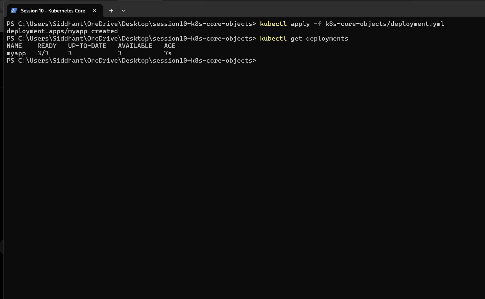

```
PS ...> kubectl apply -f k8s-core-objects/deployment.yml
deployment.apps/myapp created
PS ...> kubectl get deployments
NAME    READY   UP-TO-DATE   AVAILABLE   AGE
myapp   3/3     3            3           7s
```

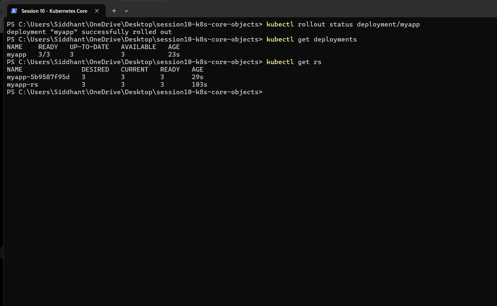

```
PS ...> kubectl rollout status deployment/myapp
deployment "myapp" successfully rolled out
PS ...> kubectl get rs
NAME               DESIRED   CURRENT   READY   AGE
myapp-5b9587f95d   3         3         3       29s
myapp-rs           3         3         3       103s
```

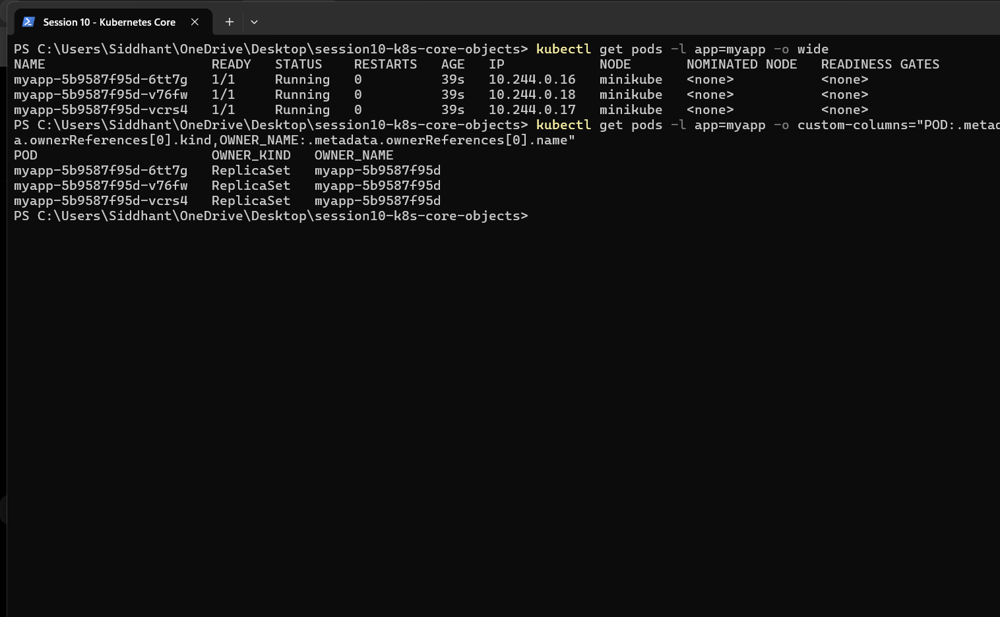

```
PS ...> kubectl get pods -l app=myapp -o wide
NAME                     READY   STATUS    RESTARTS   AGE   IP            NODE       NOMINATED NODE   READINESS GATES
myapp-5b9587f95d-6tt7g   1/1     Running   0          39s   10.244.0.16   minikube   <none>           <none>
myapp-5b9587f95d-v76fw   1/1     Running   0          39s   10.244.0.18   minikube   <none>           <none>
myapp-5b9587f95d-vcrs4   1/1     Running   0          39s   10.244.0.17   minikube   <none>           <none>

PS ...> kubectl get pods -l app=myapp -o custom-columns="POD:...,OWNER_KIND:...,OWNER_NAME:..."
POD                      OWNER_KIND   OWNER_NAME
myapp-5b9587f95d-6tt7g   ReplicaSet   myapp-5b9587f95d
myapp-5b9587f95d-v76fw   ReplicaSet   myapp-5b9587f95d
myapp-5b9587f95d-vcrs4   ReplicaSet   myapp-5b9587f95d
```

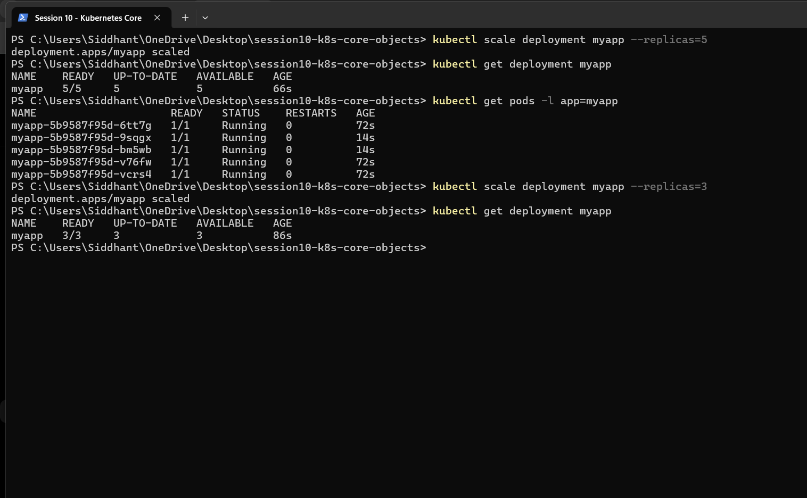

```
PS ...> kubectl scale deployment myapp --replicas=5
deployment.apps/myapp scaled
PS ...> kubectl get deployment myapp
NAME    READY   UP-TO-DATE   AVAILABLE   AGE
myapp   5/5     5            5           66s
PS ...> kubectl get pods -l app=myapp
NAME                     READY   STATUS    RESTARTS   AGE
myapp-5b9587f95d-6tt7g   1/1     Running   0          72s
myapp-5b9587f95d-9sqgx   1/1     Running   0          14s
myapp-5b9587f95d-bm5wb   1/1     Running   0          14s
myapp-5b9587f95d-v76fw   1/1     Running   0          72s
myapp-5b9587f95d-vcrs4   1/1     Running   0          72s
PS ...> kubectl scale deployment myapp --replicas=3
deployment.apps/myapp scaled
PS ...> kubectl get deployment myapp
NAME    READY   UP-TO-DATE   AVAILABLE   AGE
myapp   3/3     3            3           86s
```

### Explanation

- **The three-level relationship is visible in the real names.** `kubectl get rs` shows a ReplicaSet named `myapp-5b9587f95d` that was never written in any YAML — the Deployment created it, and the suffix is a hash of the Pod template. The Pods are then named `myapp-5b9587f95d-<random>`, i.e. ReplicaSet name + random suffix.
- The `ownerReferences` query removes all doubt: each Pod's owner is **`ReplicaSet/myapp-5b9587f95d`**, *not* the Deployment. The Deployment owns the ReplicaSet; the ReplicaSet owns the Pods.
- `kubectl get rs` also lists `myapp-rs` from section 2 side by side — the standalone ReplicaSet has no Deployment above it, which is the structural difference between the two sections.
- **Desired state:** `READY 3/3`, `UP-TO-DATE 3` (Pods running the current template) and `AVAILABLE 3` all agree, so actual state matches the declaration.
- **Scaling:** after `--replicas=5` the Deployment reports `5/5` and two extra Pods appear (`9sqgx`, `bm5wb`, both aged 14s) while the original three remain at 72s — Kubernetes added capacity instead of recreating everything. Scaling back to 3 returned it to `3/3`. Note the ReplicaSet hash never changed: scaling is not a new revision.

### Key takeaway

You declare *what* you want; the Deployment → ReplicaSet → Pod chain figures out *how* to get there. That indirection is what buys you rollouts, rollbacks and safe scaling.

---

## 4. StatefulSet

### Concept

A **StatefulSet** manages Pods that are **not** interchangeable. Each Pod gets:

- a **stable ordinal name** — `mysql-0`, `mysql-1`, `mysql-2` — that survives rescheduling (a Deployment would give random suffixes instead),
- **ordered, sequential** creation (`mysql-0` becomes Ready before `mysql-1` starts) and reverse-order deletion,
- a **stable DNS hostname** via the headless Service named in `serviceName`,
- its **own PersistentVolumeClaim**, generated from `volumeClaimTemplates`, which stays bound to that ordinal even if the Pod is deleted and recreated.

`volumeClaimTemplates` is the key field: it is a *template*, so the controller creates one PVC per replica (`<template-name>-<pod-name>`), rather than all replicas sharing one volume.

> **MySQL is only the example used in this assignment.** A StatefulSet is not "the database object". It is for any workload whose members need a stable identity or their own durable storage — Kafka brokers, ZooKeeper/etcd members, Elasticsearch nodes, sharded caches, or any clustered app where peers must address each other by a predictable name.

### YAML — `k8s-core-objects/statefulset.yml`

```yaml
apiVersion: apps/v1
kind: StatefulSet
metadata:
  name: mysql
spec:
  serviceName: "mysql"  # Required headless service
  replicas: 3
  selector:
    matchLabels:
      app: mysql
  template:
    metadata:
      labels:
        app: mysql
    spec:
      containers:
        - name: mysql
          image: mysql:5.7
          ports:
            - containerPort: 3306
          env:
            - name: MYSQL_ROOT_PASSWORD
              value: "password"
          volumeMounts:
            - name: mysql-persistent-storage
              mountPath: /var/lib/mysql
  volumeClaimTemplates:
    - metadata:
        name: mysql-persistent-storage
      spec:
        accessModes: [ "ReadWriteOnce" ]
        resources:
          requests:
            storage: 5Gi
```

### Supporting resource: the headless Service

`kubectl get svc` was run first and returned `No resources found in session10 namespace.` — the Service named by `serviceName: "mysql"` did not exist, and the reference repository does not ship one for this manifest. It was therefore created as a **supporting resource** in `supporting/mysql-headless-service.yml`, outside `k8s-core-objects/`, so the five reference files stay exactly as they are:

```yaml
apiVersion: v1
kind: Service
metadata:
  name: mysql
  labels:
    app: mysql
spec:
  clusterIP: None          # headless: no load-balanced VIP, DNS returns Pod IPs
  selector:
    app: mysql
  ports:
    - port: 3306
      name: mysql
```

To be precise about what this Service does and does not do: the StatefulSet Pods **start without it** — `serviceName` is not validated against an existing Service. What the headless Service provides is the per-Pod DNS identity `mysql-<n>.mysql.session10.svc.cluster.local`. Since stable network identity is one of the defining features being demonstrated here, the Service is required for the demonstration to be meaningful, which is why it was created.

### Commands

```powershell
kubectl get svc
kubectl apply -f supporting/mysql-headless-service.yml
kubectl apply -f k8s-core-objects/statefulset.yml
kubectl get statefulset
kubectl get pods -l app=mysql -o wide
kubectl get pvc
kubectl get pv --sort-by=.metadata.name
kubectl describe statefulset mysql
```

### Output / Verification

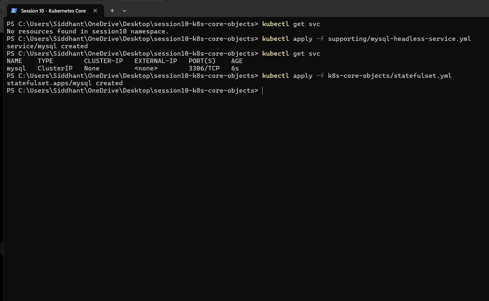

```
PS ...> kubectl get svc
No resources found in session10 namespace.
PS ...> kubectl apply -f supporting/mysql-headless-service.yml
service/mysql created
PS ...> kubectl get svc
NAME    TYPE        CLUSTER-IP   EXTERNAL-IP   PORT(S)    AGE
mysql   ClusterIP   None         <none>        3306/TCP   6s
PS ...> kubectl apply -f k8s-core-objects/statefulset.yml
statefulset.apps/mysql created
```

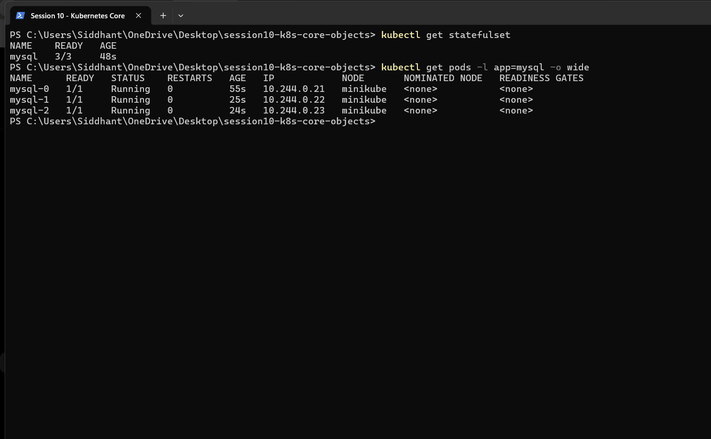

```
PS ...> kubectl get statefulset
NAME    READY   AGE
mysql   3/3     48s
PS ...> kubectl get pods -l app=mysql -o wide
NAME      READY   STATUS    RESTARTS   AGE   IP            NODE       NOMINATED NODE   READINESS GATES
mysql-0   1/1     Running   0          55s   10.244.0.21   minikube   <none>           <none>
mysql-1   1/1     Running   0          25s   10.244.0.22   minikube   <none>           <none>
mysql-2   1/1     Running   0          24s   10.244.0.23   minikube   <none>           <none>
```

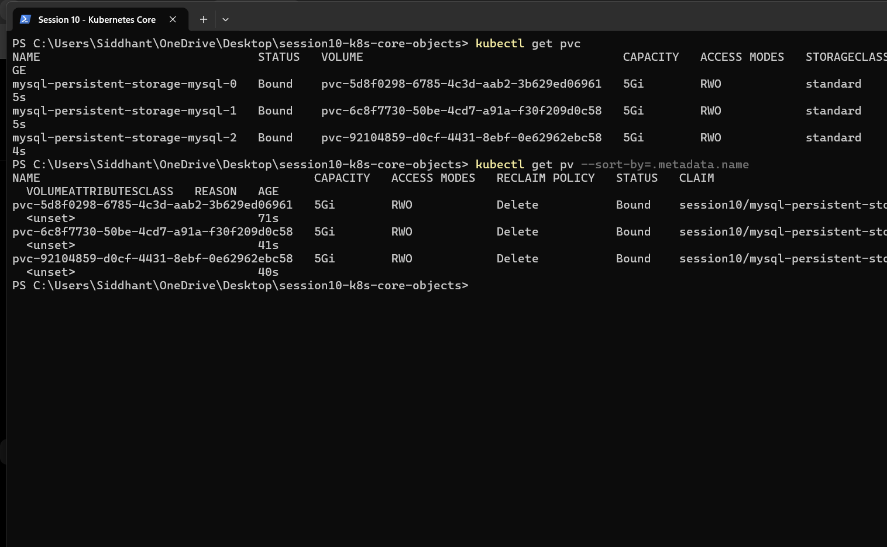

```
PS ...> kubectl get pvc
NAME                               STATUS   VOLUME                                     CAPACITY   ACCESS MODES   STORAGECLASS   VOLUMEATTRIBUTESCLASS   AGE
mysql-persistent-storage-mysql-0   Bound    pvc-5d8f0298-6785-4c3d-aab2-3b629ed06961   5Gi        RWO            standard       <unset>                 65s
mysql-persistent-storage-mysql-1   Bound    pvc-6c8f7730-50be-4cd7-a91a-f30f209d0c58   5Gi        RWO            standard       <unset>                 35s
mysql-persistent-storage-mysql-2   Bound    pvc-92104859-d0cf-4431-8ebf-0e62962ebc58   5Gi        RWO            standard       <unset>                 34s

PS ...> kubectl get pv --sort-by=.metadata.name
NAME                                       CAPACITY   ACCESS MODES   RECLAIM POLICY   STATUS   CLAIM                                        STORAGECLASS   AGE
pvc-5d8f0298-6785-4c3d-aab2-3b629ed06961   5Gi        RWO            Delete           Bound    session10/mysql-persistent-storage-mysql-0   standard       71s
pvc-6c8f7730-50be-4cd7-a91a-f30f209d0c58   5Gi        RWO            Delete           Bound    session10/mysql-persistent-storage-mysql-1   standard       41s
pvc-92104859-d0cf-4431-8ebf-0e62962ebc58   5Gi        RWO            Delete           Bound    session10/mysql-persistent-storage-mysql-2   standard       40s
```

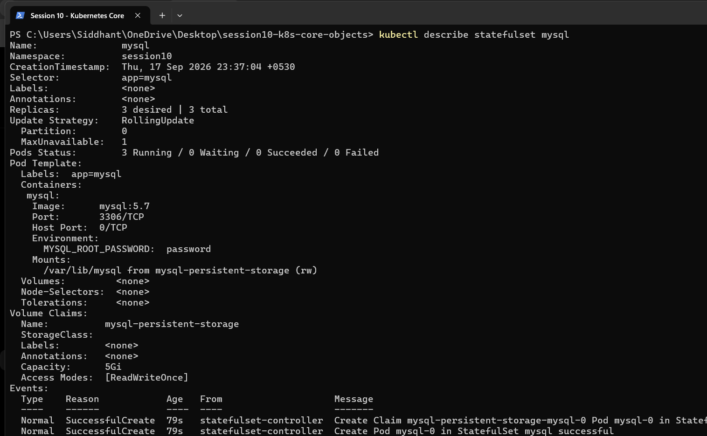

```
PS ...> kubectl describe statefulset mysql
Name:               mysql
Namespace:          session10
Selector:           app=mysql
Replicas:           3 desired | 3 total
Update Strategy:    RollingUpdate
  Partition:        0
  MaxUnavailable:   1
Pods Status:        3 Running / 0 Waiting / 0 Succeeded / 0 Failed
Pod Template:
  Containers:
   mysql:
    Image:      mysql:5.7
    Port:       3306/TCP
    Environment:
      MYSQL_ROOT_PASSWORD:  password
    Mounts:
      /var/lib/mysql from mysql-persistent-storage (rw)
Volume Claims:
  Name:          mysql-persistent-storage
  Capacity:      5Gi
  Access Modes:  [ReadWriteOnce]
Events:
  Normal  SuccessfulCreate  79s  statefulset-controller  Create Claim mysql-persistent-storage-mysql-0 Pod mysql-0 in StatefulSet mysql success
  Normal  SuccessfulCreate  79s  statefulset-controller  Create Pod mysql-0 in StatefulSet mysql successful
  Normal  SuccessfulCreate  49s  statefulset-controller  Create Claim mysql-persistent-storage-mysql-1 Pod mysql-1 in StatefulSet mysql success
  Normal  SuccessfulCreate  49s  statefulset-controller  Create Pod mysql-1 in StatefulSet mysql successful
  Normal  SuccessfulCreate  48s  statefulset-controller  Create Claim mysql-persistent-storage-mysql-2 Pod mysql-2 in StatefulSet mysql success
  Normal  SuccessfulCreate  48s  statefulset-controller  Create Pod mysql-2 in StatefulSet mysql successful
```

### Explanation

- **Stable, ordered identity.** The Pods are named `mysql-0`, `mysql-1`, `mysql-2` — predictable ordinals, no random suffix anywhere. Compare with `myapp-5b9587f95d-6tt7g` from the Deployment.
- **Ordered creation is visible in the ages and the events.** `mysql-0` is 55s old while `mysql-1` and `mysql-2` are 25s and 24s: the controller waited for `mysql-0` to become Ready (which included pulling `mysql:5.7` and initialising the data directory) before starting the next. The event timestamps confirm the same sequence: 79s → 49s → 48s.
- **One PVC per Pod, not one shared volume.** Three PVCs exist, named `mysql-persistent-storage-mysql-<n>` = `volumeClaimTemplates` name + Pod name. All three are `Bound`, 5Gi, `RWO`, on Minikube's default `standard` StorageClass, and each is backed by its own dynamically provisioned PV. The `CLAIM` column of `kubectl get pv` shows the one-to-one binding.
- **The storage outlives the Pod.** PVCs created from `volumeClaimTemplates` are deliberately *not* deleted when the StatefulSet or its Pods are deleted, so `mysql-1` always comes back to its own data — note the PVs' `RECLAIM POLICY: Delete` applies to the PV when its *claim* goes away, not when a Pod restarts.
- `describe` also shows `Update Strategy: RollingUpdate` with `Partition: 0`, the StatefulSet's ordered update mechanism, plus the `/var/lib/mysql` mount coming from the claim template.
- **Minikube storage note:** no storage problem occurred. Minikube's built-in `storage-provisioner` (the `standard` StorageClass) provisioned all three volumes and all three bound within seconds. On a cluster with no default StorageClass, these PVCs would instead sit in `Pending` and the Pods would stay `Pending` too.

### StatefulSet vs Deployment

| | Deployment | StatefulSet |
|---|---|---|
| Pod names | random suffix (`myapp-5b9587f95d-6tt7g`) | stable ordinals (`mysql-0`) |
| Pod identity | interchangeable, disposable | sticky; identity is part of the contract |
| Start/stop order | all at once, any order | sequential `0 → 1 → 2`; deleted in reverse |
| Storage | usually shared or none; all replicas use the same PVC if any | one PVC per Pod from `volumeClaimTemplates` |
| Network identity | via a load-balanced Service | per-Pod DNS via the headless Service |
| Replacement Pod | new name, no memory of the old one | same name, **same** PVC and data |

### Key takeaway

Use a Deployment when any replica will do; use a StatefulSet when "which replica" matters — because it owns data on disk or because peers must find each other by a predictable name.

---

## 5. DaemonSet

### Concept

A **DaemonSet** does not take a `replicas` field. Instead, its controller ensures **exactly one Pod per eligible node**, and the replica count is therefore derived from the cluster itself:

- add a node → a Pod is automatically scheduled onto it,
- remove a node → its Pod goes with it,
- `nodeSelector`, affinity and taints/tolerations decide which nodes are "eligible".

This is the natural shape for **node-level agents**, where the workload must be *on* every machine rather than merely *somewhere* in the cluster: metrics exporters (as here), log collectors (Fluent Bit, Filebeat), CNI network plugins, CSI storage drivers, and security/monitoring agents.

The reference manifest runs **`prom/node-exporter`**, the Prometheus exporter that reads per-node CPU, memory, disk and network metrics and serves them on port `9100` — a textbook DaemonSet use case, since node metrics are only meaningful when collected from every node.

### YAML — `k8s-core-objects/deamonset.yml`

*(reproduced exactly as it appears in the reference repository, including the filename spelling)*

```yaml
apiVersion: apps/v1
kind: DaemonSet
metadata:
  name: node-exporter
spec:
  selector:
    matchLabels:
      app: node-exporter
  template:
    metadata:
      labels:
        app: node-exporter
    spec:
      containers:
        - name: node-exporter
          image: prom/node-exporter
          ports:
            - containerPort: 9100
```

The DaemonSet name taken from the manifest is **`node-exporter`**, which is the name used in the `describe` command below.

### Commands

```powershell
kubectl apply -f k8s-core-objects/deamonset.yml
kubectl get daemonset
kubectl get nodes
kubectl get pods -l app=node-exporter -o wide
kubectl get daemonset node-exporter
kubectl describe daemonset node-exporter
```

### Output / Verification

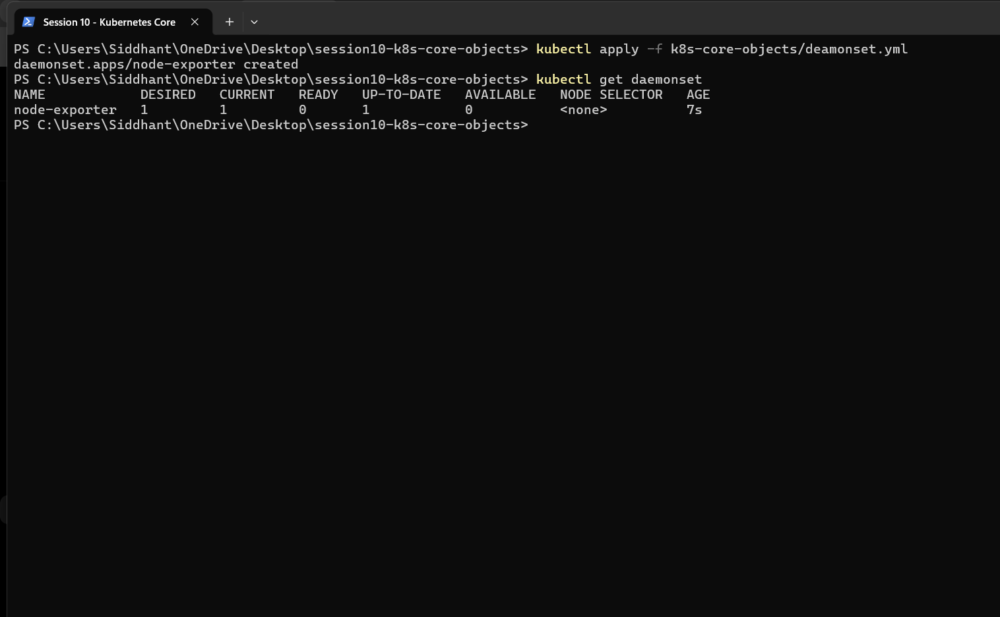

```
PS ...> kubectl apply -f k8s-core-objects/deamonset.yml
daemonset.apps/node-exporter created
PS ...> kubectl get daemonset
NAME            DESIRED   CURRENT   READY   UP-TO-DATE   AVAILABLE   NODE SELECTOR   AGE
node-exporter   1         1         0       1            0           <none>          7s
```

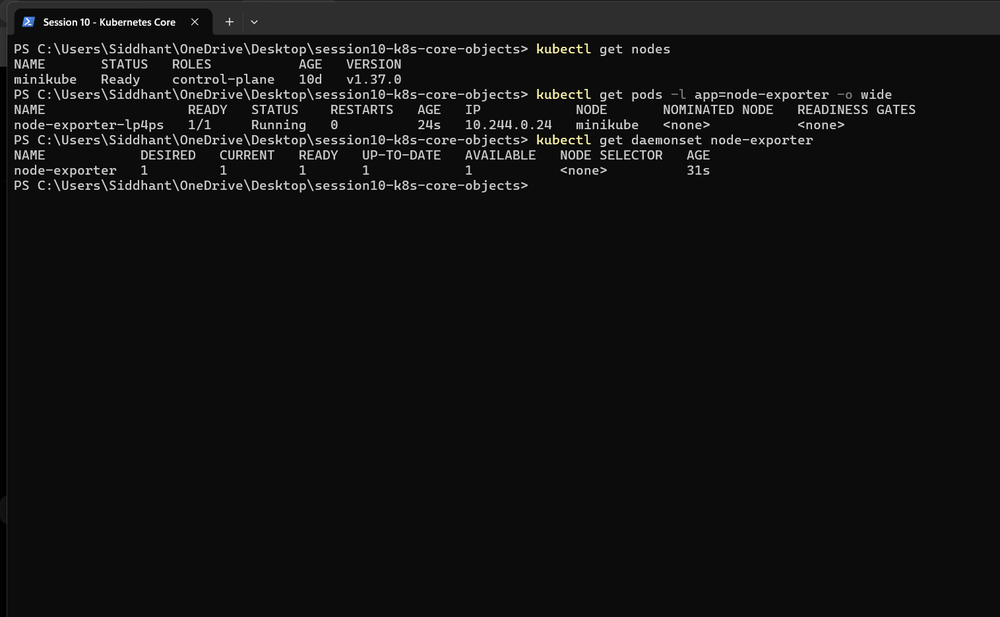

```
PS ...> kubectl get nodes
NAME       STATUS   ROLES           AGE   VERSION
minikube   Ready    control-plane   10d   v1.37.0
PS ...> kubectl get pods -l app=node-exporter -o wide
NAME                  READY   STATUS    RESTARTS   AGE   IP            NODE       NOMINATED NODE   READINESS GATES
node-exporter-lp4ps   1/1     Running   0          24s   10.244.0.24   minikube   <none>           <none>
PS ...> kubectl get daemonset node-exporter
NAME            DESIRED   CURRENT   READY   UP-TO-DATE   AVAILABLE   NODE SELECTOR   AGE
node-exporter   1         1         1       1            1           <none>          31s
```

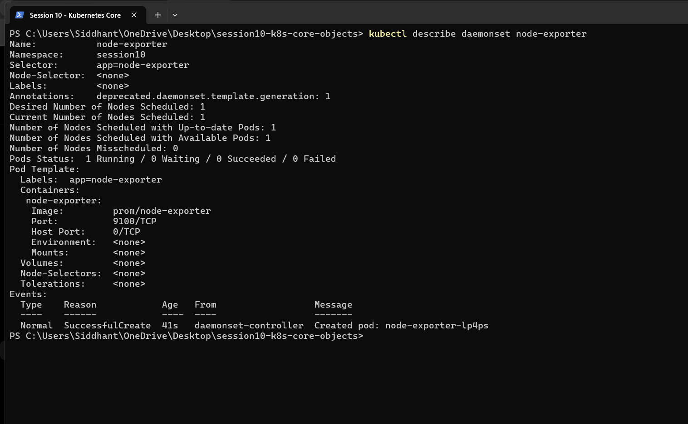

```
PS ...> kubectl describe daemonset node-exporter
Name:           node-exporter
Namespace:      session10
Selector:       app=node-exporter
Node-Selector:  <none>
Desired Number of Nodes Scheduled: 1
Current Number of Nodes Scheduled: 1
Number of Nodes Scheduled with Up-to-date Pods: 1
Number of Nodes Scheduled with Available Pods: 1
Number of Nodes Misscheduled: 0
Pods Status:  1 Running / 0 Waiting / 0 Succeeded / 0 Failed
Pod Template:
  Labels:  app=node-exporter
  Containers:
   node-exporter:
    Image:         prom/node-exporter
    Port:          9100/TCP
Events:
  Type    Reason            Age   From                  Message
  ----    ------            ----  ----                  -------
  Normal  SuccessfulCreate  41s   daemonset-controller  Created pod: node-exporter-lp4ps
```

### Explanation

- **`DESIRED` is 1 here because this cluster genuinely has exactly one node.** `kubectl get nodes` returns a single node, `minikube` (role `control-plane`). The manifest never says `1`; the DaemonSet controller counted the eligible nodes and derived it. On a three-node cluster the very same YAML would report `DESIRED 3` and create three Pods. **No multi-node behaviour is claimed from this run — it was not observed.**
- `describe` states this directly in node terms rather than replica terms: `Desired Number of Nodes Scheduled: 1`, `Number of Nodes Misscheduled: 0`.
- `Node-Selector: <none>` means every node is eligible; no node was filtered out.
- A detail worth noting: on a normal multi-node cluster, control-plane nodes usually carry a `NoSchedule` taint, so a DaemonSet without a matching toleration would skip them. This single-node Minikube node is a control-plane node **and** still received the Pod, because Minikube does not apply that taint to its single-node profile — otherwise this DaemonSet, which declares no tolerations, would have had `DESIRED 0`.
- The first `kubectl get daemonset` was taken 7s after apply and honestly shows `READY 0` / `AVAILABLE 0` while the `prom/node-exporter` image was still being pulled; 31s later the same command shows `1/1` everywhere. The Pod is `node-exporter-lp4ps` on node `minikube`.

### Key takeaway

A DaemonSet's scale is a property of the **cluster**, not of the manifest. You declare "one per node" and let node membership and scheduling rules decide the number.

---

## Kubernetes Object Comparison

| Object | Main Purpose | Pod Identity | Scaling/Placement |
|---|---|---|---|
| Pod | Run containers | Direct Pod | Manual |
| ReplicaSet | Maintain replica count | Disposable | Replica count |
| Deployment | Manage stateless workloads | Disposable | Declarative |
| StatefulSet | Stateful workloads | Stable | Ordered/stable |
| DaemonSet | Node-level workloads | Per-node | Node-based |

---

## Verification Summary

All five objects were left running in the `session10` namespace and verified together at the end:

```powershell
kubectl get pods
kubectl get rs
kubectl get deployments
kubectl get statefulsets
kubectl get daemonsets
kubectl get pvc
```

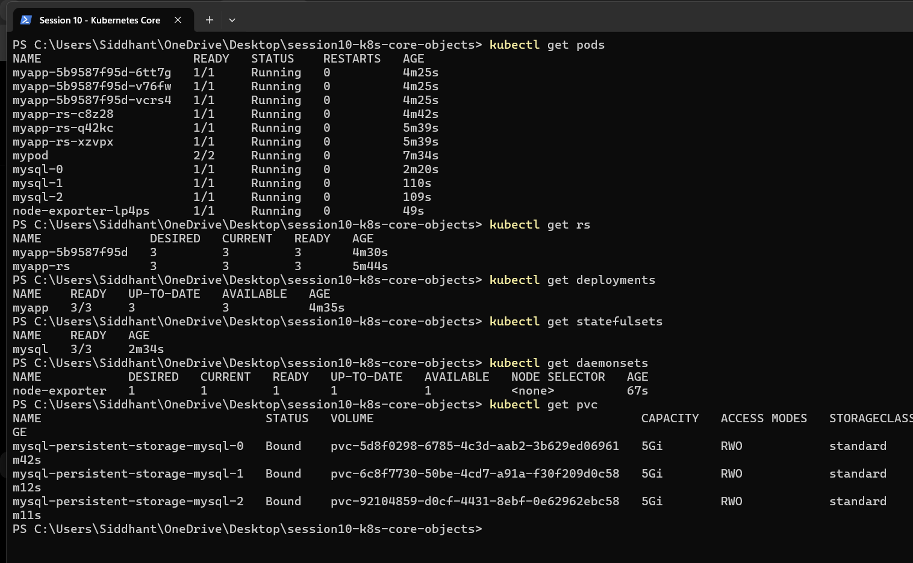

```
PS ...> kubectl get pods
NAME                     READY   STATUS    RESTARTS   AGE
myapp-5b9587f95d-6tt7g   1/1     Running   0          4m25s
myapp-5b9587f95d-v76fw   1/1     Running   0          4m25s
myapp-5b9587f95d-vcrs4   1/1     Running   0          4m25s
myapp-rs-c8z28           1/1     Running   0          4m42s
myapp-rs-q42kc           1/1     Running   0          5m39s
myapp-rs-xzvpx           1/1     Running   0          5m39s
mypod                    2/2     Running   0          7m34s
mysql-0                  1/1     Running   0          2m20s
mysql-1                  1/1     Running   0          110s
mysql-2                  1/1     Running   0          109s
node-exporter-lp4ps      1/1     Running   0          49s

PS ...> kubectl get rs
NAME               DESIRED   CURRENT   READY   AGE
myapp-5b9587f95d   3         3         3       4m30s
myapp-rs           3         3         3       5m44s

PS ...> kubectl get deployments
NAME    READY   UP-TO-DATE   AVAILABLE   AGE
myapp   3/3     3            3           4m35s

PS ...> kubectl get statefulsets
NAME    READY   AGE
mysql   3/3     2m34s

PS ...> kubectl get daemonsets
NAME            DESIRED   CURRENT   READY   UP-TO-DATE   AVAILABLE   NODE SELECTOR   AGE
node-exporter   1         1         1       1            1           <none>          67s

PS ...> kubectl get pvc
NAME                               STATUS   VOLUME                                     CAPACITY   ACCESS MODES   STORAGECLASS   AGE
mysql-persistent-storage-mysql-0   Bound    pvc-5d8f0298-6785-4c3d-aab2-3b629ed06961   5Gi        RWO            standard       2m42s
mysql-persistent-storage-mysql-1   Bound    pvc-6c8f7730-50be-4cd7-a91a-f30f209d0c58   5Gi        RWO            standard       2m12s
mysql-persistent-storage-mysql-2   Bound    pvc-92104859-d0cf-4431-8ebf-0e62962ebc58   5Gi        RWO            standard       2m11s
```

**11 Pods, all `Running`, zero restarts**, accounted for exactly as expected:

| Source | Pods | Count |
|---|---|---|
| Pod (`pod.yml`) | `mypod` (2 containers) | 1 |
| ReplicaSet (`replicaset.yml`) | `myapp-rs-*` — includes the self-healed `c8z28` | 3 |
| Deployment (`deployment.yml`) | `myapp-5b9587f95d-*` | 3 |
| StatefulSet (`statefulset.yml`) | `mysql-0`, `mysql-1`, `mysql-2` | 3 |
| DaemonSet (`deamonset.yml`) | `node-exporter-lp4ps` (1 node) | 1 |

Clean separation is confirmed: two distinct ReplicaSets (the standalone `myapp-rs` and the Deployment-owned `myapp-5b9587f95d`) each hold exactly their own 3 Pods, so no selector captured another object's Pods.

---

## Key Learnings

- **Pod** — the unit of scheduling, not the container. `2/2` READY, one shared Pod IP (`10.244.0.11`) and one node for both containers made the shared execution context concrete, and `kubectl logs` demanded `-c` to disambiguate.
- **ReplicaSet** — guarantees a *count* via a label selector and a never-ending reconciliation loop. Deleting `myapp-rs-gr77f` produced a *differently named* replacement (`myapp-rs-c8z28`, 6s old) within seconds: self-healing replaces Pods, it does not resurrect them. It also showed how a broad selector can adopt unrelated Pods — the reason this assignment ran in its own namespace.
- **Deployment** — adds a revision layer. The real names proved the chain `myapp → myapp-5b9587f95d → myapp-5b9587f95d-*`, and `ownerReferences` showed Pods are owned by the ReplicaSet, not the Deployment. Scaling 3→5→3 changed the count without creating a new ReplicaSet revision.
- **StatefulSet** — trades interchangeability for identity: ordinal names, sequential start-up (visible in the 55s/25s/24s ages), and one PVC per Pod from `volumeClaimTemplates`, each Bound to its own dynamically provisioned 5Gi volume. MySQL was just the example; the object is about identity and storage, not databases.
- **DaemonSet** — the only workload object whose scale comes from the cluster. `DESIRED 1` here because there is genuinely one node; the identical YAML would say `DESIRED 3` on three nodes.
- **Practical lessons** — `kubectl get` answers *what*, `describe` answers *why* (its `Events` section is where each controller narrates its own decisions); and label selectors are powerful enough to be dangerous, since they silently claim any matching Pod.

---

## Screenshot Index

| # | Screenshot | Demonstrates |
|---|---|---|
| 00 | [00-environment.png](screenshots/00-environment.png) | Minikube v1.39.0, kubectl v1.34.1, cluster Running, single node `minikube` v1.37.0 |
| 01 | [01-pod-apply.png](screenshots/pod/01-pod-apply.png) | `pod/mypod created`; Pod first seen as `0/2 ContainerCreating` |
| 02 | [02-pod-get.png](screenshots/pod/02-pod-get.png) | `2/2 Running`, single Pod IP `10.244.0.11`, containers `app logger` |
| 03 | [03-pod-describe.png](screenshots/pod/03-pod-describe.png) | Two separate container blocks with their own images and image IDs |
| 04 | [04-pod-logs.png](screenshots/pod/04-pod-logs.png) | Independent log streams: `log` lines from `logger`, nginx startup from `app` |
| 05 | [05-replicaset-apply.png](screenshots/replicaset/05-replicaset-apply.png) | `replicaset.apps/myapp-rs created`; `DESIRED 3 / CURRENT 3 / READY 3` |
| 06 | [06-replicaset-pods.png](screenshots/replicaset/06-replicaset-pods.png) | Three generated `myapp-rs-*` Pods with distinct IPs |
| 07 | [07-replicaset-describe.png](screenshots/replicaset/07-replicaset-describe.png) | `Selector: app=web`, Pod template, three `SuccessfulCreate` events |
| 08 | [08-replicaset-self-healing.png](screenshots/replicaset/08-replicaset-self-healing.png) | **Self-healing:** `gr77f` deleted → new `c8z28` (6s) restores the count to 3 |
| 09 | [09-deployment-apply.png](screenshots/deployment/09-deployment-apply.png) | `deployment.apps/myapp created`; `READY 3/3` |
| 10 | [10-deployment-status.png](screenshots/deployment/10-deployment-status.png) | `successfully rolled out`; auto-created ReplicaSet `myapp-5b9587f95d` beside `myapp-rs` |
| 11 | [11-deployment-pods.png](screenshots/deployment/11-deployment-pods.png) | Deployment → ReplicaSet → Pod chain proved via `ownerReferences` |
| 12 | [12-deployment-scaling.png](screenshots/deployment/12-deployment-scaling.png) | Scale 3→5 (`5/5`, two new Pods at 14s) then back to 3 |
| 13 | [13-statefulset-apply.png](screenshots/statefulset/13-statefulset-apply.png) | No Service existed → headless `mysql` (`CLUSTER-IP None`) created → StatefulSet applied |
| 14 | [14-statefulset-pods.png](screenshots/statefulset/14-statefulset-pods.png) | Stable ordinals `mysql-0/1/2`; ages 55s/25s/24s show ordered start-up |
| 15 | [15-statefulset-pvc.png](screenshots/statefulset/15-statefulset-pvc.png) | Three per-Pod PVCs `Bound` to three separate 5Gi PVs on `standard` |
| 16 | [16-statefulset-describe.png](screenshots/statefulset/16-statefulset-describe.png) | `Volume Claims` template, `/var/lib/mysql` mount, ordered Create Claim/Pod events |
| 17 | [17-daemonset-apply.png](screenshots/deamonset/17-daemonset-apply.png) | `daemonset.apps/node-exporter created`; `DESIRED 1` derived from the cluster |
| 18 | [18-daemonset-pods.png](screenshots/deamonset/18-daemonset-pods.png) | One node → one Pod `node-exporter-lp4ps`; DaemonSet reaches `1/1` |
| 19 | [19-daemonset-describe.png](screenshots/deamonset/19-daemonset-describe.png) | `Desired Number of Nodes Scheduled: 1`, `Misscheduled: 0`, port 9100 |
| 20 | [20-final-verification.png](screenshots/20-final-verification.png) | All 11 Pods Running across all five objects, plus 3 Bound PVCs |

---

## Notes on Fidelity

- The five manifests in `k8s-core-objects/` were downloaded from the reference repository and verified byte-for-byte by MD5 — no renaming (`deamonset.yml` kept), no `.yml`→`.yaml` change, no image substitutions (`nginx`, `busybox`, `mysql:5.7`, `prom/node-exporter` all as published), and no numbered sub-directories.
- The only added file is `supporting/mysql-headless-service.yml`, kept deliberately outside `k8s-core-objects/` and justified in section 4.
- Every screenshot is a capture of the real PowerShell window in which the commands ran, at `C:\Users\Siddhant\OneDrive\Desktop\session10-k8s-core-objects`. No output was typed, edited or reconstructed; the transcripts quoted in this README are copied from that same session. Where a command was caught mid-progress (`0/2 ContainerCreating`, DaemonSet `READY 0`), the real intermediate state is shown rather than a tidied-up one.
- Some wide outputs (`kubectl get pvc`, `kubectl get pv`, `kubectl get nodes -o wide`) wrap in the 140-column terminal; the code blocks above show the same rows unwrapped for readability, with no values altered.
