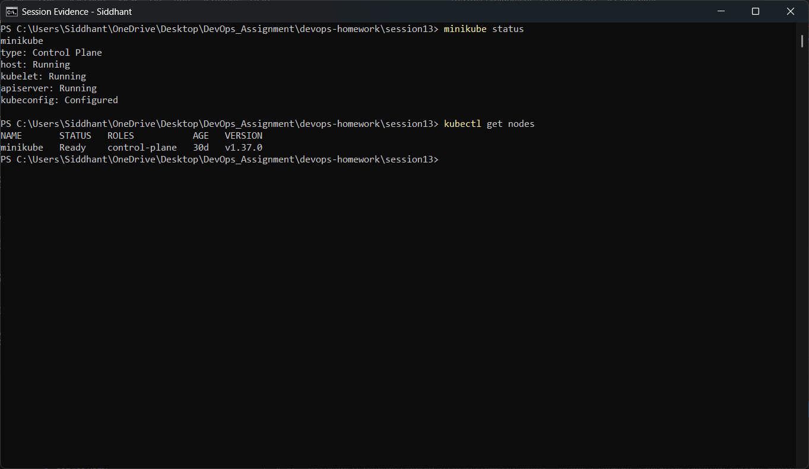
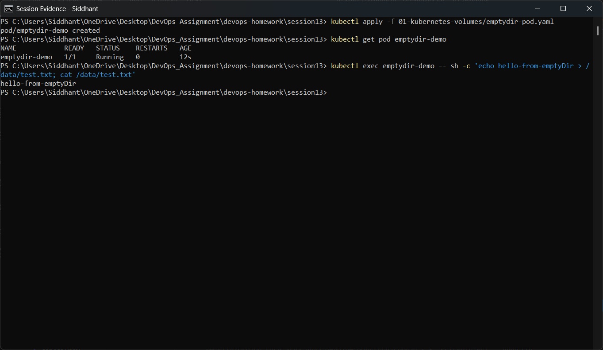
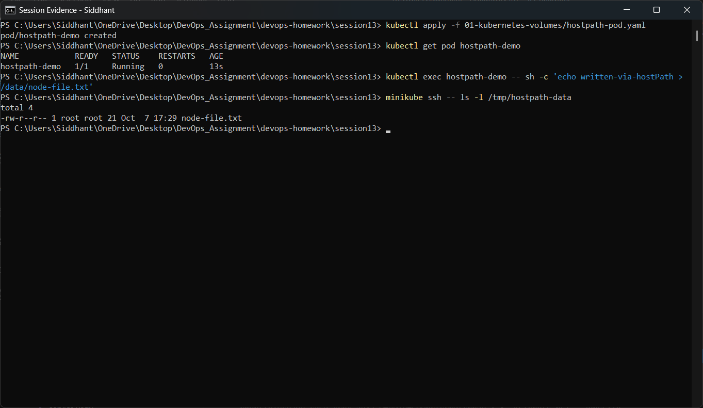
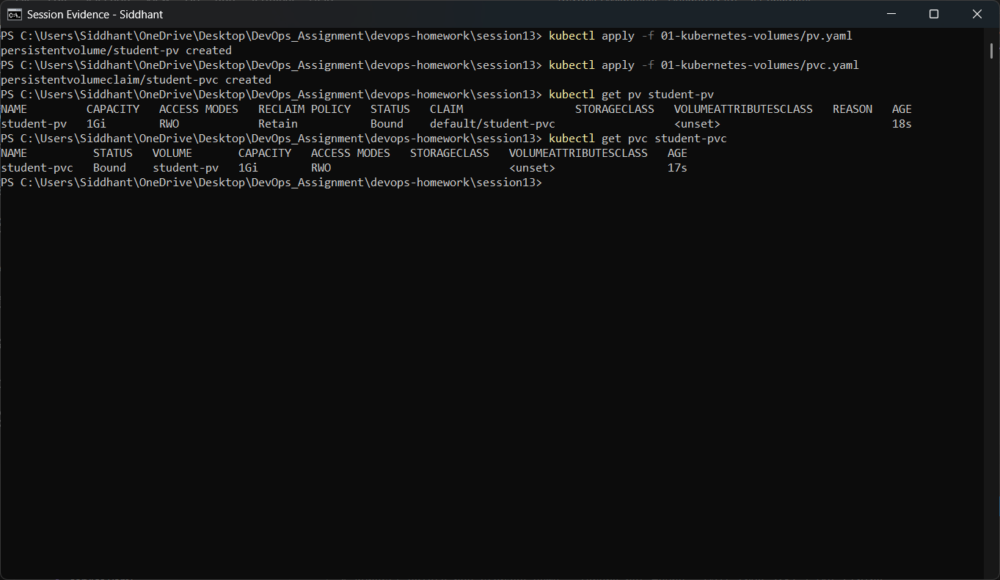
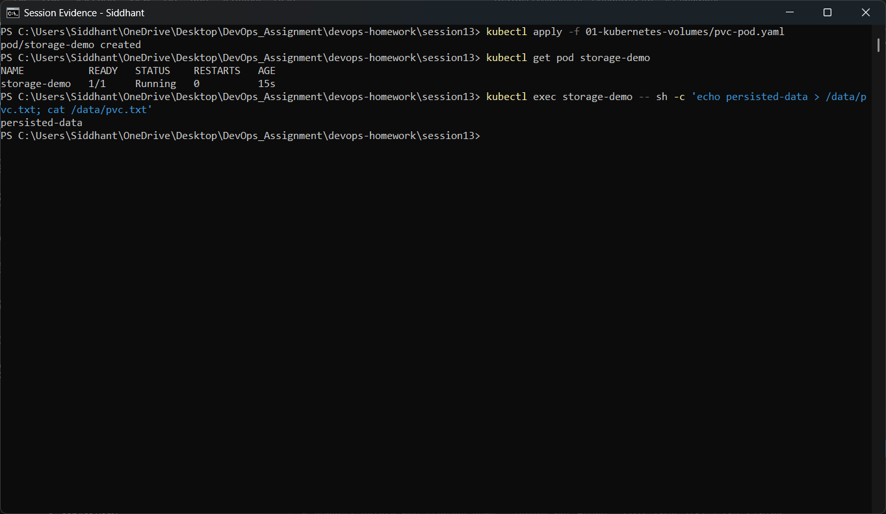
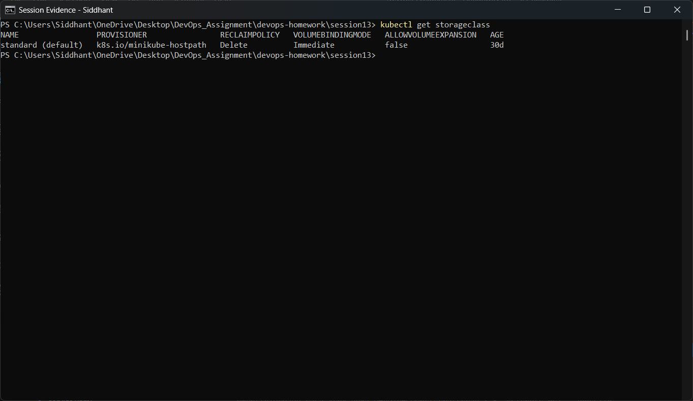
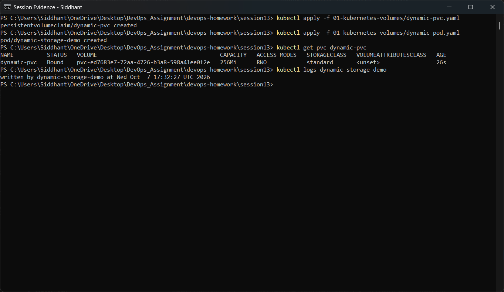
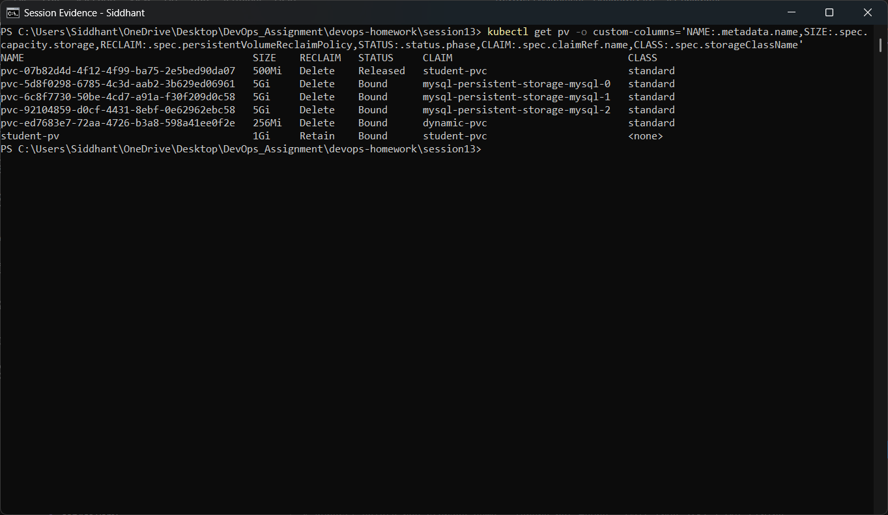
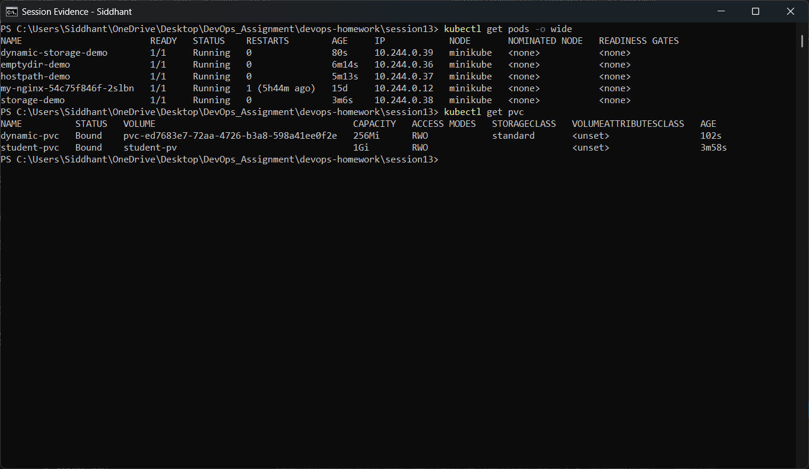

# Session 13 — Task 1: Kubernetes Volumes

**Student:** Siddhant Prasad (24BCS10255)
**Environment:** Windows 11 · Docker Desktop · Minikube (Kubernetes v1.37.0) · kubectl v1.34.1

---

## 1. Why volumes exist

A container's filesystem is **ephemeral**. When a container restarts, everything written inside
it is gone — the kubelet starts a fresh container from the same immutable image. That is fine for
stateless web servers, but useless for databases, uploads, caches or logs.

A Kubernetes **Volume** is storage that is attached to a Pod and mounted into one or more of its
containers. The volume's lifetime is decided by its *type*, not by the container:

| Scope | Volume type | Survives container restart? | Survives Pod deletion? | Survives node loss? |
|---|---|---|---|---|
| Pod | `emptyDir` | Yes | No | No |
| Node | `hostPath` | Yes | Yes (data stays on node) | No |
| Cluster | `PersistentVolume` + `PVC` | Yes | Yes | Yes (with real network storage) |

---

## 2. Volume types covered

### 2.1 emptyDir

An empty directory created when the Pod is assigned to a node. All containers in the Pod can
mount it, which makes it the standard way to **share files between containers in one Pod**.
Deleted permanently when the Pod is removed.

Use it for: scratch space, caches, a sidecar handing files to the main container.

```yaml
volumes:
  - name: shared-storage
    emptyDir: {}
```

### 2.2 hostPath

Mounts a file or directory **from the node's own filesystem** into the Pod. Data outlives the Pod
because it lives on the node, but the Pod is now tied to that specific node, and it can read the
host's filesystem — a real security concern. Production clusters usually forbid it.

Use it for: node-level agents (log collectors, monitoring) that genuinely need host files.

```yaml
volumes:
  - name: host-storage
    hostPath:
      path: /tmp/hostpath-data
      type: DirectoryOrCreate
```

### 2.3 PersistentVolume (PV)

A **cluster-level** piece of storage, provisioned by an administrator or dynamically by a
StorageClass. It is an object in its own right, independent of any Pod — it has a capacity,
access modes and a reclaim policy.

Access modes:

| Mode | Short | Meaning |
|---|---|---|
| ReadWriteOnce | RWO | Mounted read-write by a single **node** |
| ReadOnlyMany | ROX | Mounted read-only by many nodes |
| ReadWriteMany | RWX | Mounted read-write by many nodes |

Reclaim policies: `Retain` (keep the data after the claim is deleted), `Delete` (destroy the
underlying volume).

### 2.4 PersistentVolumeClaim (PVC)

A **request** for storage made by a developer: "I need 500Mi, ReadWriteOnce." Kubernetes matches
the claim to a suitable PV and **binds** them. The Pod then refers to the *claim*, never to the
volume directly. This is the key abstraction — the application does not need to know whether the
storage is a hostPath, an AWS EBS volume or a Ceph block device.

```yaml
volumes:
  - name: persistent-storage
    persistentVolumeClaim:
      claimName: student-pvc
```

### 2.5 StorageClass

Describes a *class* of storage the cluster can provision on demand — which provisioner to use,
with which parameters, and what happens on delete. Minikube ships a default class called
`standard` backed by its hostPath provisioner.

### 2.6 Dynamic provisioning

With a StorageClass present, nobody has to pre-create PVs. The developer submits a PVC naming a
StorageClass, and the provisioner **creates the PersistentVolume automatically**. This is how
storage works on every real cloud cluster.

Static vs dynamic, side by side:

```
STATIC                                 DYNAMIC
------                                 -------
admin creates PV   ──┐                 developer creates PVC
                     ├── bind                    │
developer creates PVC┘                           ▼
                                       StorageClass provisioner
                                                 │
                                                 ▼
                                       PV created automatically ── bind
```

An important detail proven in this task: a PVC with **no** `storageClassName` field does *not*
stay unbound waiting for a matching PV — it goes to the **default** StorageClass and gets a brand
new dynamic volume. To force binding to a hand-made PV you must set `storageClassName: ""`,
which is exactly what `pvc.yaml` in this folder does.

---

## 3. Files in this folder

| File | Purpose |
|---|---|
| `emptydir-pod.yaml` | Pod with an `emptyDir` volume mounted at `/data` |
| `hostpath-pod.yaml` | Pod with a `hostPath` volume mounted at `/data` |
| `pv.yaml` | Static 1Gi PersistentVolume (`student-pv`, reclaim `Retain`) |
| `pvc.yaml` | 500Mi claim with `storageClassName: ""` so it binds to `student-pv` |
| `pvc-pod.yaml` | Pod consuming the claim (`storage-demo`) |
| `dynamic-pvc.yaml` | 256Mi claim against the `standard` StorageClass |
| `dynamic-pod.yaml` | Pod writing to the dynamically provisioned volume |

---

## 4. Execution evidence

### 4.1 Environment

```powershell
minikube status
kubectl get nodes
```



The control plane, kubelet and apiserver are all `Running` and the single `minikube` node is
`Ready` on Kubernetes v1.37.0 — the cluster used for every command below.

---

### 4.2 emptyDir

```powershell
kubectl apply -f 01-kubernetes-volumes/emptydir-pod.yaml
kubectl get pod emptydir-demo
kubectl exec emptydir-demo -- sh -c 'echo hello-from-emptyDir > /data/test.txt; cat /data/test.txt'
```



The Pod reaches `Running`, and writing to `/data` then reading it back returns
`hello-from-emptyDir`. The directory exists only because the Pod exists — deleting the Pod
discards it.

---

### 4.3 hostPath

```powershell
kubectl apply -f 01-kubernetes-volumes/hostpath-pod.yaml
kubectl get pod hostpath-demo
kubectl exec hostpath-demo -- sh -c 'echo written-via-hostPath > /data/node-file.txt'
minikube ssh -- ls -l /tmp/hostpath-data
```



This is the proof that `hostPath` really touches the node: the file is written *inside the
container* at `/data/node-file.txt`, and then `minikube ssh` lists `/tmp/hostpath-data` on the
**node itself** and the file is there. The data is now independent of the Pod.

---

### 4.4 Static PersistentVolume and PersistentVolumeClaim

```powershell
kubectl apply -f 01-kubernetes-volumes/pv.yaml
kubectl apply -f 01-kubernetes-volumes/pvc.yaml
kubectl get pv student-pv
kubectl get pvc student-pvc
```



Both objects report `Bound`, and the `CLAIM` column on the PV points at `default/student-pvc`
while the PVC's `VOLUME` column points back at `student-pv`. The binding is mutual and
exclusive — no other claim can take this volume. Capacity stays 1Gi (the PV's size) even though
the claim asked for 500Mi: a claim is a minimum, not a quota.

---

### 4.5 Pod consuming the claim

```powershell
kubectl apply -f 01-kubernetes-volumes/pvc-pod.yaml
kubectl get pod storage-demo
kubectl exec storage-demo -- sh -c 'echo persisted-data > /data/pvc.txt; cat /data/pvc.txt'
```



The Pod mounts the *claim*, not the volume. Its manifest never mentions hostPath, capacity or
reclaim policy — that is the whole point of the PVC abstraction.

---

### 4.6 StorageClass

```powershell
kubectl get storageclass
```



Minikube's `standard` class is marked `(default)` and uses the `k8s.io/minikube-hostpath`
provisioner with `Delete` reclaim policy — so any PVC that does not specify a class gets a
dynamically provisioned volume from it.

---

### 4.7 Dynamic provisioning

```powershell
kubectl apply -f 01-kubernetes-volumes/dynamic-pvc.yaml
kubectl apply -f 01-kubernetes-volumes/dynamic-pod.yaml
kubectl get pvc dynamic-pvc
kubectl logs dynamic-storage-demo
```



No PersistentVolume was written by hand here. The claim named the `standard` StorageClass, the
provisioner created a volume for it, and the claim shows `Bound` with a generated volume name of
the form `pvc-<uuid>`. The Pod's log shows the line it wrote into that volume.

```powershell
kubectl get pv
```



The volume list proves the difference between the two mechanisms: `student-pv` is the one written
by hand (reclaim `Retain`, no StorageClass), while the `pvc-<uuid>` entries were generated
automatically by the `standard` class (reclaim `Delete`).

---

### 4.8 Final state

```powershell
kubectl get pods -o wide
kubectl get pvc
```



All four demo Pods are `Running` on the `minikube` node, and both claims are `Bound` — one to the
static volume, one to a dynamically provisioned volume.

---

## 5. What this task demonstrated

- `emptyDir` gives a Pod scratch space that dies with the Pod.
- `hostPath` writes to the node's filesystem, proven by reading the file over `minikube ssh`.
- A static PV + PVC bind to each other and the Pod consumes only the claim.
- A StorageClass lets a PVC be satisfied **without any pre-created PV** (dynamic provisioning).
- Omitting `storageClassName` silently opts into the default class; `storageClassName: ""` is
  what actually forces static binding.
