# Session 13 — Kubernetes Storage, HPA & Probes

**Student:** Siddhant Prasad (24BCS10255)
**Environment:** Windows 11 · Docker Desktop · Minikube (Kubernetes v1.37.0) · kubectl v1.34.1 · metrics-server addon

| Task | Topic | Folder |
|---|---|---|
| 1 | Kubernetes Volumes | [`01-kubernetes-volumes/`](01-kubernetes-volumes/README.md) |
| 2 | HPA hands-on | `02-hpa/` (documented below) |
| 3 | Mini project — Storage + Probes + HPA | `03-mini-project/` (documented below) |

Task 1 has its own detailed write-up in
[`01-kubernetes-volumes/README.md`](01-kubernetes-volumes/README.md) — emptyDir, hostPath,
PersistentVolume, PersistentVolumeClaim, StorageClass and dynamic provisioning, each with real
terminal evidence.

---

# TASK 2 — Horizontal Pod Autoscaler

## 2.1 What the HPA does

A **HorizontalPodAutoscaler** changes the *number of Pods* in a Deployment based on observed
metrics. It is a control loop that runs every 15 seconds:

```
            ┌──────────────────────────┐
            │   metrics-server         │  collects CPU/memory from kubelets
            └────────────┬─────────────┘
                         │ resource metrics API
                         ▼
            ┌──────────────────────────┐
            │  HPA controller          │  desired = ceil(current × currentUtil / targetUtil)
            └────────────┬─────────────┘
                         │ scales
                         ▼
            ┌──────────────────────────┐
            │  Deployment → ReplicaSet │ → more / fewer Pods
            └──────────────────────────┘
```

Key points:

- Utilisation is measured **against the CPU `requests`**, not the limits. A Pod requesting `100m`
  and burning `300m` reports **300%**.
- `metrics-server` is mandatory. Without it the HPA reports `cpu: <unknown>` and does nothing.
- Scaling **up** is fast; scaling **down** waits for a 5-minute stabilisation window by default,
  so the replica count does not oscillate.

## 2.2 Why `nginx` was replaced with `hpa-example`

The original `deployment.yaml` ran `nginx:1.27`. nginx serving a static page uses roughly `1m` of
CPU no matter how hard it is hammered, so CPU utilisation never approaches the 50% target and the
HPA would never scale — the demo would prove nothing. The image was therefore changed to
`registry.k8s.io/hpa-example` (the php-apache image from the upstream Kubernetes walkthrough),
which performs a CPU-heavy calculation on **every** request. That is what makes the scale-up in
section 2.6 real.

## 2.3 Manifests

`02-hpa/deployment.yaml` — note the `requests.cpu: 100m`, which is the baseline for the
percentage:

```yaml
resources:
  requests:
    cpu: 100m
  limits:
    cpu: 500m
```

`02-hpa/hpa.yaml`:

```yaml
apiVersion: autoscaling/v2
kind: HorizontalPodAutoscaler
metadata:
  name: hpa-demo
spec:
  scaleTargetRef:
    apiVersion: apps/v1
    kind: Deployment
    name: hpa-demo
  minReplicas: 1
  maxReplicas: 5
  metrics:
    - type: Resource
      resource:
        name: cpu
        target:
          type: Utilization
          averageUtilization: 50
```

`02-hpa/load-generator.yaml` runs three busybox Pods in a tight `wget` loop against the Service.

## 2.4 Step 1–2: deploy the application and configure the HPA

```powershell
kubectl apply -f 02-hpa/deployment.yaml
kubectl apply -f 02-hpa/service.yaml
kubectl get pods -l app=hpa-demo
kubectl get svc hpa-demo-service
```

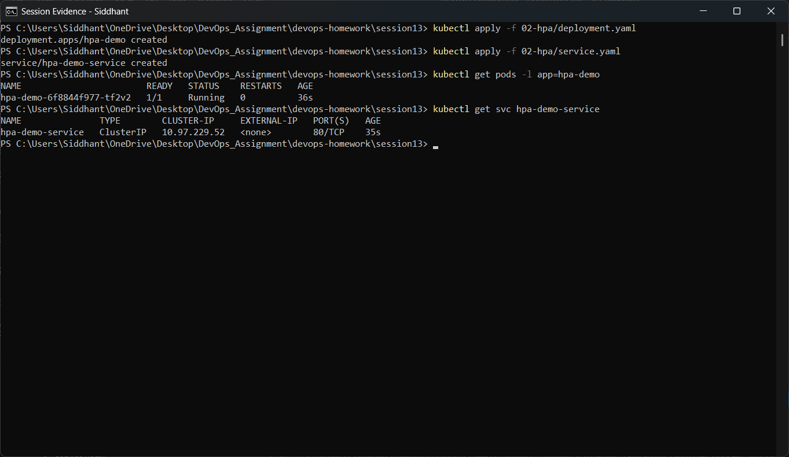

One Pod is `Running` and `hpa-demo-service` has a ClusterIP on port 80 — the address the load
generator will hit.

```powershell
kubectl apply -f 02-hpa/hpa.yaml
kubectl get hpa hpa-demo
```

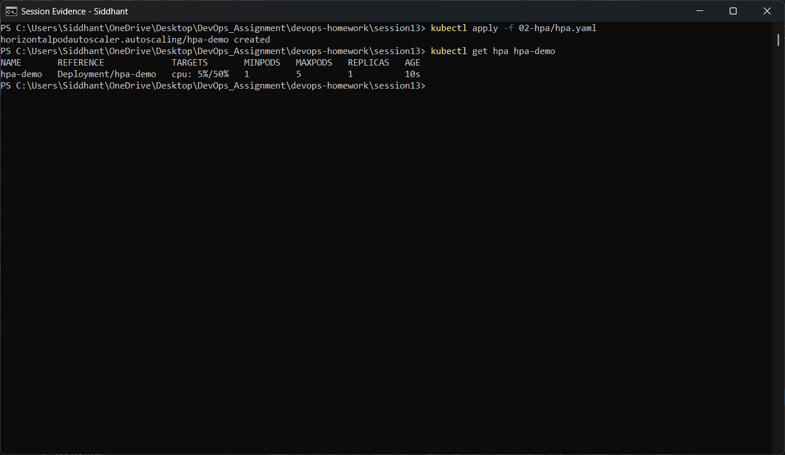

The HPA is created and already targets `Deployment/hpa-demo`. Immediately after creation the
`TARGETS` column reads `cpu: <unknown>/50%` because metrics-server has not reported a sample yet.

## 2.5 Step 3: verify the HPA

```powershell
kubectl get hpa hpa-demo
```

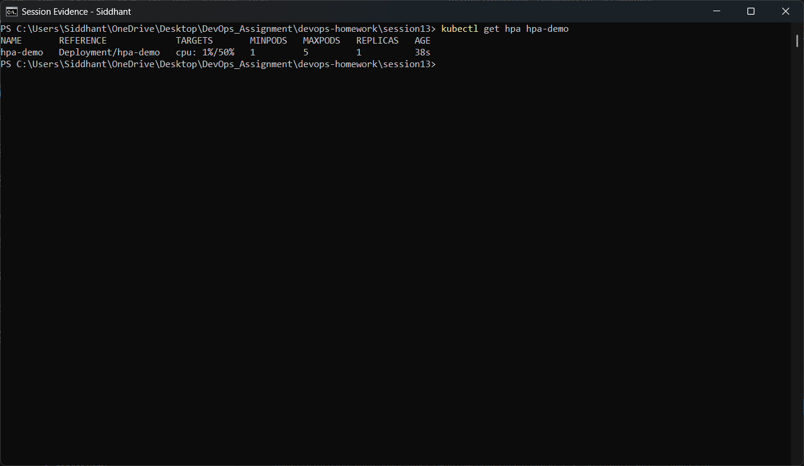

After about a minute the metric resolves and the HPA shows real utilisation against the 50%
target, with `REPLICAS 1` — the idle baseline.

```powershell
kubectl top pods -l app=hpa-demo
```

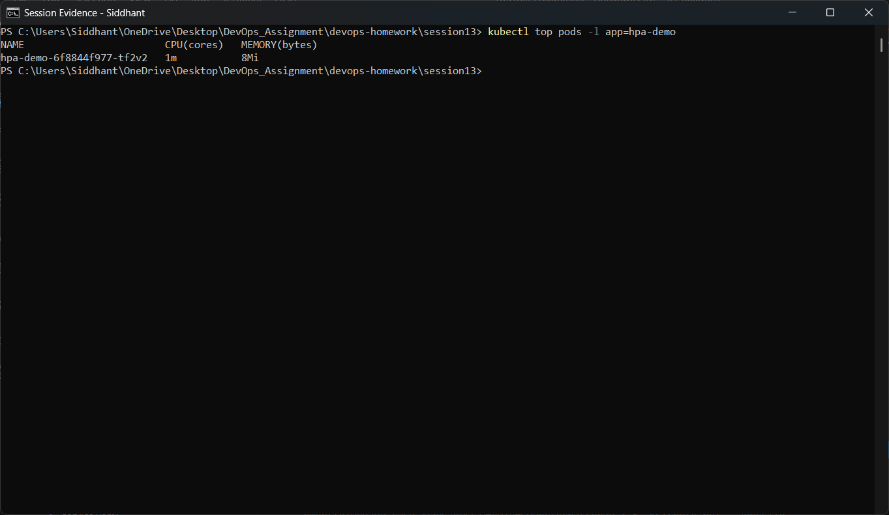

`kubectl top` confirms the Pod is essentially idle before any load is applied.

## 2.6 Steps 4–7: generate load, observe CPU and watch the scaling

```powershell
kubectl apply -f 02-hpa/load-generator.yaml
kubectl get pods -l app=load-generator
```

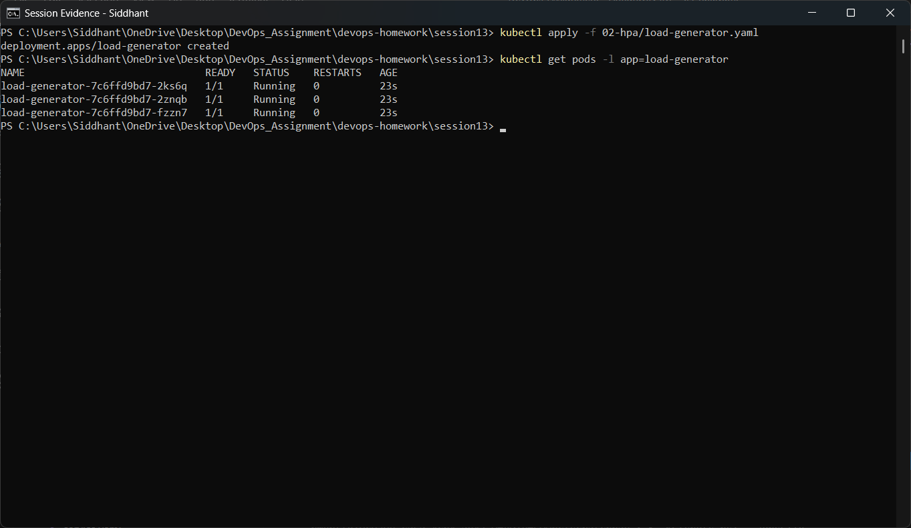

Three load-generator Pods are `Running`, each looping requests at the Service.

```powershell
kubectl top pods -l app=hpa-demo
```

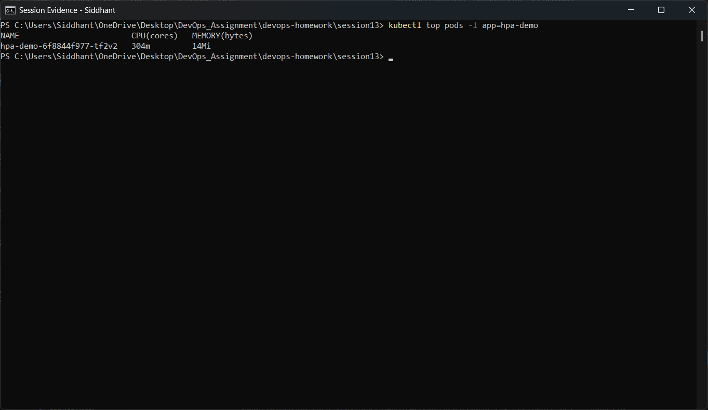

CPU consumption of the application Pods climbs far above the `100m` request — this is the signal
the HPA acts on.

```powershell
kubectl get hpa hpa-demo
kubectl get pods -l app=hpa-demo
```

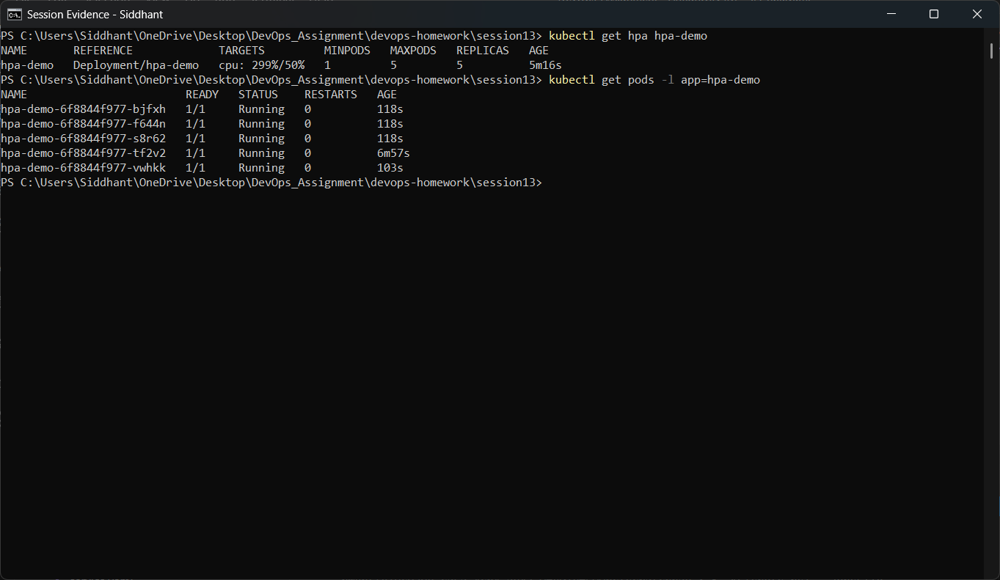

**This is the result of the task.** The HPA reports `cpu: 299%/50%` and has scaled the Deployment
to **5 replicas** — its `maxReplicas` ceiling. All five Pods are `1/1 Running`, and their ages
show the four new ones were created well after the original (which is ~7 minutes old). Utilisation
stayed above target because the load generators simply push as hard as the Pods allow, so the HPA
goes to the ceiling and stops there — exactly the expected behaviour.

## 2.7 Step 8: describe the HPA

```powershell
kubectl describe hpa hpa-demo
```

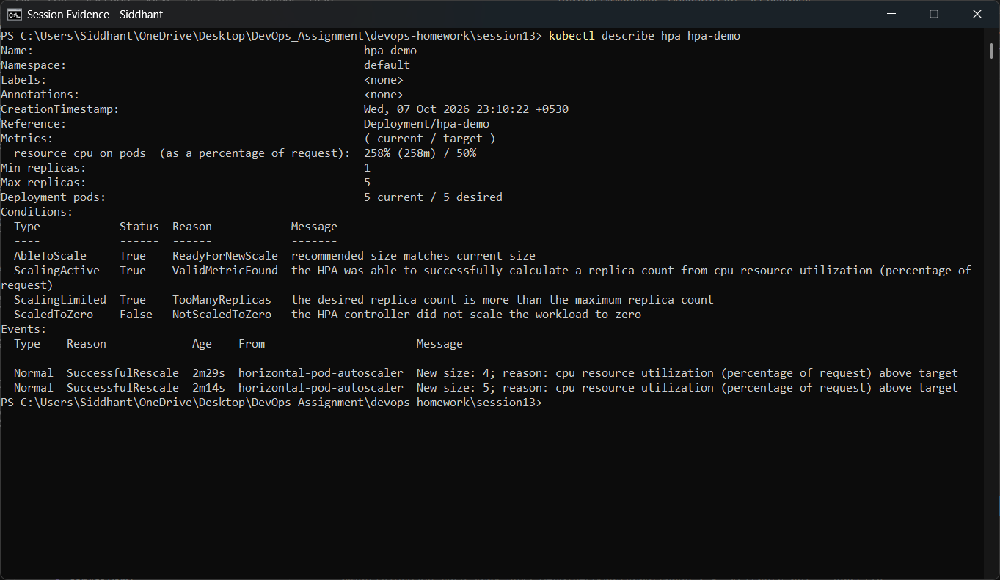

`describe` is the diagnostic view: the metric and target, the current replica count, the
`ScalingActive` / `ScalingLimited` conditions, and an **event log** of each scaling decision the
controller made with its reason.

## 2.8 Scale-down

```powershell
kubectl delete -f 02-hpa/load-generator.yaml
```

Once the load generators are deleted, CPU falls back to idle. The HPA does **not** shrink the
Deployment immediately — it honours the 5-minute downscale stabilisation window before returning
to `minReplicas: 1`.

---

# TASK 3 — Mini Project: Notes App (Storage + Probes + HPA)

## 3.1 What it demonstrates

One workload that combines all three Session 13 topics:

```
                 ┌──────────────────────────────┐
                 │  notes-pvc (256Mi, standard) │  dynamically provisioned storage
                 └───────────────┬──────────────┘
                                 │ mounted at /usr/share/nginx/html
                 ┌───────────────▼──────────────┐
   init container│  seed-content (busybox)      │ writes index.html + health.html
                 └───────────────┬──────────────┘
                                 ▼
                 ┌──────────────────────────────┐
                 │  notes-app (nginx:alpine)    │
                 │   startupProbe   /index.html │  gates the other probes
                 │   readinessProbe /health.html│  controls Service traffic
                 │   livenessProbe  /index.html │  controls restarts
                 └───────────────┬──────────────┘
                     ┌───────────┴───────────┐
                     ▼                       ▼
            notes-service (ClusterIP)   HPA (60% CPU, 1–4 replicas)
```

The design makes the readiness probe **controllable**: it checks `health.html`, a file that lives
on the PersistentVolume, so deleting that file breaks readiness on demand without killing the
container — which is how the probe behaviour below is proven.

## 3.2 The three probe types

| Probe | Question it answers | Effect when it fails |
|---|---|---|
| `startupProbe` | "Has the app finished booting?" | Liveness/readiness are held back; container is killed if it never passes |
| `readinessProbe` | "Can it serve traffic right now?" | Pod is removed from Service endpoints — **no restart** |
| `livenessProbe` | "Is it still alive, or wedged?" | Container is **restarted** |

The critical distinction: a failing **readiness** probe takes the Pod out of load-balancing but
leaves it running; a failing **liveness** probe restarts the container.

## 3.3 Deploy

```powershell
kubectl apply -f 03-mini-project/01-pvc.yaml -f 03-mini-project/02-deployment.yaml -f 03-mini-project/03-service.yaml -f 03-mini-project/04-hpa.yaml
kubectl get pvc notes-pvc
kubectl get pods -l app=notes-app
```

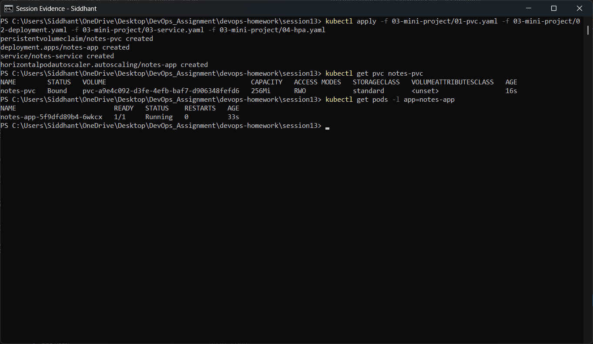

All four objects are created, `notes-pvc` is `Bound` to a dynamically provisioned 256Mi volume,
and the Pod reaches `1/1 Running` — meaning the startup probe passed and the readiness probe is
succeeding.

## 3.4 Probes as configured on the running Pod

```powershell
kubectl describe pod -l app=notes-app | Select-String -Pattern "Startup:|Liveness:|Readiness:|Image:"
```

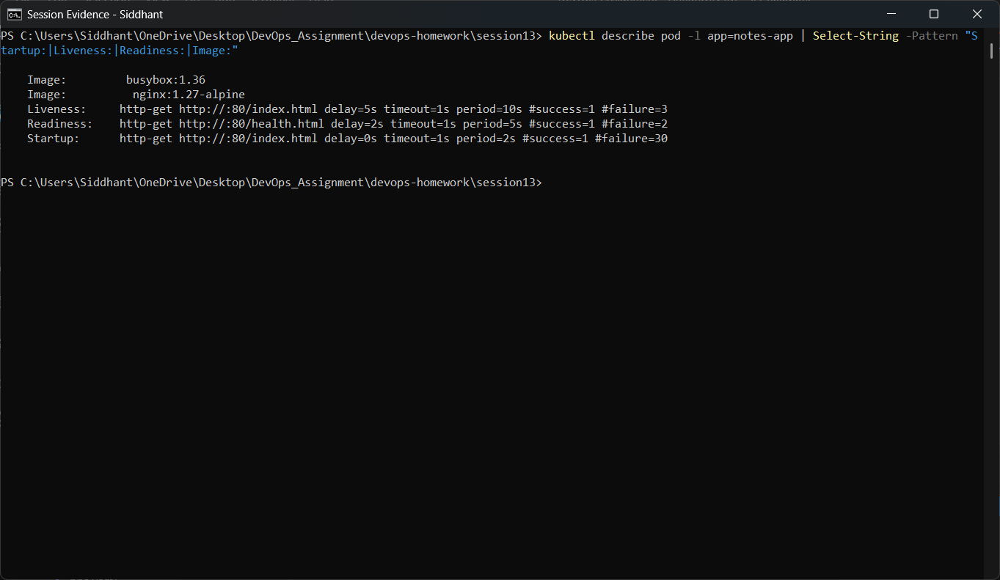

The running Pod reports all three probes with their resolved settings — the HTTP path, port,
delay, period and failure threshold that Kubernetes is actually enforcing.

## 3.5 Healthy service

```powershell
kubectl get svc notes-service
kubectl get endpoints notes-service
```

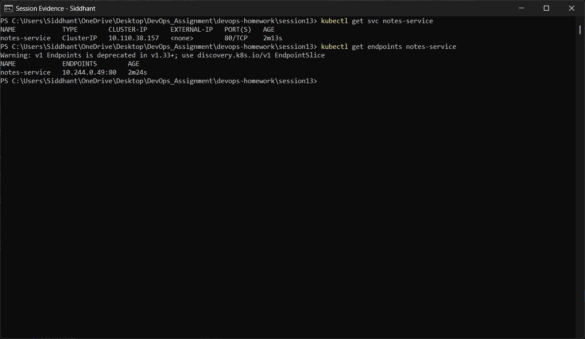

While the readiness probe passes, the Pod IP appears in the Service's endpoint list, so the
Service will route traffic to it.

## 3.6 Breaking the readiness probe

```powershell
kubectl get pod -l app=notes-app -o name
kubectl exec deploy/notes-app -c web -- rm -f /usr/share/nginx/html/health.html
kubectl get pods -l app=notes-app
kubectl get endpoints notes-service
```

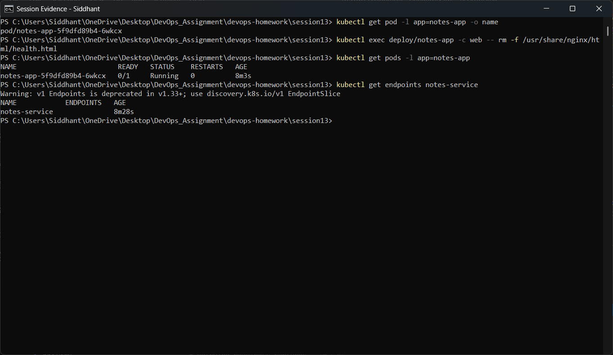

Deleting `health.html` makes nginx answer `404` on the readiness path. Within two probe periods
the Pod flips to **`0/1 Running`** and the Service endpoint list becomes **empty** — Kubernetes
has pulled the Pod out of load-balancing. Note the `STATUS` is still `Running` and `RESTARTS` is
still `0`: readiness failure removes traffic, it does **not** restart the container.

## 3.7 Recovering

```powershell
kubectl exec deploy/notes-app -c web -- sh -c "echo ok > /usr/share/nginx/html/health.html"
kubectl get pods -l app=notes-app
kubectl get endpoints notes-service
```

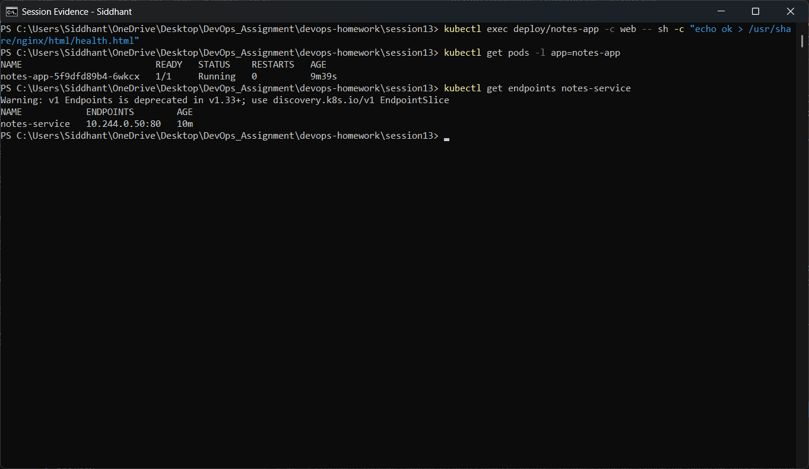

Restoring the file makes the probe succeed again; the Pod returns to `1/1` and its IP is put back
into the Service endpoints automatically. No human intervention beyond fixing the underlying
cause — the control loop handles the rest.

## 3.8 Autoscaling the mini project

```powershell
kubectl get hpa notes-app
```

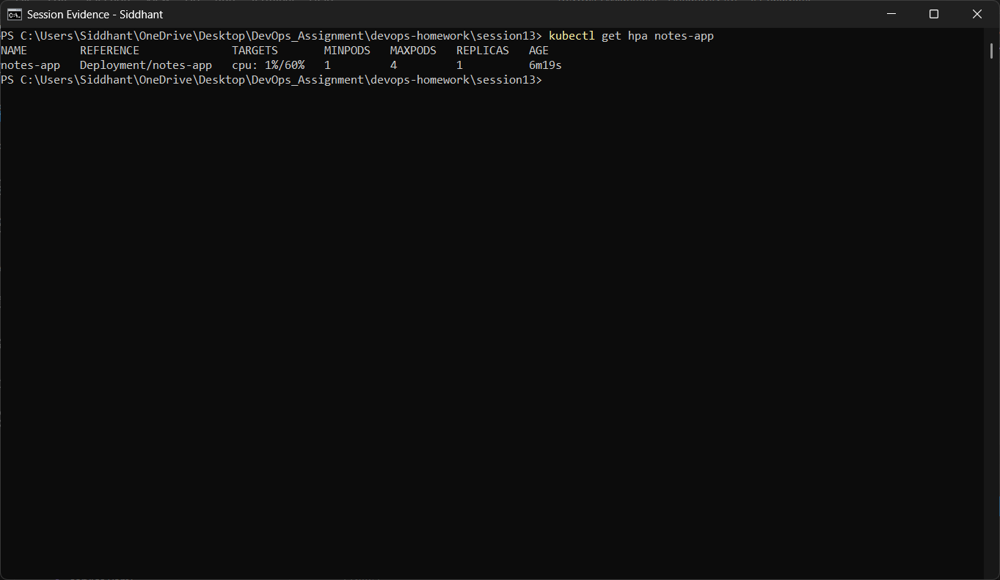

The same workload is also under HPA control, targeting 60% CPU between 1 and 4 replicas.

---

# Deliverables checklist

| Required deliverable | Where |
|---|---|
| Volume documentation | [`01-kubernetes-volumes/README.md`](01-kubernetes-volumes/README.md) |
| HPA YAML | `02-hpa/hpa.yaml` |
| Load generator | `02-hpa/load-generator.yaml` |
| HPA output | `02-hpa/screenshots/` (sections 2.4–2.7) |
| Screenshots | `01-kubernetes-volumes/screenshots/`, `02-hpa/screenshots/`, `03-mini-project/screenshots/` |
| Mini-project implementation | `03-mini-project/*.yaml` |
| README documentation | this file + the Task 1 README |

# Key learnings

- **Storage:** volume lifetime is chosen by *type* — `emptyDir` dies with the Pod, `hostPath`
  lives on the node, a PVC-backed volume outlives both. A PVC with no `storageClassName` silently
  uses the default StorageClass instead of binding to a hand-made PV.
- **HPA:** utilisation is relative to CPU **requests**, metrics-server is a hard dependency, and
  the workload has to actually consume CPU for autoscaling to be observable — proven here at
  `299%/50%` scaling 1 → 5 replicas.
- **Probes:** readiness controls *traffic*, liveness controls *restarts*, and startup protects
  slow-booting apps from the other two. Proven by deleting and restoring a single health file and
  watching the Service endpoints empty and refill.
