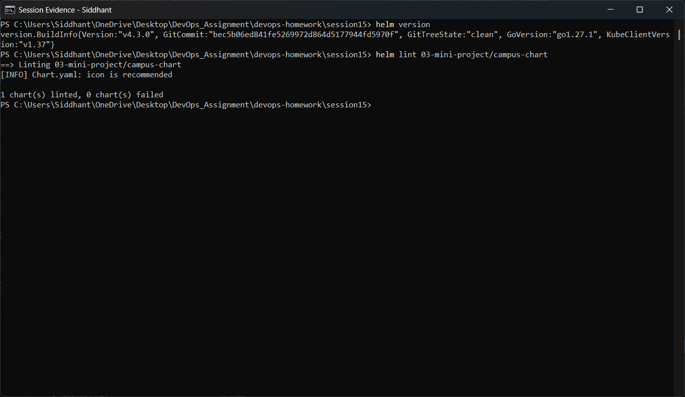
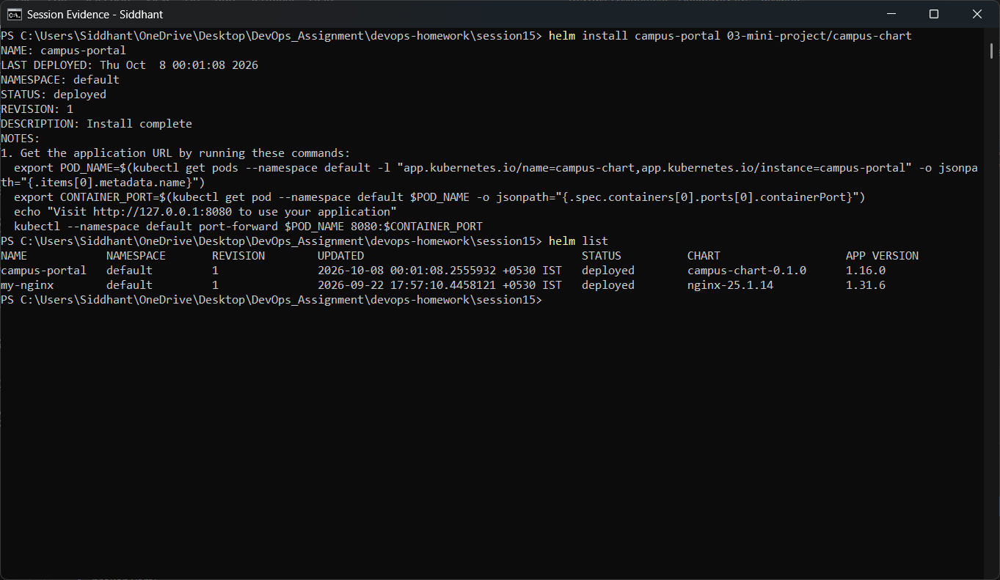
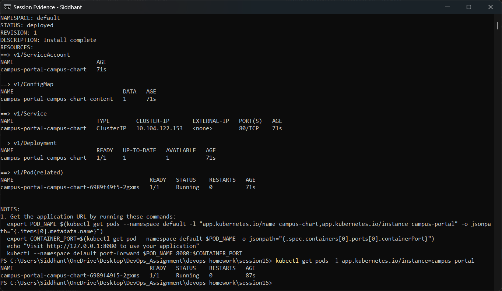
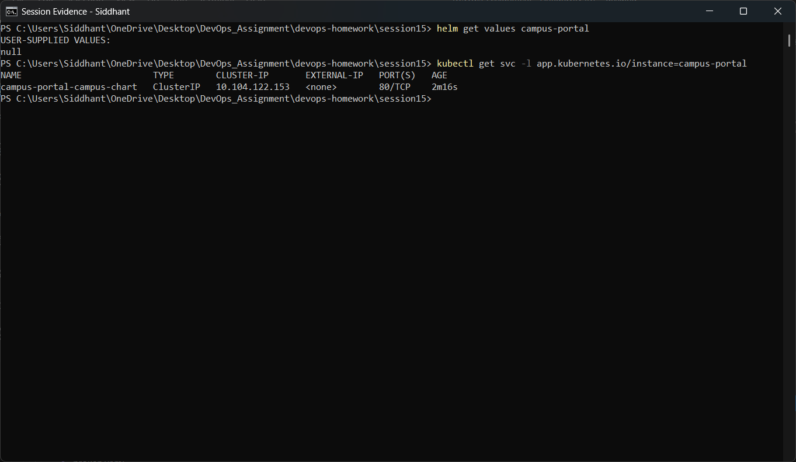
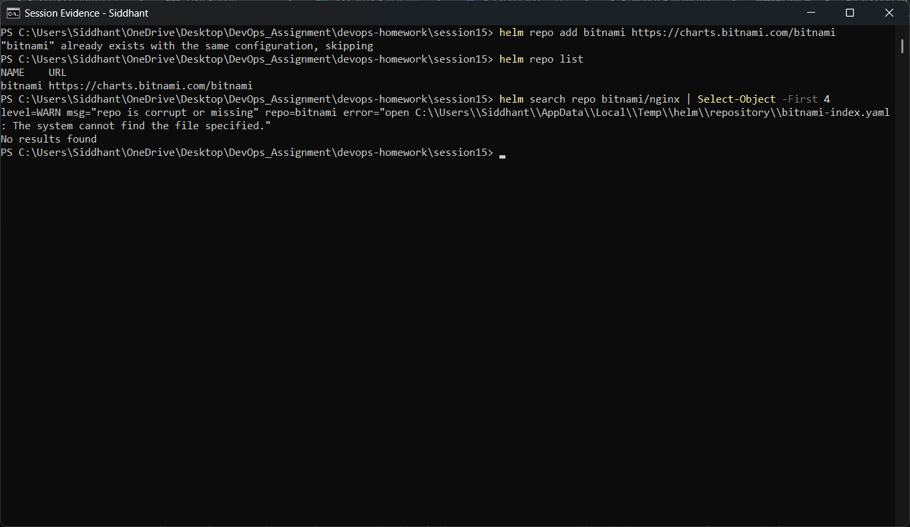
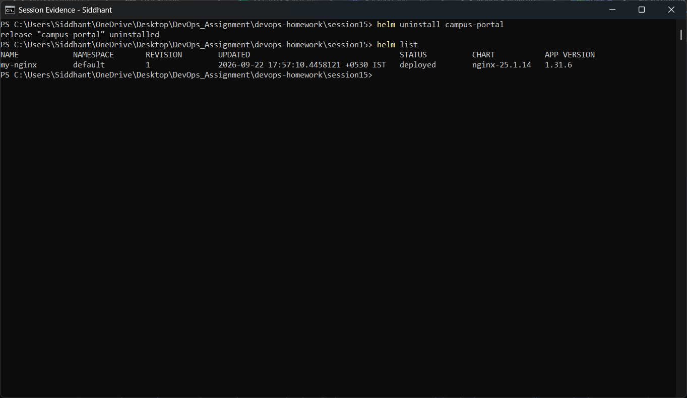
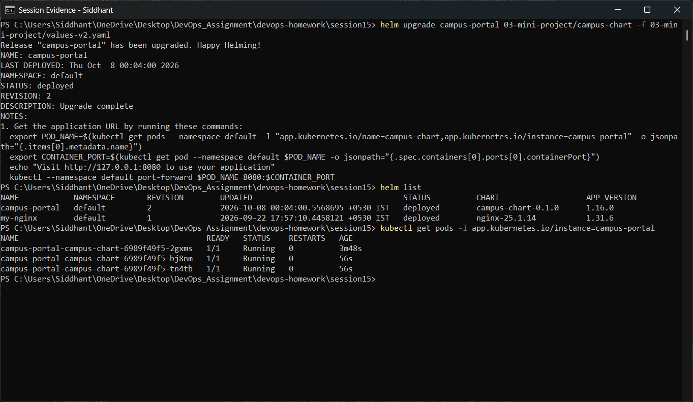
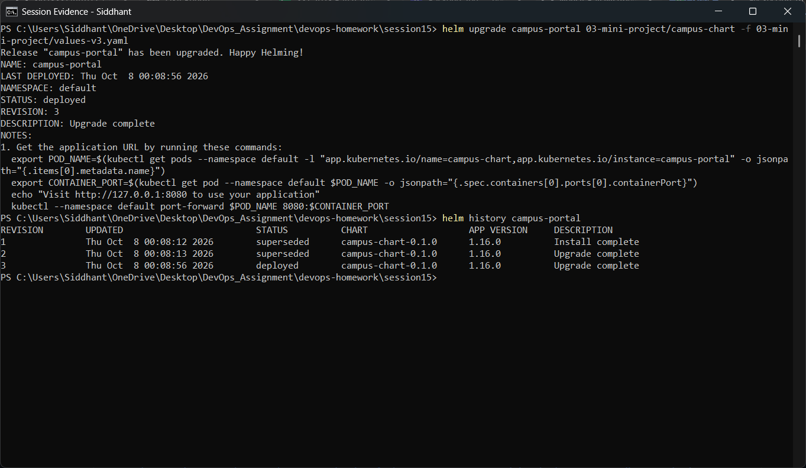
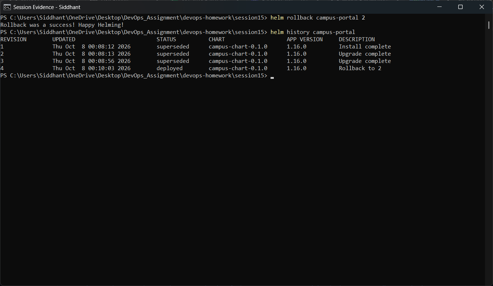
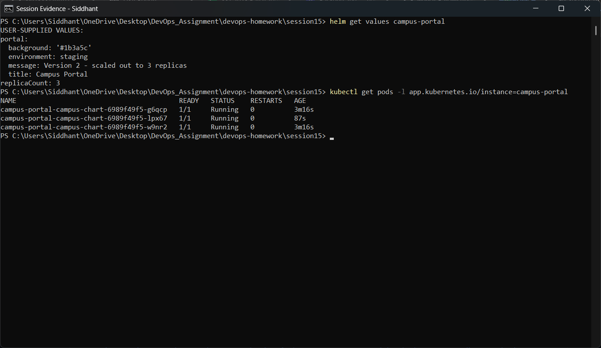

# Session 15 — Helm

**Student:** Siddhant Prasad (24BCS10255)
**Environment:** Windows 11 · Docker Desktop · Minikube (Kubernetes v1.37.0) · Helm v4.3.0

| Task | Topic | Folder |
|---|---|---|
| 1 | Helm commands hands-on | `01-helm-commands/` |
| 2 | Complete rollback workflow | `02-rollback/` |
| 3 | Mini project — `campus-chart` | `03-mini-project/` |

---

## 1. What Helm is and why it exists

Plain Kubernetes manifests have three practical problems:

1. **No parameterisation.** Deploying the same app to dev and prod means copying YAML and editing
   it by hand.
2. **No grouping.** A release is really one unit (Deployment + Service + ConfigMap + HPA …), but
   `kubectl apply` treats each file separately.
3. **No history.** Once you apply a change, the previous state is gone — there is no "undo".

Helm is the package manager that fixes all three:

```
          campus-chart/                     values.yaml  (+ -f values-v2.yaml …)
       ┌────────────────────┐              ┌─────────────────┐
       │ templates/*.yaml   │  +           │ parameters      │
       │ (Go templating)    │              └────────┬────────┘
       └─────────┬──────────┘                       │
                 └──────────────┬───────────────────┘
                                ▼
                        helm install / upgrade
                                │
                                ▼
                 ┌──────────────────────────────┐
                 │  RELEASE  (named, versioned) │  revision 1, 2, 3 …
                 │  stored as a Secret in-cluster│  → helm history / helm rollback
                 └──────────────┬───────────────┘
                                ▼
                  rendered Kubernetes objects applied
```

Key vocabulary:

| Term | Meaning |
|---|---|
| **Chart** | The package: templates + default values + metadata |
| **Values** | The parameters fed into the templates |
| **Release** | One named installation of a chart in a cluster |
| **Revision** | A numbered snapshot of a release, created on every install/upgrade/rollback |

---

## 2. The mini project chart — `campus-chart`

Created with a real `helm create`, then customised. The interesting part is
`templates/configmap.yaml`, which renders the app's landing page **from values**:

```yaml
data:
  index.html: |
    <h1>{{ .Values.portal.title }}</h1>
    <h2>{{ .Values.portal.message }}</h2>
    <p>Chart version: {{ .Chart.Version }} | App version: {{ .Chart.AppVersion }}</p>
    <p>Release: {{ .Release.Name }} | Revision: {{ .Release.Revision }}</p>
    <p>Environment: {{ .Values.portal.environment }} | Replicas: {{ .Values.replicaCount }}</p>
```

This demonstrates the three template data sources: `.Values` (user input), `.Chart` (chart
metadata) and `.Release` (runtime facts about this release). Because the page content is a
*value*, an upgrade changes the running app without rebuilding any image.

`values.yaml` (revision 1 defaults): 1 replica, `nginx:1.27-alpine`, ClusterIP on port 80,
readiness/liveness probes, CPU/memory requests and limits.

The two override files drive the rollback workflow:

| File | replicaCount | message | environment |
|---|---|---|---|
| `values.yaml` | 1 | Version 1 — initial install | development |
| `values-v2.yaml` | 3 | Version 2 — scaled out to 3 replicas | staging |
| `values-v3.yaml` | 2 | Version 3 — production theme | production |

---

# TASK 1 — Helm commands

### `helm version` and `helm lint`

```powershell
helm version
helm lint 03-mini-project/campus-chart
```



`helm lint` renders the chart and checks it for errors *without touching the cluster* — the
cheapest way to catch a templating mistake. The chart passes with only the cosmetic
"icon is recommended" info message.

### `helm install`

```powershell
helm install campus-portal 03-mini-project/campus-chart
helm list
```



`install` renders the templates with the default values and creates the objects as a single named
release. The output reports `STATUS: deployed` and `REVISION: 1`, followed by the chart's
`NOTES.txt`. `helm list` then shows the release with its chart version and app version.

### `helm status`

```powershell
helm status campus-portal
kubectl get pods -l app.kubernetes.io/instance=campus-portal
```



`status` is the release-level view: deployment state, revision and notes. The `kubectl` command
alongside it proves the release's Pod is really running — and note the
`app.kubernetes.io/instance` label, which Helm adds automatically so a release's objects can
always be selected.

### `helm get values`

```powershell
helm get values campus-portal
kubectl get svc -l app.kubernetes.io/instance=campus-portal
```



`helm get values` shows the values **this release was installed with** (`helm get all` would dump
the fully rendered manifests). At revision 1 no overrides were supplied, so the user-supplied
values are empty — everything came from `values.yaml`.

### `helm repo` and `helm search`

```powershell
helm repo add bitnami https://charts.bitnami.com/bitnami
helm repo list
helm search repo bitnami/nginx | Select-Object -First 4
```



`helm repo add` registers a remote chart repository, `helm repo list` confirms it, and
`helm search repo` queries the local cache of that repository's index — this is how third-party
charts are discovered before installing them.

### `helm uninstall`

```powershell
helm uninstall campus-portal
helm list
```



`uninstall` removes every object in the release **and** its revision history, so the release
disappears from `helm list`. This is the clean teardown a `kubectl delete` of individual files
cannot guarantee.

---

# TASK 2 — Complete rollback workflow

The workflow executed end to end:

```
install (rev 1)  →  upgrade v2 (rev 2)  →  verify  →  upgrade v3 (rev 3)  →  verify
                                                                  │
                                                                  ▼
                                                    rollback to rev 2 (rev 4)  →  verify
```

### Step 1 — Upgrade to version 2

```powershell
helm upgrade campus-portal 03-mini-project/campus-chart -f 03-mini-project/values-v2.yaml
helm list
kubectl get pods -l app.kubernetes.io/instance=campus-portal
```



The upgrade creates **revision 2**. `values-v2.yaml` sets `replicaCount: 3`, so the Pod count
goes from 1 to 3 — visible in the `kubectl get pods` output, where the two new Pods are much
younger than the original.

### Step 2 — Upgrade to version 3

```powershell
helm upgrade campus-portal 03-mini-project/campus-chart -f 03-mini-project/values-v3.yaml
helm history campus-portal
```



**Revision 3** applies the production theme and 2 replicas. `helm history` now lists all three
revisions with their status — revisions 1 and 2 are `superseded`, revision 3 is `deployed`. This
history is what makes rollback possible: Helm stored each revision's full manifest in-cluster.

### Step 3 — Roll back

```powershell
helm rollback campus-portal 2
helm history campus-portal
```



`helm rollback campus-portal 2` re-applies the manifests stored for revision 2. Importantly,
Helm does **not** delete history — it appends a **new revision 4** whose description records that
it is a rollback to 2. The audit trail stays intact, and the rollback itself can be rolled back.

### Step 4 — Verify

```powershell
helm get values campus-portal
kubectl get pods -l app.kubernetes.io/instance=campus-portal
```



The release's active values are the version-2 values again (3 replicas, staging environment), and
the Pod count matches. The cluster state and the recorded release state agree — the rollback is
genuinely complete, not just a history entry.

---

# Deliverables checklist

| Required deliverable | Where |
|---|---|
| Helm chart | `03-mini-project/campus-chart/` |
| `values.yaml` | `03-mini-project/campus-chart/values.yaml` (+ `values-v2.yaml`, `values-v3.yaml`) |
| Templates | `03-mini-project/campus-chart/templates/` |
| Installation | `01-helm-commands/screenshots/02-helm-install.png` |
| Upgrade | `02-rollback/screenshots/01-upgrade-v2.png`, `02-upgrade-v3.png` |
| Rollback | `02-rollback/screenshots/03-rollback.png`, `04-verify-rollback.png` |
| Screenshots | `01-helm-commands/screenshots/`, `02-rollback/screenshots/` |
| README | this file |
| Mini project | `03-mini-project/` |

# Key learnings

- A **release** is the unit Helm manages — named, versioned, and recorded in the cluster, which
  is what makes `history` and `rollback` possible at all.
- Values are the seam between a chart and an environment: the same chart produced dev, staging and
  production configurations here with no template edits.
- **`helm rollback` moves forward, not backward** — it creates a new revision that restores an old
  one, so nothing is lost from the audit trail.
- `helm lint` and `helm template` validate a chart without a cluster; use them before every
  install.
