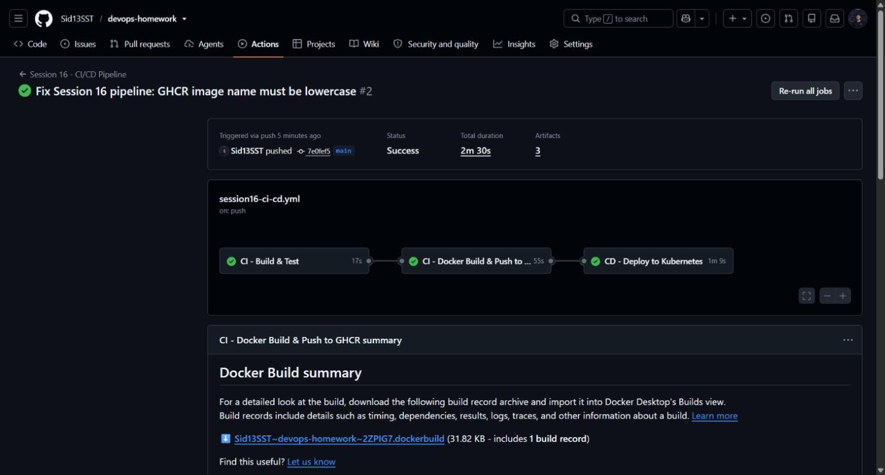
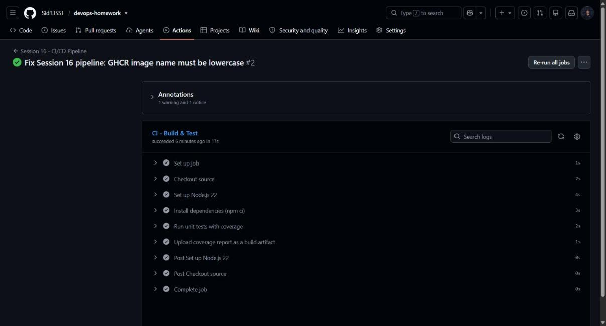
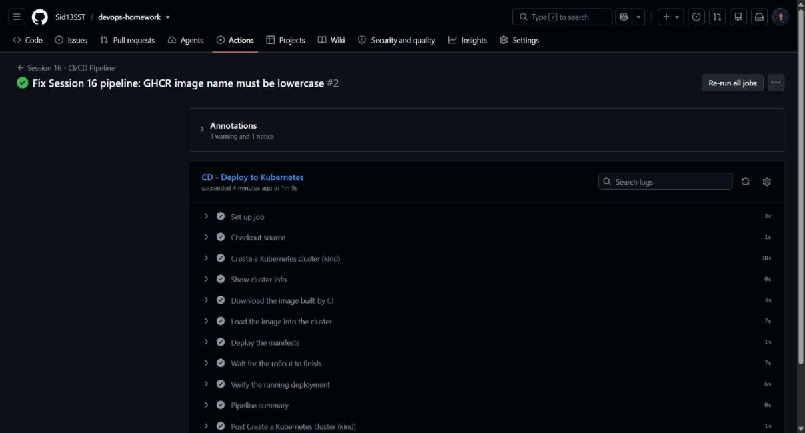

# Session 16 — CI/CD & GitHub Actions

**Student:** Siddhant Prasad (24BCS10255)
**Repository:** https://github.com/Sid13SST/devops-homework
**Workflow:** [`.github/workflows/session16-ci-cd.yml`](../.github/workflows/session16-ci-cd.yml)
**Successful run:** [`37666886041`](https://github.com/Sid13SST/devops-homework/actions/runs/37666886041) — ✅ success in **2m30s**

---

## 1. CI vs CD

| | Continuous Integration | Continuous Delivery / Deployment |
|---|---|---|
| Question | "Does this change build and pass its tests?" | "Can this build reach an environment safely?" |
| Trigger | Every push / pull request | A successful CI run |
| Output | A tested artifact (here: a container image) | A running deployment |
| Fails when | Compilation or tests break | The rollout fails health checks |

CI protects the **main branch**; CD protects the **environment**. The pipeline in this session
does both: three jobs where each one only starts if the previous succeeded.

## 2. GitHub Actions vocabulary

| Term | In this pipeline |
|---|---|
| **Workflow** | `session16-ci-cd.yml` — the whole file |
| **Event** | `on: push` (filtered to `session16/**`) and `workflow_dispatch` |
| **Job** | `build-and-test`, `docker-build-push`, `deploy` — separate machines |
| **Step** | One command or action inside a job |
| **Runner** | `ubuntu-latest`, a fresh VM GitHub provides per job |
| **Action** | A reusable step, e.g. `actions/checkout@v4`, `docker/build-push-action@v6` |
| **Secret** | `secrets.GITHUB_TOKEN`, injected automatically, used to log in to GHCR |
| **Artifact** | `coverage-report` and `container-image`, passed between jobs |
| **`needs:`** | Creates the job dependency chain |

## 3. Pipeline architecture

```
                 push to main (session16/**)
                            │
            ┌───────────────▼────────────────┐
  JOB 1     │  CI - Build & Test             │  node 22, npm ci, npm test
            │  → uploads coverage artifact   │  ✅ 17s
            └───────────────┬────────────────┘
                            │ needs
            ┌───────────────▼────────────────┐
  JOB 2     │  CI - Docker Build & Push      │  buildx, multi-stage image
            │  → pushes to GHCR              │  ✅ 55s
            │  → uploads image tar artifact  │
            └───────────────┬────────────────┘
                            │ needs
            ┌───────────────▼────────────────┐
  JOB 3     │  CD - Deploy to Kubernetes     │  kind cluster in the runner
            │  → kubectl apply + rollout     │  ✅ 1m9s
            │  → verifies the live endpoint  │
            └────────────────────────────────┘
```

## 4. The application

`session16/app/` — a small Express API, deliberately simple so the pipeline is the focus:

| Endpoint | Purpose |
|---|---|
| `GET /` | Service metadata (used as the deployment proof) |
| `GET /health` | Readiness/liveness probe target |
| `GET /api/notes` | List notes |
| `GET /api/notes/:id` | One note, `404` when unknown |
| `POST /api/notes` | Create a note, `400` when `title` is missing |

7 Jest + supertest tests cover all of it, at **100% statement coverage**.

### Dockerfile — multi-stage

```dockerfile
FROM node:22-alpine AS build      # installs dev deps and RUNS THE TESTS
...
RUN npm test
FROM node:22-alpine AS runtime    # production deps only
RUN npm ci --omit=dev
USER nodeapp                      # non-root
HEALTHCHECK ... /health
```

Two things worth noting: the tests run **inside the build stage**, so an image can never be
produced from failing code; and the runtime stage carries no dev dependencies and runs as a
non-root user.

---

## 5. Pipeline execution evidence

### 5.1 Workflow run summary



All three jobs green. The run is reachable at
`https://github.com/Sid13SST/devops-homework/actions/runs/37666886041`.

```
✓ main Session 16 - CI/CD Pipeline · 37666886041
JOBS
✓ CI - Build & Test in 17s
✓ CI - Docker Build & Push to GHCR in 55s
✓ CD - Deploy to Kubernetes in 1m9s
```

### 5.2 Job 1 — tests passing on the runner



The real runner log:

```
> campus-notes-api@1.0.0 test
  campus-notes-api
    ✓ GET /api/notes returns a list (4 ms)
    ✓ GET /api/notes/:id returns one note (4 ms)
    ✓ GET /api/notes/:id returns 404 for an unknown id (4 ms)
    ✓ POST /api/notes creates a note (11 ms)
    ✓ POST /api/notes rejects a missing title (2 ms)
```

The coverage report is then uploaded as the `coverage-report` artifact, downloadable from the run
page.

### 5.3 Job 2 — image build and registry push

The job logs in to `ghcr.io` using `secrets.GITHUB_TOKEN`, builds the multi-stage image with
buildx and pushes two tags:

```
ghcr.io/sid13sst/campus-notes-api:<commit-sha>
ghcr.io/sid13sst/campus-notes-api:latest
```

**A real failure that had to be fixed:** the first run of this pipeline failed here with

```
ERROR: failed to build: invalid tag "ghcr.io/Sid13SST/campus-notes-api:...":
repository name must be lowercase
```

`github.repository_owner` is `Sid13SST`, but Docker requires lowercase repository names. Fixed by
pinning the image name to lowercase — the commit
`Fix Session 16 pipeline: GHCR image name must be lowercase` is the fix, and run `37666886041`
is the green result.

### 5.4 Job 3 — CD deploying to Kubernetes



The CD job creates a real **kind** Kubernetes cluster inside the runner, loads the image built by
CI, pins the deployment to the exact commit SHA and waits for the rollout. Real log output:

```
pod/campus-notes-api-6dd585645d-fcpxh   1/1  Running  0  7s  10.244.0.5  cd-cluster-control-plane
service/campus-notes-api   ClusterIP   10.96.142.211   <none>   80/TCP   7s   app=campus-notes-api

--- endpoint check from inside the cluster ---
{"service":"campus-notes-api","version":"ci","student":"Siddhant Prasad (24BCS10255)",
 "message":"Deployed by the GitHub Actions CI/CD pipeline"}

--- notes endpoint ---
[{"id":1,"title":"Session 16","body":"CI/CD with GitHub Actions"},
 {"id":2,"title":"Session 17","body":"DevSecOps pipeline"}]
```

This is the complete proof of delivery: the image built by CI from this commit is running in a
Kubernetes cluster and **answering real HTTP requests** with the expected JSON.

### 5.5 Artifacts

Two artifacts are produced per run — `coverage-report` (the test coverage HTML) and
`container-image` (the image tar handed from CI to CD). Artifacts are how data crosses the
job boundary, since each job runs on a different machine.

---

## 6. How the image reaches the cluster

The image is pushed to GHCR **and** passed to CD as an artifact. The artifact is what the kind
cluster loads, which keeps the deploy independent of registry authentication inside the runner
(a freshly published GHCR package is private by default). The GHCR push is still the real
registry step a production pipeline needs.

```
build ──┬── push ──→ ghcr.io/sid13sst/campus-notes-api:<sha>   (registry of record)
        └── save ──→ container-image artifact ──→ kind load ──→ deployed
```

## 7. Secrets

`secrets.GITHUB_TOKEN` is provided automatically to every run, scoped by the job's
`permissions:` block — this pipeline requests `packages: write` so it can push to GHCR. No
credential is ever written into the repository. A custom secret would be added under
**Settings → Secrets and variables → Actions** and referenced the same way.

---

# Deliverables checklist

| Required deliverable | Where |
|---|---|
| Application source code | `app/app.js`, `app/server.js`, `app/app.test.js` |
| Dockerfile | `app/Dockerfile` (multi-stage, non-root, healthcheck) |
| GitHub Actions workflow | `../.github/workflows/session16-ci-cd.yml` |
| CI pipeline | Jobs 1–2 (test + image build/push) |
| CD pipeline | Job 3 (kind cluster deploy + endpoint verification) |
| Screenshots of successful execution | `screenshots/` |
| README.md | this file |

# Key learnings

- `needs:` turns independent jobs into a gated pipeline — CD cannot run on untested code.
- Running `npm test` **inside the Docker build** makes it impossible to ship an image built from
  failing code.
- Jobs are isolated machines, so anything shared between them must become an **artifact**.
- Registry naming is strict: Docker repository names must be lowercase, which is exactly what
  broke the first run and is visible in the pipeline history.
