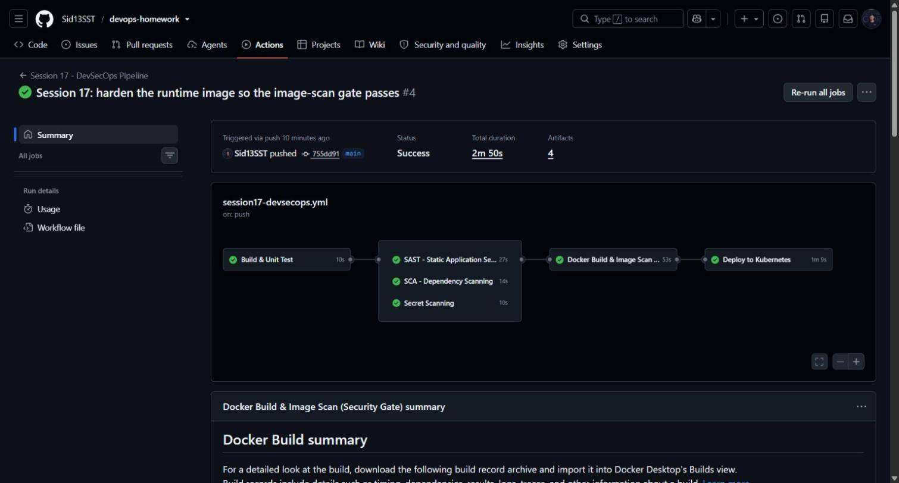
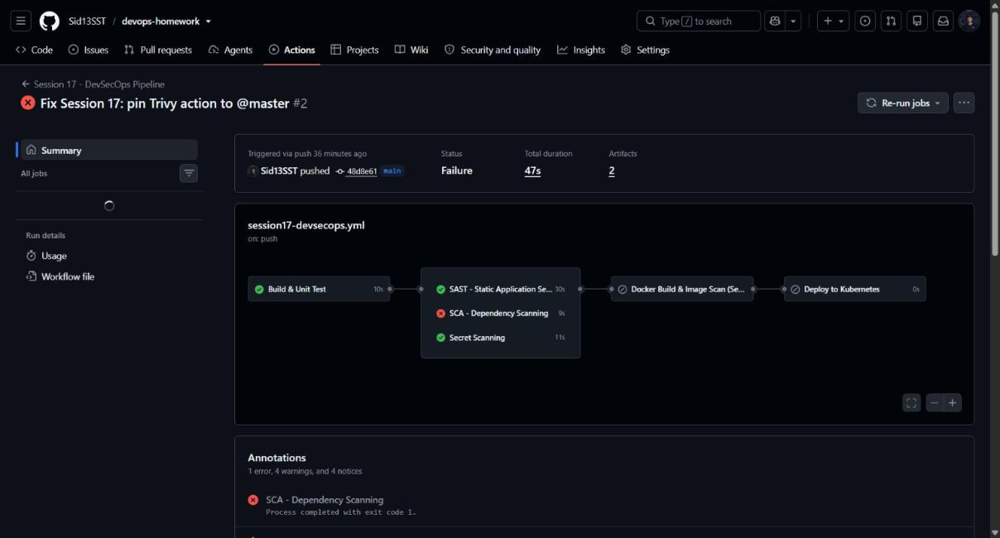
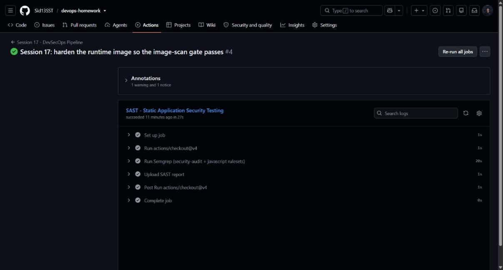
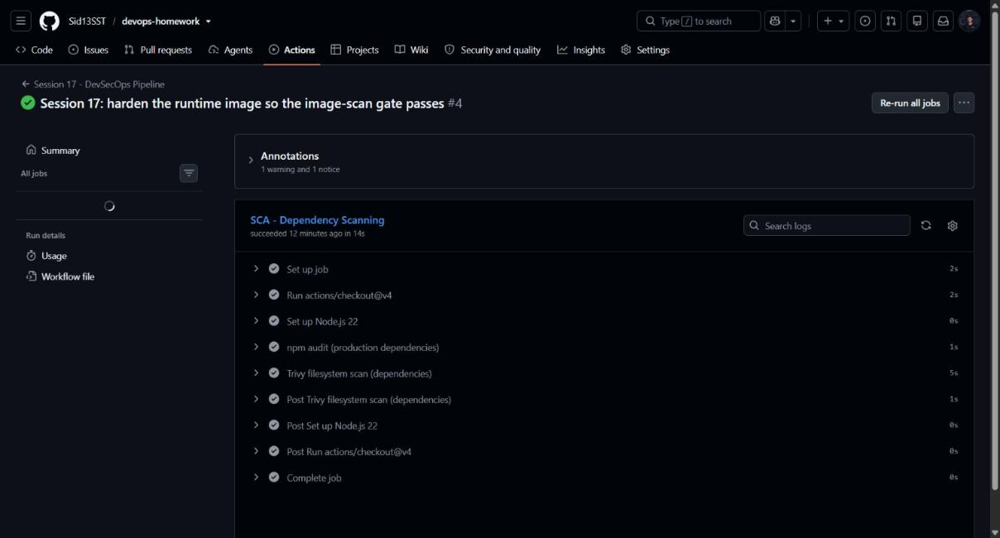
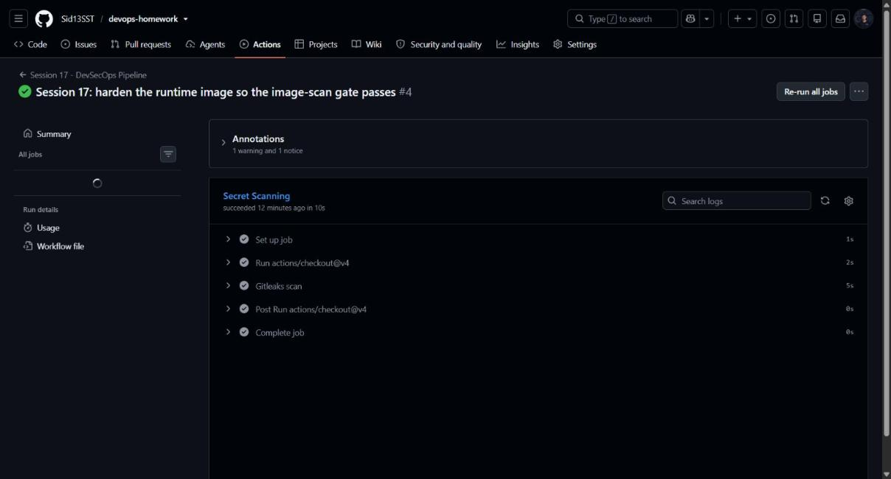
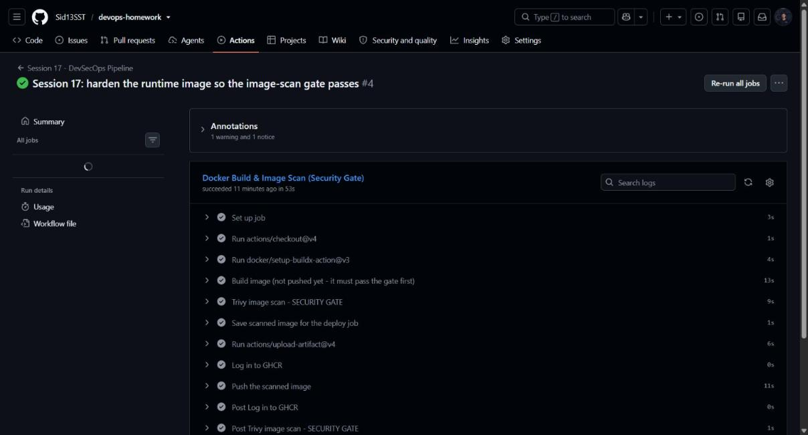
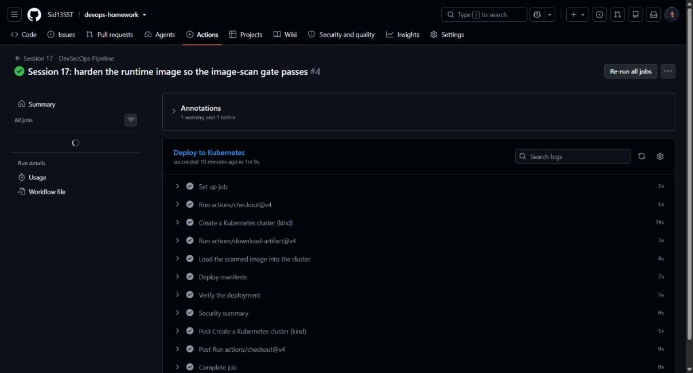

# Session 17 — Complete CI/CD & DevSecOps

**Student:** Siddhant Prasad (24BCS10255)
**Workflow:** [`.github/workflows/session17-devsecops.yml`](../.github/workflows/session17-devsecops.yml)
**Successful run:** [`37673446926`](https://github.com/Sid13SST/devops-homework/actions/runs/37673446926) — ✅ success in **2m50s**

---

## 1. What DevSecOps changes

Classic CI/CD asks one question: *does it work?* DevSecOps adds a second: *is it safe to ship?*
Security moves from a manual review at the end ("shift right") to automated gates inside the
pipeline ("shift left"), so a vulnerability is caught in minutes by the developer who introduced
it rather than months later by an auditor.

The pipeline enforces this with a **security gate**: the image is built, then scanned, and only
pushed and deployed **if the scan passes**. A failing gate stops delivery.

## 2. Pipeline flow

```
 Code
   │
   ▼
 Build & Unit Test ─────────────── Jest, 7 tests, coverage artifact
   │
   ├──────────────┬───────────────┐   (these three run in parallel)
   ▼              ▼               ▼
 SAST           SCA            Secret Scan
 Semgrep        npm audit      Gitleaks
                + Trivy fs
   └──────────────┴───────────────┘
                  │  all must pass
                  ▼
        Docker Build (image not pushed yet)
                  │
                  ▼
        Container Image Scan  ──► Trivy, HIGH/CRITICAL
                  │
                  ▼
           ⛔ SECURITY GATE ⛔   fail ⇒ nothing is pushed or deployed
                  │ pass
                  ▼
            Push Image to GHCR
                  │
                  ▼
        Deploy to Kubernetes (kind) + verify live endpoint
```

## 3. The security stages

| Stage | Tool | What it looks for | Blocking? |
|---|---|---|---|
| **SAST** | Semgrep (`p/security-audit`, `p/javascript`) | Insecure code patterns — injection, unsafe `eval`, weak crypto | Yes, on ERROR severity |
| **SCA** | `npm audit --omit=dev` + Trivy `fs` | Known CVEs in third-party dependencies | Yes, on HIGH/CRITICAL |
| **Secret scanning** | Gitleaks | Committed credentials, API keys, tokens | Yes, on any finding |
| **Container image scan** | Trivy `image` | CVEs in OS packages and app libraries inside the image | **Yes — this is the gate** |

Why all four are needed: they inspect different layers. SAST reads *your* source, SCA reads your
*dependency tree*, secret scanning reads your *git content*, and the image scan reads the
*final artifact* including the base image — which none of the others can see.

---

## 4. Execution evidence

### 4.1 Full pipeline — all gates green



Six jobs, every one green:

```
✓ Build & Unit Test
✓ SAST - Static Application Security Testing
✓ SCA - Dependency Scanning
✓ Secret Scanning
✓ Docker Build & Image Scan (Security Gate)
✓ Deploy to Kubernetes
```

### 4.2 The security gate actually blocking a release

This is the most important evidence in the session: the gate **failed the pipeline twice on real
findings** before passing. Both failures are in the run history.



**Failure 1 — SCA caught vulnerable dependencies.** Run
[`37670133368`](https://github.com/Sid13SST/devops-homework/actions/runs/37670133368) failed at
the SCA stage:

```
path-to-regexp  <0.1.13   Severity: high
  path-to-regexp vulnerable to Regular Expression Denial of Service
  https://github.com/advisories/GHSA-37ch-88jc-xwx2

qs has a remotely triggerable DoS  https://github.com/advisories/GHSA-q8mj-m7cp-5q26
body-parser vulnerable to denial of service  (moderate)

##[error]Process completed with exit code 1
```

All four advisories came from `express@4.21.2`'s dependency tree. **Remediation:** upgraded to
`express@^4.22.3`. Result:

```
$ npm audit --omit=dev --audit-level=high
found 0 vulnerabilities

Tests: 7 passed, 7 total
```

**Failure 2 — the image scan caught 10 HIGH CVEs.** The next run failed at the gate itself:

```
Total: 10 (HIGH: 10, CRITICAL: 0)
│ brace-expansion │ CVE-2026-102276 │ HIGH │ fixed │ ...
```

Investigation showed every finding sat in `/usr/local/lib/node_modules/npm/...` — the **npm CLI
bundled into `node:22-alpine`**, not the application. **Remediation:** the runtime stage now
deletes `npm`, `npx` and `corepack` after installing production dependencies, since the container
only needs the `node` runtime:

```dockerfile
RUN npm ci --omit=dev \
    && npm cache clean --force \
    && rm -rf /usr/local/lib/node_modules/npm \
              /usr/local/lib/node_modules/corepack \
              /usr/local/bin/npm /usr/local/bin/npx /usr/local/bin/corepack
```

Smaller image, smaller attack surface, gate passes. **Neither fix was a bypass** — the severity
thresholds were never lowered and `exit-code: 1` was never relaxed.

### 4.3 SAST — Semgrep



Semgrep runs the `p/security-audit` and `p/javascript` rule packs over the application source and
fails the job on ERROR-severity findings. The SARIF report is uploaded as an artifact so findings
can be reviewed or fed into code scanning.

### 4.4 SCA — dependency scanning



Two complementary tools: `npm audit --omit=dev --audit-level=high` checks the npm advisory
database for production dependencies only (dev tooling is not shipped), and Trivy's filesystem
scanner independently cross-checks the lockfile against its own vulnerability database with
`ignore-unfixed: true`, so the gate only fires on issues that are actually actionable.

### 4.5 Secret scanning — Gitleaks



Gitleaks scans the application source with `--redact`, so any match is reported without printing
the secret into the public build log. Configuration lives in
[`security/.gitleaks.toml`](security/.gitleaks.toml), which extends the default rule set and
allow-lists lockfiles and coverage output (machine-generated, no real credentials).

### 4.6 Container image scan — the gate



The ordering in this job is deliberate and is the whole point of the session:

1. `docker build` with `push: false` — the image exists only on the runner.
2. Trivy scans it with `severity: HIGH,CRITICAL` and `exit-code: 1`.
3. **Only if step 2 passes** does the job log in to GHCR and push.

An unsafe image therefore never reaches the registry, and because `deploy` has
`needs: image-build-scan`, it never reaches Kubernetes either.

### 4.7 Deployment and live verification



The deploy job creates a kind cluster, loads the **scanned** image, pins the deployment to the
commit SHA, waits for the rollout and then calls the service from inside the cluster:

```
{"service":"campus-secure-api","version":"ci","student":"Siddhant Prasad (24BCS10255)",
 "message":"Deployed by the GitHub Actions CI/CD pipeline"}
```

### 4.8 Pipeline summary in the run

The final step writes a summary table to `$GITHUB_STEP_SUMMARY`, giving a one-glance security
report attached to every run (visible on the run page under the job list):

| Stage | Tool | Result |
|---|---|---|
| Unit tests | Jest | passed |
| SAST | Semgrep | passed |
| SCA | npm audit + Trivy fs | passed |
| Secret scan | Gitleaks | passed |
| Image scan (gate) | Trivy image | passed |
| Deploy | kind + kubectl | rolled out |

---

## 5. Application and Kubernetes manifests

| Path | Purpose |
|---|---|
| `app/app.js`, `app/server.js` | Express API (`/`, `/health`, `/api/notes`) |
| `app/app.test.js` | 7 Jest + supertest tests, 100% statement coverage |
| `app/Dockerfile` | Multi-stage, tests run in the build stage, non-root user, npm removed from runtime |
| `k8s/deployment.yaml` | 2 replicas, resource requests/limits, readiness + liveness probes |
| `k8s/service.yaml` | ClusterIP service on port 80 → container 3000 |
| `security/.gitleaks.toml` | Secret-scanning rules |

### Container hardening applied

- Multi-stage build — build tooling never ships
- `npm ci --omit=dev` — no dev dependencies in the runtime image
- **npm/npx/corepack removed** — cuts the CVE surface that failed the gate
- Runs as a non-root user (`nodeapp`)
- `HEALTHCHECK` defined, and probes configured in Kubernetes
- Image pinned by **commit SHA** at deploy time, never by a floating tag

---

# Deliverables checklist

| Required deliverable | Where |
|---|---|
| Application | `app/` |
| Dockerfile | `app/Dockerfile` |
| GitHub Actions workflow | `../.github/workflows/session17-devsecops.yml` |
| Security tools configuration | `security/.gitleaks.toml`, severity thresholds in the workflow |
| Kubernetes manifests | `k8s/deployment.yaml`, `k8s/service.yaml` |
| Successful pipeline output | Run `37673446926`, screenshots in `screenshots/` |
| Screenshots | `screenshots/` |
| Complete README.md | this file |

# Key learnings

- A **security gate** is only real if it can stop the pipeline. Proven here twice — on vulnerable
  dependencies and on a vulnerable base image — and both times the fix was to remediate, not to
  lower the threshold.
- **Build, scan, then push.** Pushing before scanning would put an unsafe image in the registry
  where something else could pull it.
- **Most container CVEs come from the base image, not your code.** Removing tools the runtime
  does not need (here, npm) eliminated all 10 HIGH findings at once.
- Scan **production dependencies only** (`--omit=dev`); dev tooling never ships, so failing on it
  creates noise that trains people to ignore the gate.
- `ignore-unfixed: true` keeps the gate actionable — it fires only on vulnerabilities that have a
  fix available.
