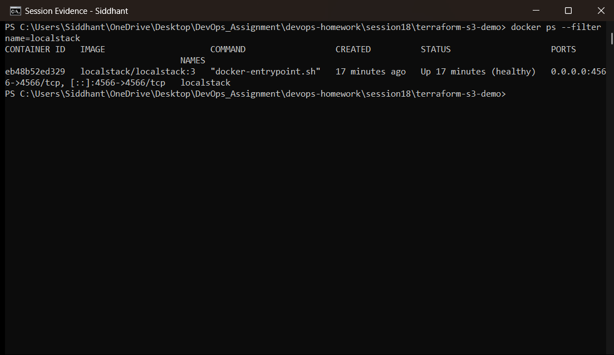
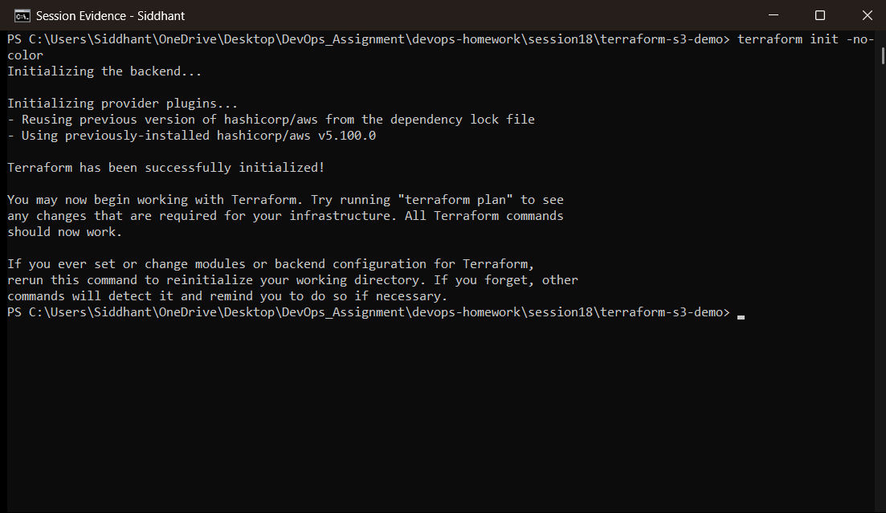
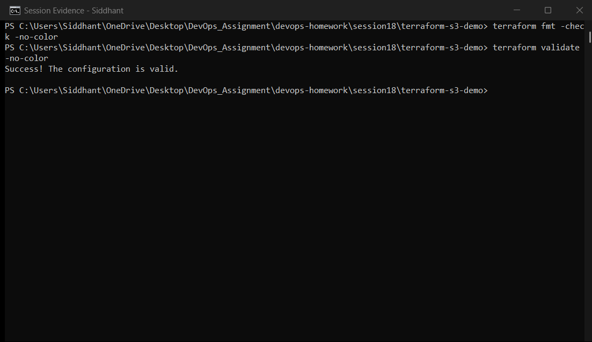
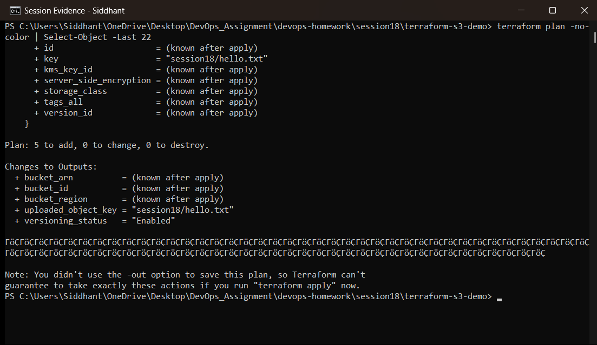
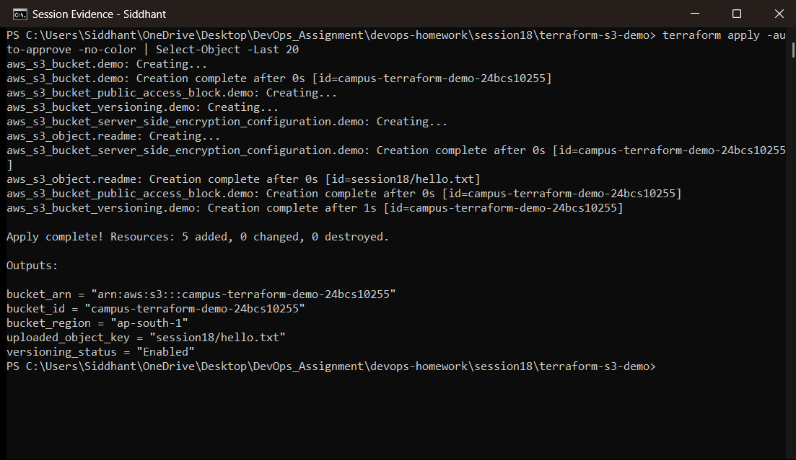
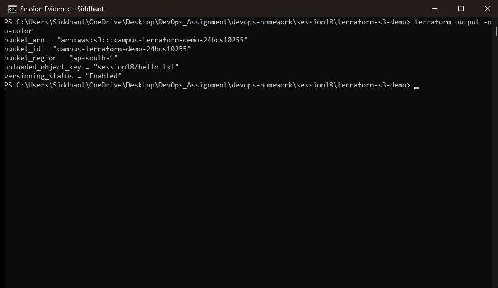
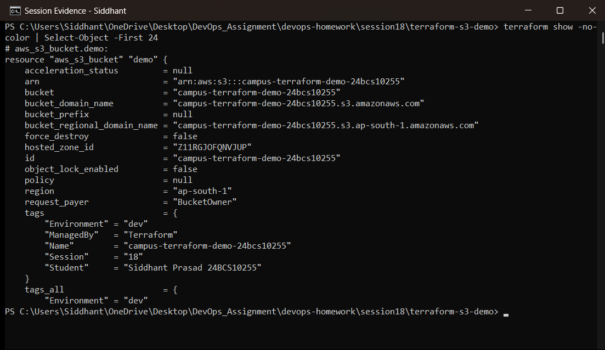
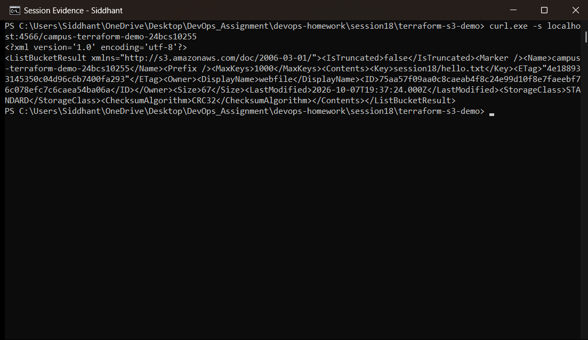
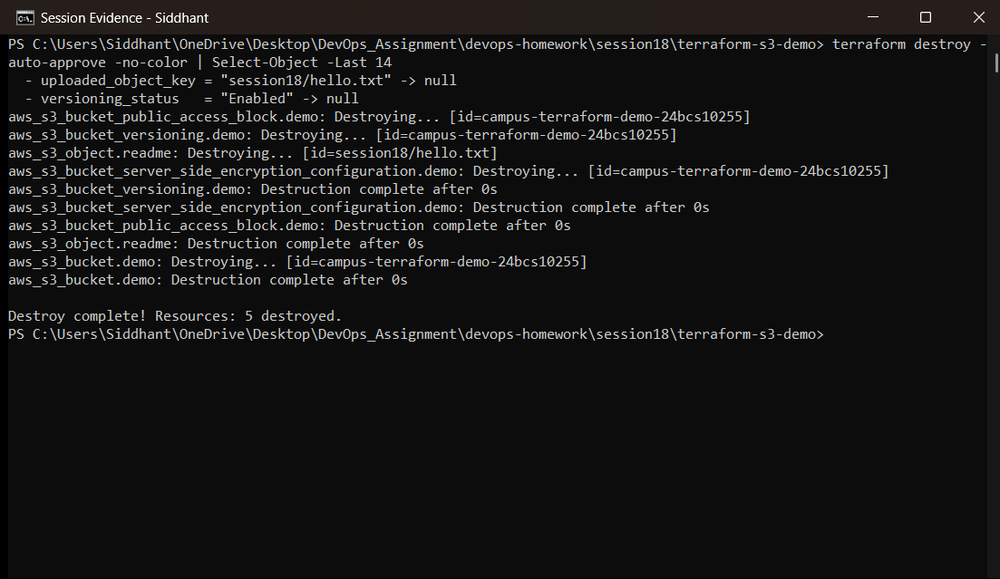

# Session 18 — Terraform & Infrastructure as Code

**Student:** Siddhant Prasad (24BCS10255)
**Environment:** Windows 11 · Terraform v1.16.2 · AWS provider ~> 5.0 · LocalStack 3 (Docker)

| Task | Topic | Folder |
|---|---|---|
| 1 | Terraform S3 demo | `terraform-s3-demo/` |
| 2 | AWS services research | `aws-services/` |

> **How this was executed — stated plainly.** Every Terraform command in this document was
> really run, and the outputs are real. The AWS API calls were served by **LocalStack**, an AWS
> API emulator running in Docker on this machine, rather than by Amazon. The provider, the
> resources, the state file and the command output are all genuine Terraform behaviour; only the
> endpoint differs. This keeps the exercise free and requires no cloud credentials. The one place
> LocalStack's emulation fell short is documented honestly in section 4.

---

## 1. What is Infrastructure as Code?

Infrastructure as Code means defining servers, networks and services in **version-controlled
declarative files** instead of clicking through a console.

| Manual console work | Infrastructure as Code |
|---|---|
| Not reproducible — "what did I click?" | Same config → same infrastructure, every time |
| No history | Every change is a git commit, reviewable and revertible |
| Drift goes unnoticed | `terraform plan` shows drift explicitly |
| Tribal knowledge | The repository *is* the documentation |

Terraform's distinguishing features: it is **declarative** (you describe the desired end state,
not the steps), **provider-agnostic** (AWS, Azure, GCP, Kubernetes, GitHub, …), and it keeps a
**state file** mapping your configuration to real resource IDs.

### How state works

```
   main.tf (desired)          terraform.tfstate (known)        LocalStack/AWS (actual)
          │                            │                               │
          └──────────── terraform plan compares all three ─────────────┘
                                       │
                                       ▼
                        a plan: create / update / destroy
```

The state file is why Terraform knows that an existing bucket is *the* bucket in your config and
should be updated rather than duplicated. In a team it belongs in a **remote backend** (S3 +
locking), never committed — hence the `.gitignore` in `terraform-s3-demo/`.

## 2. Project layout and why the files are split

```
terraform-s3-demo/
├── provider.tf       required_version, required_providers, provider config
├── variables.tf      input variables with types, defaults and validation
├── main.tf           the resources themselves
├── outputs.tf        values exported after apply
├── terraform.tfvars  actual values for this environment
└── .gitignore        excludes .terraform/ and *.tfstate
```

Terraform loads every `.tf` file in the directory, so the split is purely for human
readability — the standard convention.

### provider.tf — pointing the AWS provider at LocalStack

```hcl
provider "aws" {
  region     = var.aws_region
  access_key = "test"          # LocalStack accepts any credentials
  secret_key = "test"

  skip_credentials_validation = true
  skip_metadata_api_check     = true
  skip_requesting_account_id  = true
  s3_use_path_style           = true

  endpoints {
    s3  = var.localstack_endpoint   # http://localhost:4566
    iam = var.localstack_endpoint
    ec2 = var.localstack_endpoint
    sts = var.localstack_endpoint
  }
}
```

Only the `endpoints` block and the `skip_*` flags differ from a real AWS configuration.

### variables.tf — typed inputs with validation

```hcl
variable "environment" {
  description = "Environment tag applied to every resource"
  type        = string
  default     = "dev"

  validation {
    condition     = contains(["dev", "staging", "prod"], var.environment)
    error_message = "environment must be one of: dev, staging, prod."
  }
}
```

Validation blocks catch bad input at `plan` time rather than halfway through an `apply`.

### main.tf — the resources

| Resource | Purpose |
|---|---|
| `aws_s3_bucket.demo` | The bucket itself, with tags |
| `aws_s3_bucket_versioning.demo` | Keeps previous object versions |
| `aws_s3_bucket_server_side_encryption_configuration.demo` | AES256 encryption at rest |
| `aws_s3_bucket_public_access_block.demo` | All four public-access settings blocked |
| `aws_s3_object.readme` | An object, proving the bucket is usable |

Note how the child resources reference `aws_s3_bucket.demo.id` — that reference is what creates
the **implicit dependency graph**, so Terraform knows the bucket must exist first. No ordering is
written by hand.

---

## 3. Executed workflow

### 3.1 LocalStack running

```powershell
docker ps --filter name=localstack --format "{{.Names}} {{.Status}} {{.Ports}}"
curl.exe -s http://localhost:4566/_localstack/health
```



The container is `Up` with port `4566` published, and the health endpoint reports the AWS
services as `available` — this is the endpoint the provider talks to.

### 3.2 `terraform init`

```powershell
terraform init
```



`init` downloads the AWS provider plugin into `.terraform/`, writes the dependency lock file and
initialises the backend. It must be run before any other command, and re-run whenever providers
or modules change.

### 3.3 `terraform fmt` and `terraform validate`

```powershell
terraform fmt -check
terraform validate
```



`fmt -check` exits 0, meaning every file already matches canonical formatting. `validate` reports
**"Success! The configuration is valid."** — it checks syntax, types and references **without
contacting the API**, which makes both commands ideal CI steps.

### 3.4 `terraform plan`

```powershell
terraform plan
```



The plan is Terraform's dry run: it refreshes state, compares it to the configuration and lists
exactly what it would do — here **5 resources to add**, with the output values that will be
known after apply. Nothing is changed. Reviewing a plan before applying is the core safety
habit of IaC.

### 3.5 `terraform apply`

```powershell
terraform apply -auto-approve
```



Apply creates the resources in dependency order and finishes with
**`Apply complete! Resources: 5 added, 0 changed, 0 destroyed.`** followed by the outputs. The
state file now records the real resource IDs.

### 3.6 `terraform output`

```powershell
terraform output
```



Outputs are the documented interface of the configuration — the values other systems or modules
consume:

```
bucket_arn          = "arn:aws:s3:::campus-terraform-demo-24bcs10255"
bucket_id           = "campus-terraform-demo-24bcs10255"
bucket_region       = "ap-south-1"
uploaded_object_key = "session18/hello.txt"
versioning_status   = "Enabled"
```

### 3.7 `terraform show`

```powershell
terraform show
```



`show` prints the **current state** — every attribute Terraform recorded for each resource,
including values that were computed by AWS rather than written by hand (ARN, region, hosted zone
ID). This is what `plan` compares against on the next run.

### 3.8 Independent verification inside LocalStack

```powershell
curl.exe -s http://localhost:4566/campus-terraform-demo-24bcs10255
curl.exe -s http://localhost:4566/campus-terraform-demo-24bcs10255/session18/hello.txt
```



This is the proof that does not come from Terraform itself: querying the S3 API directly lists
the bucket contents and returns the object body that Terraform uploaded. The infrastructure
really exists, independently of the state file.

### 3.9 `terraform destroy`

```powershell
terraform destroy -auto-approve
```



Destroy removes everything the state file tracks, in reverse dependency order, ending with
**`Destroy complete! Resources: 5 destroyed.`** This is the other half of IaC's value: an
environment can be torn down completely and rebuilt identically, which is what makes ephemeral
test environments practical.

---

## 4. A real limitation encountered — stated honestly

The configuration originally included an `aws_s3_bucket_lifecycle_configuration` resource
(expiring non-current object versions after 30 days). Against LocalStack the apply failed:

```
Error: creating S3 Bucket (campus-terraform-demo-24bcs10255) Lifecycle Configuration
While waiting: timeout while waiting for state to become 'true'
(last state: 'false', timeout: 3m0s)
```

**Cause:** the AWS provider polls S3 after writing a lifecycle configuration to confirm it has
propagated. LocalStack's S3 emulation does not implement that read-back, so the provider waits
the full three minutes and fails. This is a limitation of the *emulator*, not of the
configuration — the same resource applies normally against real AWS.

**Resolution:** the resource was removed from `main.tf` with a comment recording why, and S3
lifecycle policies are documented in
[`aws-services/03-s3/README.md`](aws-services/03-s3/README.md) instead. The remaining five
resources apply and destroy cleanly, as the screenshots show.

---

## 5. Command reference

| Command | Purpose | Touches the API? |
|---|---|---|
| `terraform init` | Download providers, initialise backend | Only the provider registry |
| `terraform fmt` | Canonical formatting | No |
| `terraform validate` | Syntax, types, references | No |
| `terraform plan` | Preview changes | Read-only |
| `terraform apply` | Make the changes | Yes — writes |
| `terraform show` | Print current state | No (reads state) |
| `terraform output` | Print output values | No (reads state) |
| `terraform destroy` | Delete managed resources | Yes — writes |

---

# TASK 2 — AWS services research

Each service has its own README, as required:

| # | Service | Document |
|---|---|---|
| 01 | **IAM** — Governance | [`aws-services/01-iam/README.md`](aws-services/01-iam/README.md) |
| 02 | **EC2** — Compute | [`aws-services/02-ec2/README.md`](aws-services/02-ec2/README.md) |
| 03 | **S3** — Storage | [`aws-services/03-s3/README.md`](aws-services/03-s3/README.md) |
| 04 | **VPC** — Networking | [`aws-services/04-vpc/README.md`](aws-services/04-vpc/README.md) |
| 05 | **DynamoDB & RDS** — Databases | [`aws-services/05-dynamodb-rds/README.md`](aws-services/05-dynamodb-rds/README.md) |

Each one covers the full list of required topics — for example IAM covers users, groups, roles,
policies, permission evaluation, least privilege, best practices and use cases; VPC covers CIDR,
subnets, route tables, IGW, NAT Gateway, security groups, NACLs and the public/private subnet
distinction.

---

# Deliverables checklist

| Required deliverable | Where |
|---|---|
| `terraform-s3-demo/` with main/variables/outputs/provider/tfvars + README | `terraform-s3-demo/`, documented above |
| S3 bucket created with Terraform | Sections 3.5–3.8 |
| Full command workflow (init → fmt → validate → plan → apply → show → output → destroy) | Sections 3.2–3.9 |
| `aws-services/` with five READMEs | Task 2 table above |
| Screenshots | `screenshots/` |

# Key learnings

- **Declarative beats imperative:** the configuration describes the end state, and Terraform
  computes the steps — including the dependency order, derived from resource references alone.
- **`plan` is the safety net.** It is read-only, so reviewing it before `apply` costs nothing and
  catches mistakes while they are still free.
- **State is the source of truth** that links configuration to real resources; losing it means
  Terraform forgets what it owns, which is why remote backends with locking exist.
- `fmt` and `validate` need no cloud access, which makes them the cheapest possible CI gate for
  infrastructure code.
- **Emulators are not AWS.** LocalStack covered the entire workflow except one propagation
  check — worth knowing before trusting an emulator as a release gate.
