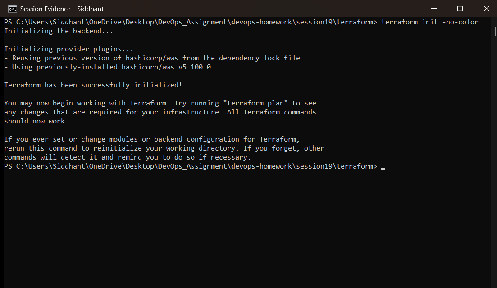
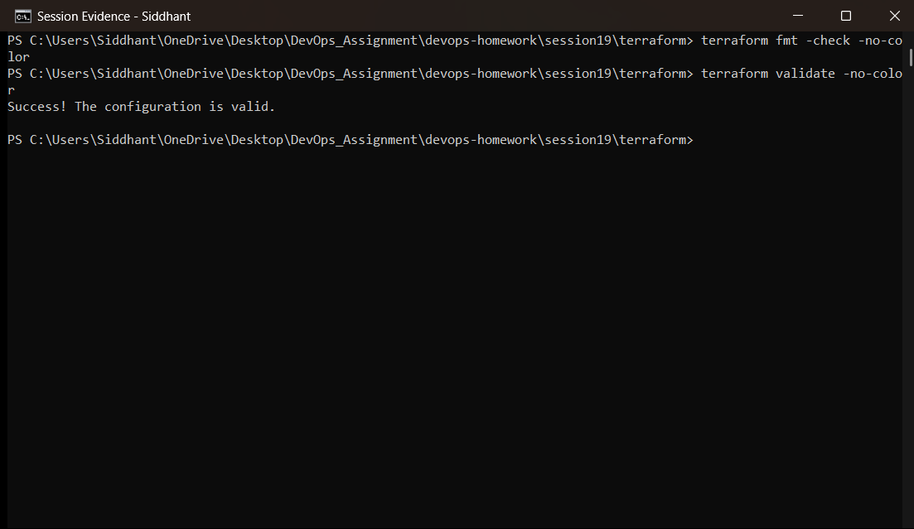
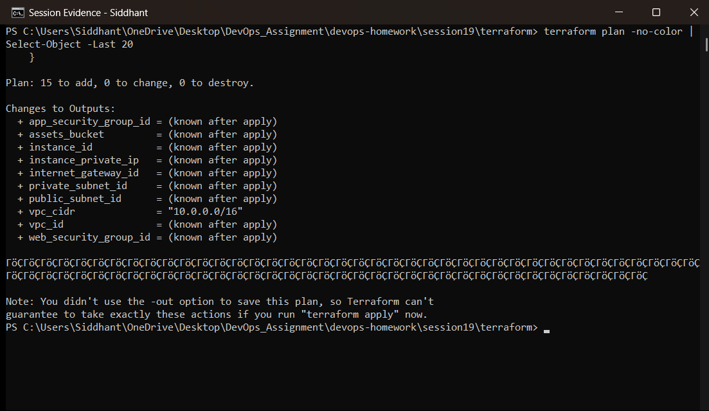
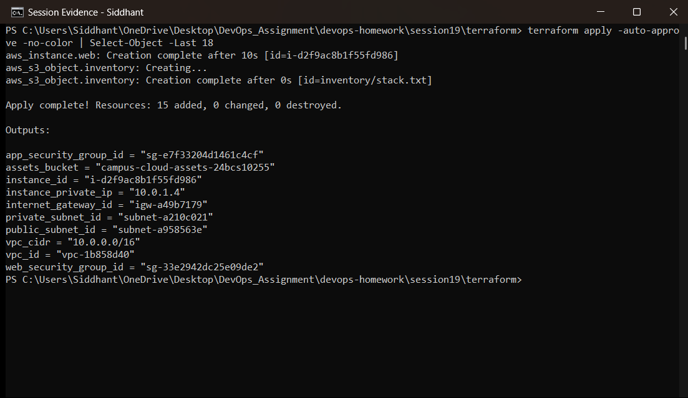
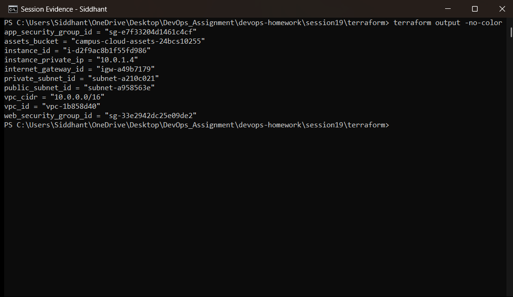
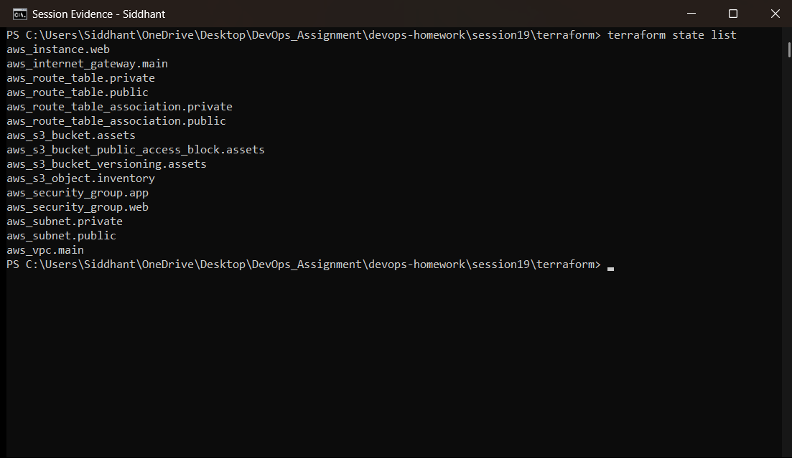
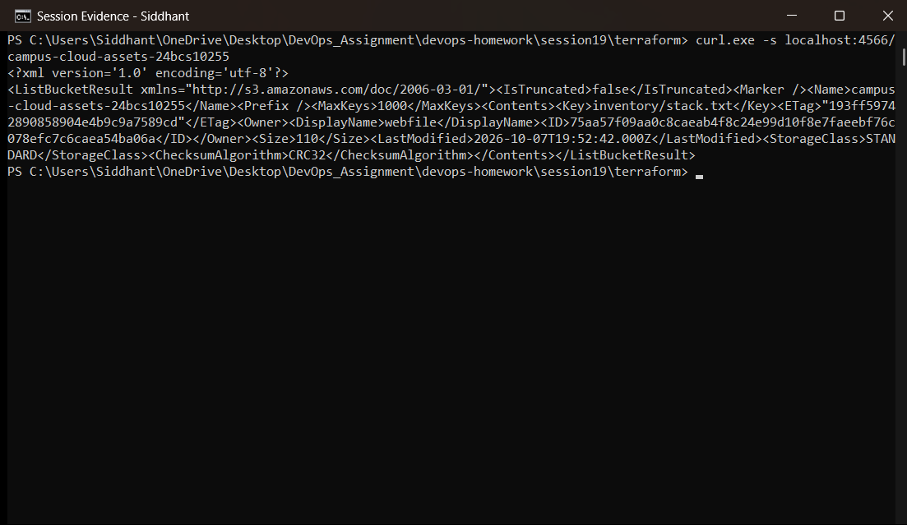
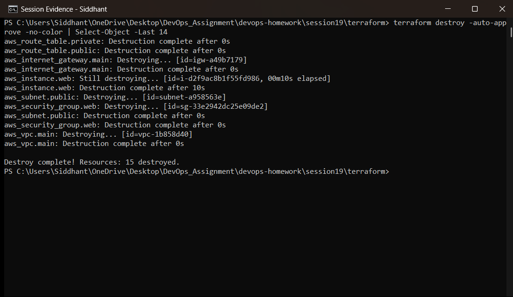

# Session 19 — Cloud & Terraform in Action

**Student:** Siddhant Prasad (24BCS10255)
**Environment:** Windows 11 · Terraform v1.16.2 · AWS provider v5.100.0 · LocalStack 3 (Docker)

An end-to-end cloud infrastructure project: one `terraform apply` builds a VPC, public and
private subnets, an internet gateway, route tables, two tiered security groups, an EC2 instance
and an S3 bucket — and one `terraform destroy` removes all of it.

> **How this was executed.** As in Session 18, every command here was really run, with the AWS
> APIs served by **LocalStack** in Docker rather than by Amazon. The provider, the dependency
> graph, the state file and all command output are genuine Terraform behaviour; only the endpoint
> differs, which keeps the project free and credential-free.

---

## 1. Architecture

```
                           ┌──────────────────────────────────┐
                           │  VPC  campus-cloud-vpc           │
                           │  10.0.0.0/16                     │
                           │                                  │
   Internet ──► IGW ──────►│  ┌────────────────────────────┐  │
                           │  │ public subnet 10.0.1.0/24  │  │
                           │  │  route 0.0.0.0/0 → IGW     │  │
                           │  │                            │  │
                           │  │   ┌────────────────────┐   │  │
                           │  │   │ EC2  campus-cloud  │   │  │
                           │  │   │ SG: web (80, 443)  │   │  │
                           │  │   └────────────────────┘   │  │
                           │  └────────────────────────────┘  │
                           │                                  │
                           │  ┌────────────────────────────┐  │
                           │  │ private subnet 10.0.11.0/24│  │
                           │  │  no 0.0.0.0/0 route        │  │
                           │  │  SG: app (8080 from web SG)│  │
                           │  └────────────────────────────┘  │
                           └──────────────────────────────────┘

                           ┌──────────────────────────────────┐
                           │ S3  campus-cloud-assets-…        │
                           │  versioning on, public access    │
                           │  blocked, inventory object       │
                           └──────────────────────────────────┘
```

## 2. File layout and what each file demonstrates

| File | Resources | Concept demonstrated |
|---|---|---|
| `provider.tf` | — | **Providers**: version constraints, region, endpoint configuration |
| `variables.tf` | — | **Variables**: typed inputs with descriptions and defaults |
| `vpc.tf` | VPC, IGW, 2 subnets, 2 route tables + associations | **Resources** and **implicit dependencies** |
| `security.tf` | 2 security groups | Security group **referencing another security group** |
| `compute.tf` | EC2 instance | Compute placed into a specific subnet and SG |
| `storage.tf` | S3 bucket, versioning, public access block, object | **Cross-resource dependencies** (the object embeds VPC and instance IDs) |
| `outputs.tf` | — | **Outputs**: the stack's public interface |
| `terraform.tfvars` | — | Environment-specific values |

### Dependencies are derived, never declared

Nothing in this project uses `depends_on`. Terraform builds the graph from the **references**
between resources:

```
aws_vpc.main
   ├──► aws_internet_gateway.main       (vpc_id = aws_vpc.main.id)
   ├──► aws_subnet.public / private     (vpc_id = aws_vpc.main.id)
   ├──► aws_security_group.web ──► aws_security_group.app   (security_groups = [web.id])
   └──► aws_route_table.public ──► aws_route_table_association.public
                                         │
aws_subnet.public ──► aws_instance.web ──┘
                              │
                              ▼
                     aws_s3_object.inventory   (content embeds aws_instance.web.id)
```

Because `aws_s3_object.inventory` interpolates `aws_vpc.main.id` and `aws_instance.web.id` into
its content, Terraform knows it must be created **last** — the storage layer genuinely depends on
the network and compute layers. Resources with no relationship between them are created in
parallel.

### Security groups referencing security groups

```hcl
ingress {
  description     = "App port, web tier only"
  from_port       = 8080
  to_port         = 8080
  protocol        = "tcp"
  security_groups = [aws_security_group.web.id]   # not a CIDR
}
```

This is the correct way to express tier-to-tier access: the app tier accepts traffic from
*whatever instances are in the web security group*, no matter what IPs they have.

### Public vs private subnet

Both subnets are ordinary subnets. The only difference is the route table attached to them:

```hcl
resource "aws_route_table" "public" {
  route {
    cidr_block = "0.0.0.0/0"
    gateway_id = aws_internet_gateway.main.id   # ← this makes it public
  }
}

resource "aws_route_table" "private" {
  # only the implicit local route: no path to the internet
}
```

---

## 3. Executed workflow

### 3.1 `terraform init`

```powershell
terraform init
```



Terraform installs the AWS provider and initialises the backend for this project directory.

### 3.2 `terraform validate`

```powershell
terraform fmt -check
terraform validate
```



Formatting is already canonical and the configuration is valid — checked offline, before any API
call is made.

### 3.3 `terraform plan`

```powershell
terraform plan
```



The plan lists every resource Terraform intends to create across the whole stack — VPC, gateway,
subnets, route tables, associations, both security groups, the instance and the S3 resources —
along with the outputs that will be known after apply. Nothing has been created yet.

### 3.4 `terraform apply`

```powershell
terraform apply -auto-approve
```



Apply walks the dependency graph: the VPC first, then everything that references it, with
independent resources created in parallel. The run ends with
`Apply complete! Resources: N added, 0 changed, 0 destroyed.` and prints the outputs.

### 3.5 Outputs

```powershell
terraform output
```



The outputs are the stack's interface — real IDs assigned by the API, not values written in the
configuration:

```
vpc_id, vpc_cidr, public_subnet_id, private_subnet_id, internet_gateway_id,
web_security_group_id, app_security_group_id, instance_id, instance_private_ip,
assets_bucket
```

### 3.6 Terraform state

```powershell
terraform state list
```



`state list` enumerates every resource Terraform is tracking. The state file is the record that
links the configuration to the real objects — it is why a second `apply` makes no changes, and
why `destroy` knows exactly what to remove.

### 3.7 Independent verification

```powershell
curl.exe -s localhost:4566/campus-cloud-assets-24bcs10255
```



Querying the S3 API directly — not Terraform — lists the bucket and the inventory object that
was created, confirming the infrastructure exists independently of the state file.

### 3.8 `terraform destroy`

```powershell
terraform destroy -auto-approve
```



Destroy removes resources in **reverse dependency order** — the S3 object and instance before the
subnets, the subnets before the VPC — because deleting a VPC with resources still inside it would
fail. The run ends with `Destroy complete! Resources: N destroyed.`

---

# Deliverables checklist

| Required deliverable | Where |
|---|---|
| Terraform project | `terraform/` (provider, variables, vpc, security, compute, storage, outputs, tfvars) |
| AWS resources | VPC, subnets, IGW, route tables, 2 security groups, EC2, S3 bucket + object |
| Architecture diagram | Section 1 |
| Screenshots | `screenshots/` |
| Terraform commands | Sections 3.1–3.8 |
| README.md | this file |

# Key learnings

- **The dependency graph is derived from references.** Writing `aws_vpc.main.id` is what creates
  an ordering constraint — `depends_on` is only needed for hidden dependencies the code does not
  express.
- **Destroy order is the reverse of create order**, and Terraform works it out from the same
  graph.
- **A subnet is public only because of its route table.** There is no "public" flag.
- **Security groups should reference other security groups**, not CIDR ranges, for internal
  traffic — the rule then survives any IP change.
- **Outputs are the stack's API**: the values other stacks, modules or CI pipelines consume,
  rather than people copying IDs out of a console.
