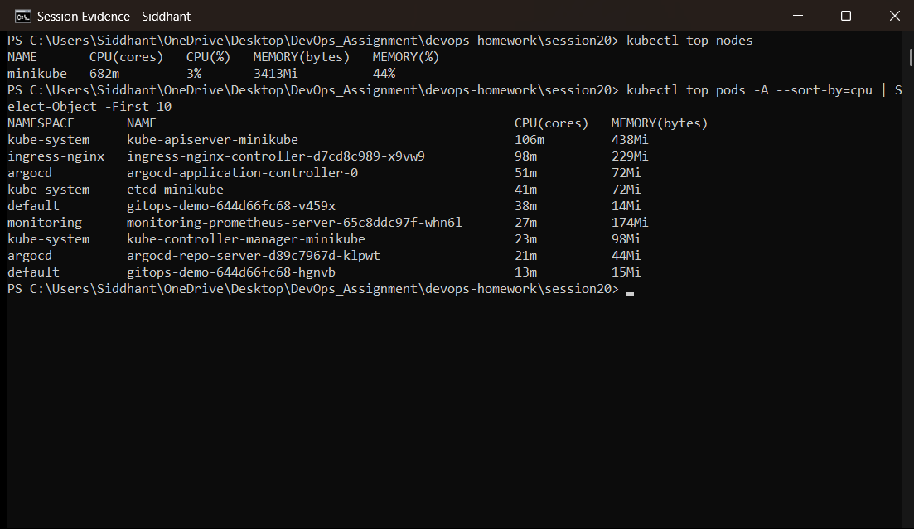
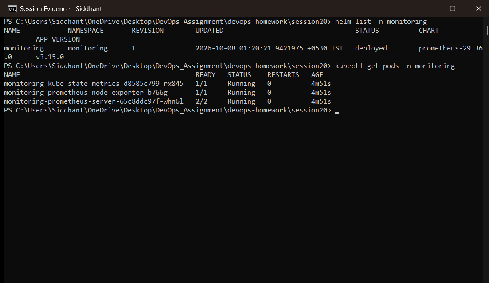
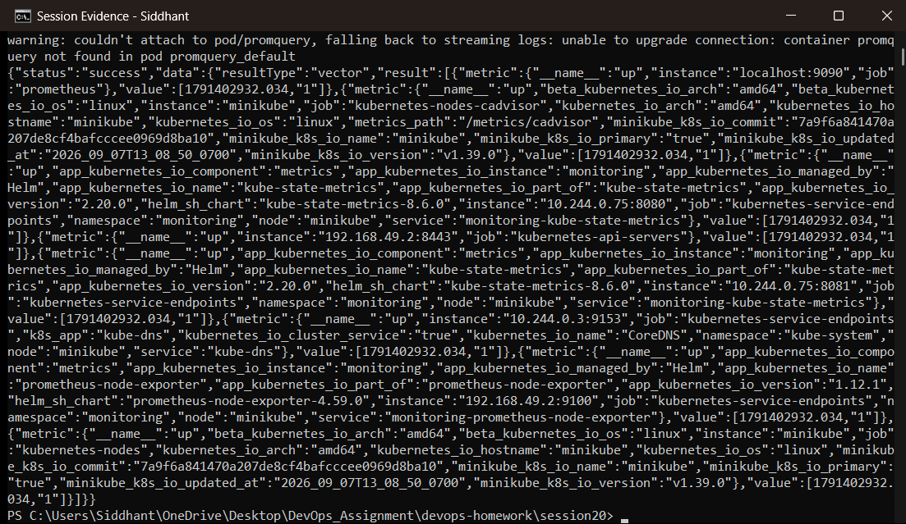
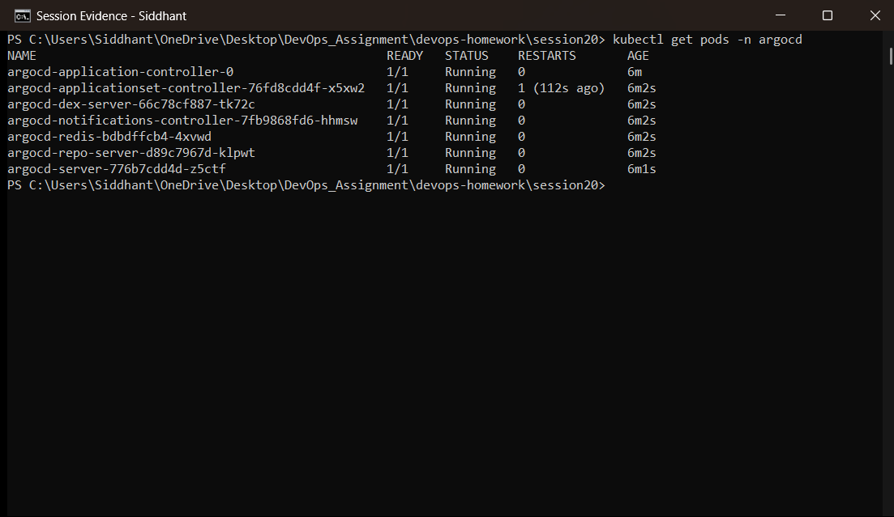
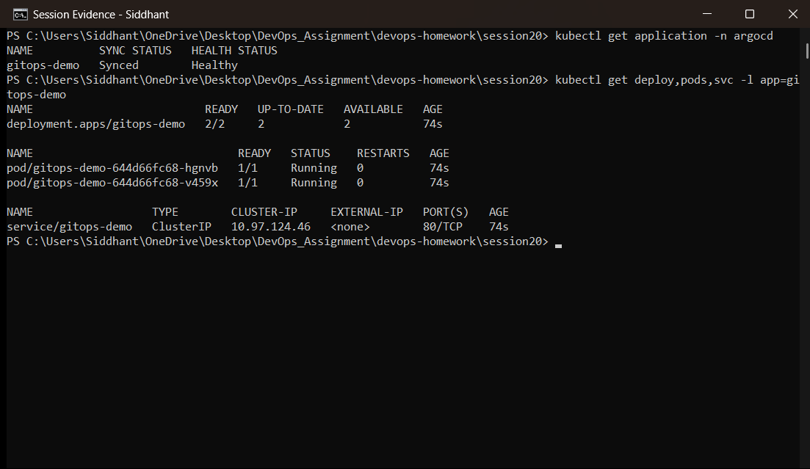

# Session 20 — Monitoring, Observability & GitOps

**Student:** Siddhant Prasad (24BCS10255)
**Environment:** Windows 11 · Minikube (Kubernetes v1.37.0) · metrics-server · Prometheus (Helm) · Argo CD

| Task | Topic | Artefacts |
|---|---|---|
| 1 | Monitoring | `monitoring/`, Prometheus installed via Helm |
| 2 | Observability | documented below |
| 3 | GitOps | `gitops/` — Argo CD Application reconciling this repository |

---

# TASK 1 — Monitoring

## 1.1 What monitoring is

Monitoring answers **"is the system healthy right now?"** by collecting known signals and
alerting when they cross a threshold. It is built on questions you decided in advance: is CPU
high, is memory exhausted, is the app responding.

The Kubernetes monitoring stack used here:

```
   kubelet / cAdvisor  (per-node resource usage)
            │
            ├────────────► metrics-server ──► kubectl top, HPA decisions
            │                                 (live values only, no history)
            │
   /metrics endpoints  ──► Prometheus ──► time-series database + PromQL
   (apps, kube-state-metrics, node-exporter)        │
                                                    └──► alerts, dashboards
```

The two are complementary: **metrics-server** holds only the latest value and exists to serve
`kubectl top` and the HPA, while **Prometheus** scrapes and *stores* metrics over time, which is
what makes trends, dashboards and alerting possible.

## 1.2 Metrics

```powershell
kubectl top nodes
kubectl top pods -A --sort-by=cpu
```



Real CPU and memory consumption per node and per Pod. These are the numbers the HPA acts on
(Session 13 proved that: utilisation is measured against each container's CPU **request**).

## 1.3 Prometheus

Installed with Helm:

```powershell
helm repo add prometheus-community https://prometheus-community.github.io/helm-charts
helm install monitoring prometheus-community/prometheus -n monitoring
kubectl get pods -n monitoring
```



The chart deploys the Prometheus server plus two exporters that supply most Kubernetes signals:

| Component | What it provides |
|---|---|
| `prometheus-server` | Scrapes targets, stores the time series, evaluates rules |
| `kube-state-metrics` | Object-level state: replica counts, Pod phase, deployment status |
| `node-exporter` | Node-level OS metrics: CPU, memory, disk, filesystem |

## 1.4 Querying with PromQL

```powershell
kubectl port-forward -n monitoring svc/monitoring-prometheus-server 9090:80
curl.exe -s "http://localhost:9090/api/v1/query?query=up"
```



`up` is the canonical health query — it returns `1` for every target Prometheus can scrape and
`0` for every one it cannot, which is the simplest possible "is it alive" signal.

Other queries that matter in practice:

| Query | Answers |
|---|---|
| `up` | Which targets are reachable |
| `kube_pod_status_phase{phase="Running"}` | How many Pods are running |
| `rate(container_cpu_usage_seconds_total[5m])` | CPU burn rate per container |
| `container_memory_working_set_bytes` | Memory actually in use (what the OOM killer looks at) |
| `kube_deployment_status_replicas_unavailable` | Deployments not at full strength |

## 1.5 Alerts

An alert is a PromQL expression plus a duration — it fires only if the condition holds, which
prevents a brief spike from paging anyone:

```yaml
- alert: PodCrashLooping
  expr: rate(kube_pod_container_status_restarts_total[10m]) > 0
  for: 5m
  labels:
    severity: critical
  annotations:
    summary: "Pod {{ $labels.pod }} is restarting repeatedly"
```

## 1.6 Application health

Health in Kubernetes is enforced by **probes**, not by a dashboard: readiness controls whether a
Pod receives traffic, liveness controls whether it is restarted. Session 13 demonstrated both.
Monitoring observes that process; probes are what actually act on it.

---

# TASK 2 — Observability

## 2.1 Monitoring vs observability

| | Monitoring | Observability |
|---|---|---|
| Question | "Is it broken?" | "**Why** is it broken?" |
| Based on | Known failure modes you predicted | Exploring data you did not predict |
| Typical output | A dashboard, an alert | An investigation |

Monitoring tells you the error rate rose at 14:03. Observability tells you *why* — which release,
which dependency, which user segment. A system is observable when you can answer new questions
about it **without shipping new code**.

## 2.2 The three pillars

```
   METRICS                    LOGS                        TRACES
   numbers over time          discrete events             one request end to end
   ───────────────            ───────────────             ───────────────────────
   cheap, aggregatable        rich detail, verbose        shows latency per hop
   "error rate is 5%"         "NullPointer at line 42"    "the 800ms was in auth"
   Prometheus                 Loki / ELK                  Jaeger / Tempo
```

### Metrics
Numeric measurements at regular intervals. Cheap to store and perfect for trends, thresholds and
alerting — but they are aggregates, so they cannot explain an individual failed request.

### Logs
Immutable records of discrete events, with the detail metrics lack. Expensive at volume, and only
as useful as they are structured — JSON logs with a correlation ID can be searched; free-text
logs mostly cannot.

```powershell
kubectl logs <pod>              # current container
kubectl logs <pod> --previous   # the container that crashed (Session 14)
kubectl logs -l app=campus --tail=50
```

### Traces
A trace follows **one request across every service it touches**, with a span per hop. This is the
only pillar that pinpoints *where* latency comes from in a distributed system, and it is what
metrics and logs structurally cannot show.

## 2.3 Why observability is required

- **Microservices**: a single user action crosses many services; no one service's logs explain a
  failure.
- **Ephemeral infrastructure**: Pods are rescheduled and deleted, so you cannot SSH in afterwards
  to look around — telemetry must be exported *before* the Pod disappears.
- **Unknown unknowns**: dashboards only show failures someone anticipated. Real outages are
  usually novel.
- **MTTR**: the time to restore is dominated by the time to *diagnose*, which is exactly what
  observability shortens.

## 2.4 Common tools

| Pillar | Open source | Managed |
|---|---|---|
| Metrics | Prometheus, VictoriaMetrics | CloudWatch, Datadog |
| Logs | Loki, Elasticsearch/ELK, Fluent Bit | CloudWatch Logs, Splunk |
| Traces | Jaeger, Tempo, OpenTelemetry | AWS X-Ray, Honeycomb |
| Dashboards | Grafana | Datadog, New Relic |

**OpenTelemetry** is the emerging standard across all three: one vendor-neutral instrumentation
layer, so the backend can be swapped without touching application code.

## 2.5 Kubernetes observability specifically

| Layer | Source |
|---|---|
| Cluster events | `kubectl events`, `kubectl describe` (Session 14 relied on these) |
| Resource usage | metrics-server, cAdvisor, Prometheus |
| Object state | kube-state-metrics |
| Container output | `kubectl logs`, shipped off-node by Fluent Bit |
| Node health | node-exporter |
| Application health | readiness / liveness / startup probes |

---

# TASK 3 — GitOps

## 3.1 What GitOps is

GitOps manages infrastructure and applications with **Git as the single source of truth**, and an
in-cluster agent that continuously makes reality match the repository.

```
   developer ──commit──► Git repository ◄──pull/watch── Argo CD (in cluster)
                         (desired state)                      │
                                                              │ reconcile
                                                              ▼
                                                      Kubernetes cluster
                                                        (actual state)
```

Nobody runs `kubectl apply` against production. You commit; the agent applies.

## 3.2 Git as the source of truth

Because every change is a commit:

- the repository is a **complete audit log** — who changed what, when, and why;
- **rollback is `git revert`**, and the agent converges the cluster back;
- code review becomes **change control** for infrastructure;
- a cluster can be rebuilt from the repository alone.

## 3.3 Declarative configuration

GitOps requires declarative manifests — they describe the desired *end state*, so the agent can
compare desired against actual at any moment. An imperative script (`kubectl scale ...`) cannot be
diffed, which is why GitOps and declarative configuration are inseparable.

## 3.4 Continuous reconciliation

This is the property that separates GitOps from ordinary CD. The agent does not just apply once —
it loops:

```
every ~3 minutes:
   desired = manifests in Git
   actual  = objects in the cluster
   if they differ:
       OutOfSync  ──► (selfHeal) re-apply the desired state
```

So **drift is corrected automatically**. If someone edits a Deployment by hand, Argo CD reverts it
on the next pass. Push-based CD cannot do this — it only acts when a pipeline runs.

## 3.5 The Application object

[`gitops/application.yaml`](gitops/application.yaml) is the GitOps configuration itself:

```yaml
source:
  repoURL: https://github.com/Sid13SST/devops-homework.git
  targetRevision: main
  path: session20/gitops/app-manifests
destination:
  server: https://kubernetes.default.svc
  namespace: default
syncPolicy:
  automated:
    prune: true      # delete resources removed from Git
    selfHeal: true   # revert manual changes in the cluster
```

`prune` and `selfHeal` are what make Git authoritative in both directions: anything deleted from
Git is deleted from the cluster, and anything changed in the cluster is reverted to Git.

## 3.6 Argo CD installed

```powershell
kubectl create namespace argocd
kubectl apply -n argocd -f https://raw.githubusercontent.com/argoproj/argo-cd/stable/manifests/install.yaml
kubectl get pods -n argocd
```



Argo CD's components: the **application-controller** (runs the reconciliation loop), the
**repo-server** (clones Git and renders manifests), the **server** (API and UI), **redis** (cache)
and **dex** (SSO).

## 3.7 The application reconciled from Git

```powershell
kubectl apply -f gitops/application.yaml
kubectl get application -n argocd
kubectl get pods,svc -l app=gitops-demo
```



The Application reports `Synced` / `Healthy`, and the Deployment and Service exist in the cluster —
**created by Argo CD from the manifests in this repository**, not by anyone running `kubectl apply`
on them. That is the whole point: the only human action was a Git commit.

## 3.8 Kubernetes + GitOps

Kubernetes suits GitOps unusually well because its API is declarative by design: every object has
a desired `spec` and an observed `status`, which is exactly the comparison a reconciler needs.
Argo CD simply extends Kubernetes' own control-loop pattern out to a Git repository.

---

# Deliverables checklist

| Required deliverable | Where |
|---|---|
| Monitoring demo | Task 1 — metrics-server, Prometheus, PromQL |
| Observability documentation | Task 2 — metrics, logs, traces |
| GitOps demo | Task 3 — Argo CD reconciling `gitops/app-manifests` from this repo |
| Screenshots | `screenshots/` |
| README.md | this file |

# Key learnings

- **metrics-server and Prometheus solve different problems**: live values for `kubectl top` and
  the HPA versus stored history for trends and alerting.
- **Monitoring answers "is it broken", observability answers "why"** — the second needs metrics,
  logs *and* traces together.
- **GitOps inverts deployment**: the cluster pulls from Git rather than a pipeline pushing to the
  cluster, so credentials never leave the cluster and Git stays authoritative.
- **Continuous reconciliation is the key differentiator** — `selfHeal` means manual drift is
  corrected automatically, which ordinary CD cannot do.
