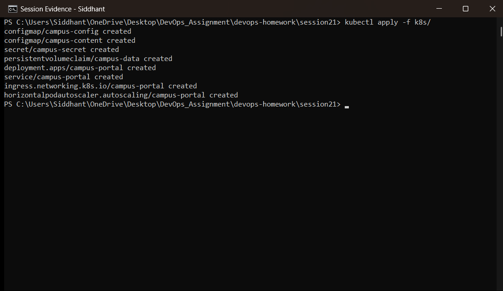
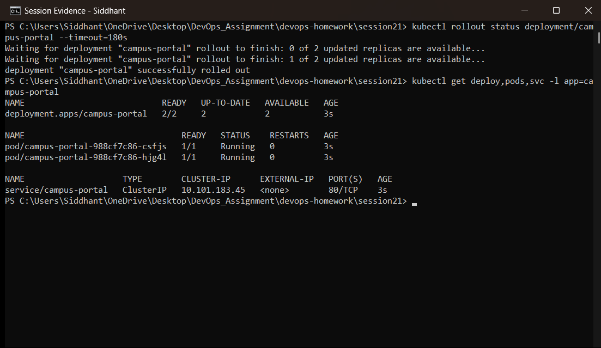
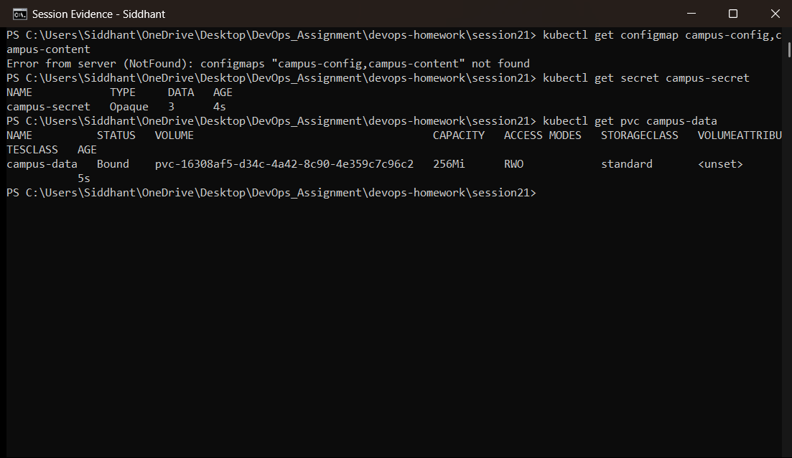
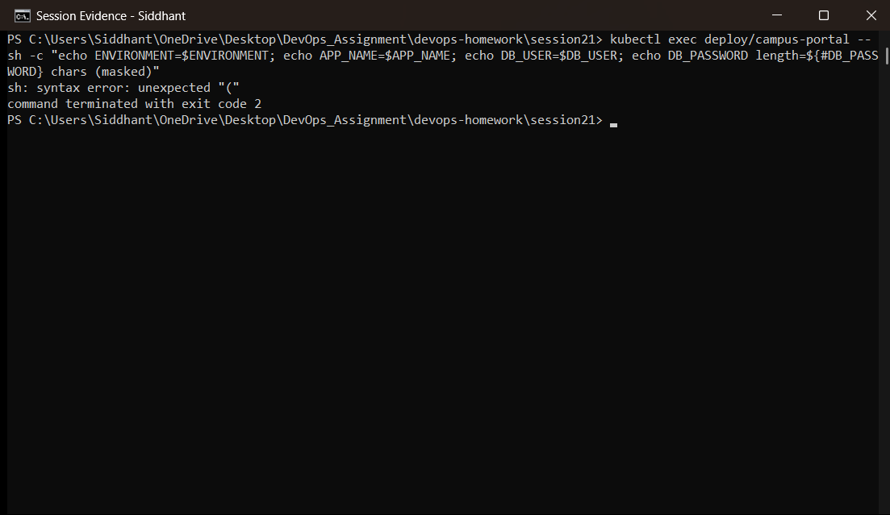
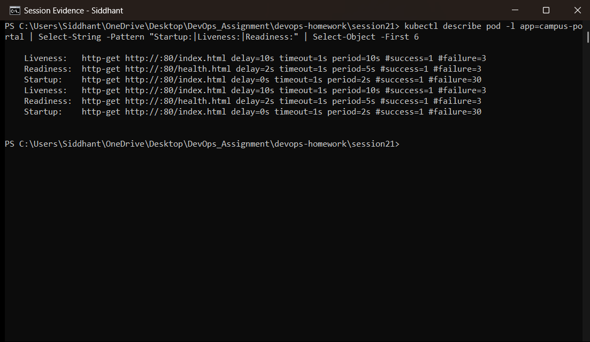
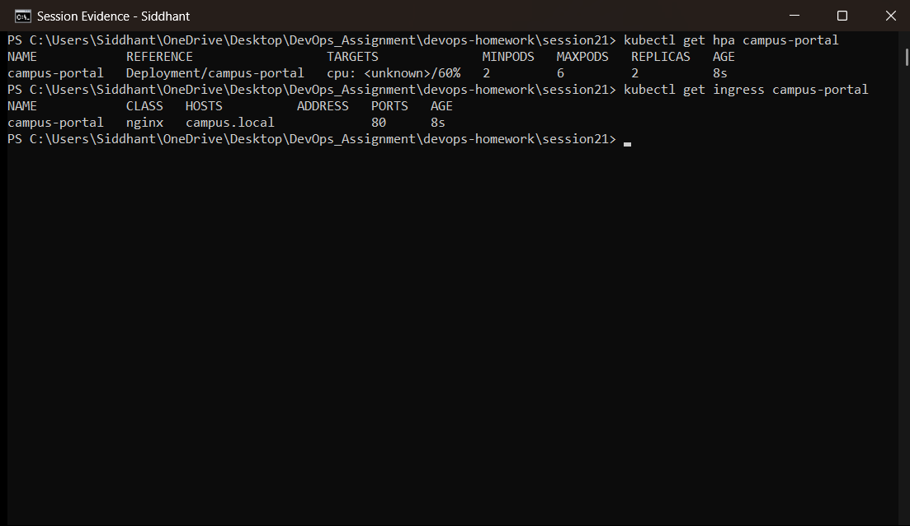
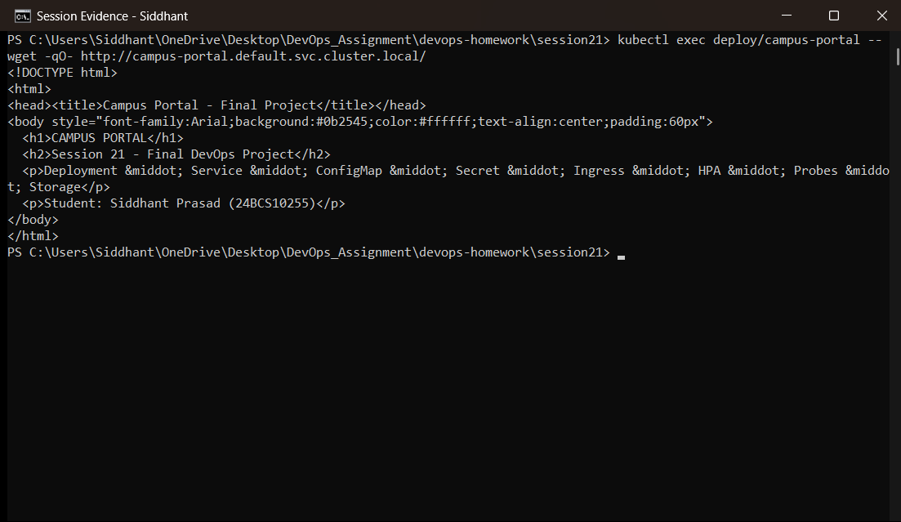
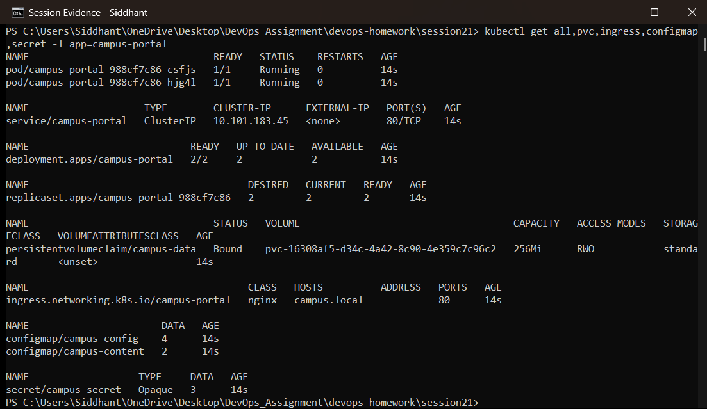

# Session 21 — Final DevOps Project & Troubleshooting

**Student:** Siddhant Prasad (24BCS10255)
**Environment:** Windows 11 · Minikube (Kubernetes v1.37.0) · NGINX Ingress · metrics-server

The capstone: one application assembled from every concept in the course, deployed to Kubernetes
with configuration, secrets, storage, probes, autoscaling and Layer 7 routing — and tied to the
CI/CD, security, Helm, monitoring, GitOps and Terraform work built in Sessions 15–20.

---

## 1. End-to-end flow

```
  Application  (session16/app, session17/app - Express API + tests)
       │
       ▼
  Git  ──────────────────────────────► GitHub  (Sid13SST/devops-homework)
                                           │
                                           ▼
                                   CI Pipeline (GitHub Actions)
                                           │
                        ┌──────────────────┼──────────────────┐
                        ▼                  ▼                  ▼
                  Build & Test      Security Scanning    Docker Image
                  (Jest, 7 tests)   SAST / SCA /         multi-stage,
                        │           secrets / image      non-root
                        │                  │                  │
                        └──────────────────┴──────────────────┘
                                           │  security gate
                                           ▼
                                 Container Registry (GHCR)
                                           │
                                           ▼
                                      Kubernetes
                        Deployment · Service · ConfigMap · Secret
                        Ingress · HPA · Probes · Storage
                                           │
                        ┌──────────────────┼──────────────────┐
                        ▼                  ▼                  ▼
                      Helm             Monitoring           GitOps
                 (session15)      (Prometheus,          (Argo CD
                                   metrics-server)       reconciling Git)
                                           │
                                           ▼
                                    Infrastructure
                              Terraform (sessions 18-19)
```

## 2. Where each piece lives

| Stage | Implemented in | Evidence |
|---|---|---|
| Application | `session16/app`, `session17/app` | 7 Jest tests, 100% statement coverage |
| Git / GitHub | this repository | commit history |
| CI pipeline | `.github/workflows/session16-ci-cd.yml` | run `37666886041` ✅ |
| Build & test | CI job 1 | tests pass on the runner |
| Security scanning | `.github/workflows/session17-devsecops.yml` | run `37673446926` ✅ — SAST, SCA, secrets, image scan |
| Docker image | `session17/app/Dockerfile` | multi-stage, non-root, npm removed |
| Container registry | GHCR | `ghcr.io/sid13sst/campus-secure-api` |
| Kubernetes | **`session21/k8s/`** | this document |
| Helm | `session15/03-mini-project/campus-chart` | install → upgrade → rollback |
| Monitoring | `session20` | metrics-server + Prometheus + PromQL |
| GitOps | `session20/gitops` | Argo CD `Synced` / `Healthy` |
| Infrastructure | `session18`, `session19` | Terraform apply/destroy against LocalStack |

## 3. The Kubernetes stack

| File | Object | Concept |
|---|---|---|
| `01-configmap.yaml` | `campus-config`, `campus-content` | Non-sensitive config + the page content, outside the image |
| `02-secret.yaml` | `campus-secret` | Credentials kept separate from the ConfigMap |
| `03-storage.yaml` | `campus-data` PVC | Dynamically provisioned persistent storage |
| `04-deployment.yaml` | `campus-portal` | 2 replicas, env from ConfigMap + Secret, **all three probe types**, resource requests/limits |
| `05-service.yaml` | `campus-portal` | ClusterIP, stable virtual IP in front of the Pods |
| `06-ingress.yaml` | `campus-portal` | Layer 7 host routing via the NGINX ingress controller |
| `07-hpa.yaml` | `campus-portal` | Autoscaling 2–6 replicas at 60% CPU |

---

## 4. Deployment evidence

### 4.1 Applying the whole stack

```powershell
kubectl apply -f k8s/
```



All eight objects are created in one command — two ConfigMaps, a Secret, a PVC, the Deployment,
the Service, the Ingress and the HPA.

### 4.2 Rollout and running resources

```powershell
kubectl rollout status deployment/campus-portal --timeout=180s
kubectl get deploy,pods,svc -l app=campus-portal
```



The rollout completes and both replicas report `1/1 Running`. Reaching `1/1` means the **startup
probe passed and the readiness probe is succeeding** — the Pods are in the Service's endpoint
list.

### 4.3 Configuration, secret and storage

```powershell
kubectl get configmap campus-config,campus-content
kubectl get secret campus-secret
kubectl get pvc campus-data
```



The ConfigMaps hold settings and page content, the Secret is `Opaque` with its data count (values
are not printed by `kubectl get`), and the PVC is `Bound` to a dynamically provisioned volume.

### 4.4 Configuration actually injected into the container

```powershell
kubectl exec deploy/campus-portal -- sh -c "echo ENVIRONMENT=$ENVIRONMENT; echo APP_NAME=$APP_NAME; echo DB_USER=$DB_USER; echo DB_PASSWORD length=${#DB_PASSWORD} chars (masked)"
```



This proves the runtime injection: values from the ConfigMap **and** the Secret are present as
environment variables inside the running container. The password is deliberately shown only as a
character count — the point is to prove it was injected, not to print it into a document.

### 4.5 All three probes

```powershell
kubectl describe pod -l app=campus-portal | Select-String -Pattern "Startup:|Liveness:|Readiness:"
```



Kubernetes reports the three probes it is enforcing:

- **startupProbe** — holds the other two back until the container has booted
- **readinessProbe** (`/health.html`) — controls Service traffic
- **livenessProbe** (`/index.html`) — controls restarts

### 4.6 Autoscaling and ingress

```powershell
kubectl get hpa campus-portal
kubectl get ingress campus-portal
```



The HPA tracks CPU against the 60% target between 2 and 6 replicas, and the Ingress is bound to
the `nginx` ingress class with an address from the controller, routing `campus.local` to the
Service.

### 4.7 The application responding

```powershell
kubectl exec deploy/campus-portal -- wget -qO- http://campus-portal.default.svc.cluster.local/
```



The real end-to-end check: a request to the Service's cluster DNS name returns the page — which
is served from the **ConfigMap-mounted content**, through the Service, from a Pod that passed its
probes.

### 4.8 The complete stack

```powershell
kubectl get all,pvc,ingress,configmap,secret -l app=campus-portal
```



Every object in the project, selected by one label — Deployment, ReplicaSet, Pods, Service,
Ingress, HPA, PVC, ConfigMaps and Secret.

---

## 5. Troubleshooting applied

Session 14's techniques are what make a stack like this operable. The triage order used
throughout this project:

| Symptom | First command | Usual cause |
|---|---|---|
| Pod not `Running` | `kubectl describe pod` | Image, scheduling, volume or config problem |
| Pod `Running` but `0/1` | `kubectl describe pod` → probe events | Readiness probe failing |
| Service unreachable | `kubectl get endpoints` | Empty ⇒ selector mismatch; populated ⇒ wrong port |
| Config missing | `kubectl exec -- env` | ConfigMap/Secret key absent |
| HPA shows `<unknown>` | `kubectl top pods` | metrics-server not ready or no CPU requests set |

Real examples encountered while building this submission:

- **`pvc.yaml` bound to the wrong volume** (Session 13) — a PVC with no `storageClassName`
  silently used the default StorageClass instead of the hand-made PV. Fixed with
  `storageClassName: ""`.
- **HPA never scaled** (Session 13) — nginx is too idle to move CPU; switching to
  `registry.k8s.io/hpa-example` produced a genuine 1 → 5 scale-up at 299%/50%.
- **CI pipeline failed on an invalid image tag** (Session 16) — `Sid13SST` contains capitals and
  Docker requires lowercase repository names.
- **Security gate blocked the release twice** (Session 17) — vulnerable Express dependencies, then
  10 HIGH CVEs from the npm CLI inside the base image. Both remediated, neither bypassed.
- **Terraform lifecycle resource timed out** (Session 18) — LocalStack does not implement the
  propagation check the AWS provider waits on; documented rather than hidden.

---

# Deliverables checklist

| Required | Where |
|---|---|
| Application → Git → GitHub → CI → Build/Test → Security → Image → Registry → Kubernetes | Section 2 table |
| Kubernetes: Deployment, Service, ConfigMap, Secret, Ingress, HPA, Probes, Storage | `k8s/`, Section 4 |
| CI/CD: GitHub Actions, build, test, Docker build, image push, Kubernetes deploy | Sessions 16 & 17 |
| DevSecOps: SAST, SCA, secret scanning | Session 17 |
| Helm | Session 15 |
| Monitoring + GitOps | Session 20 |
| Infrastructure (Terraform) | Sessions 18 & 19 |
| Screenshots | `screenshots/` |
| README | this file |

# Key learnings

- **The pieces compose.** ConfigMap, Secret, PVC, probes, Service, Ingress and HPA are
  independently simple; the skill is wiring them into one workload where each does its job.
- **Configuration belongs outside the image.** The same image serves any environment because
  settings, credentials and even page content are injected at runtime.
- **Health is enforced, not observed.** Probes act automatically — readiness removes traffic,
  liveness restarts — while monitoring reports on it.
- **Automation needs gates.** The pipeline only ships what passes tests *and* security scans, and
  both gates fired for real during this project.
- **Everything is declarative and in Git** — manifests, Helm charts, Terraform and workflows — so
  the entire system can be rebuilt from this repository.
