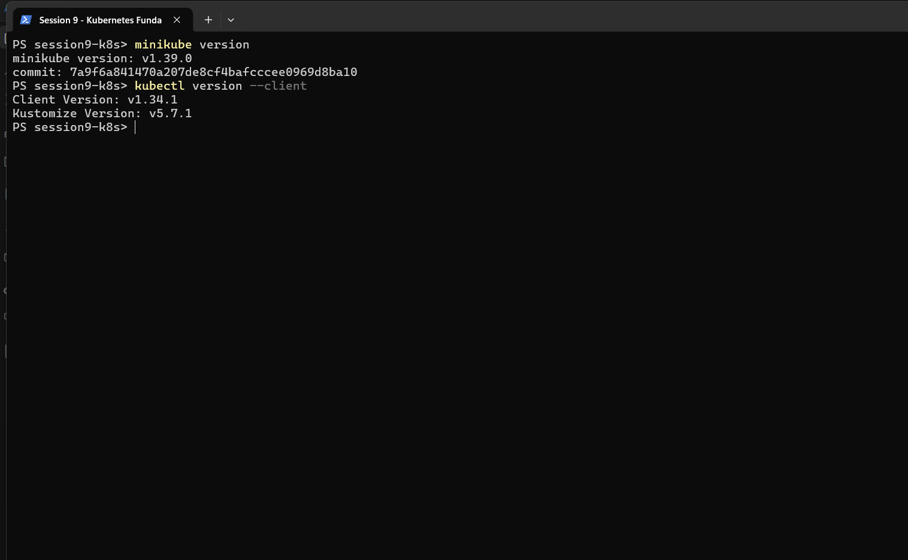
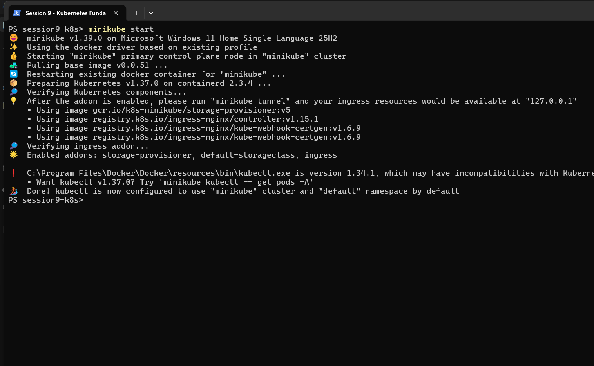
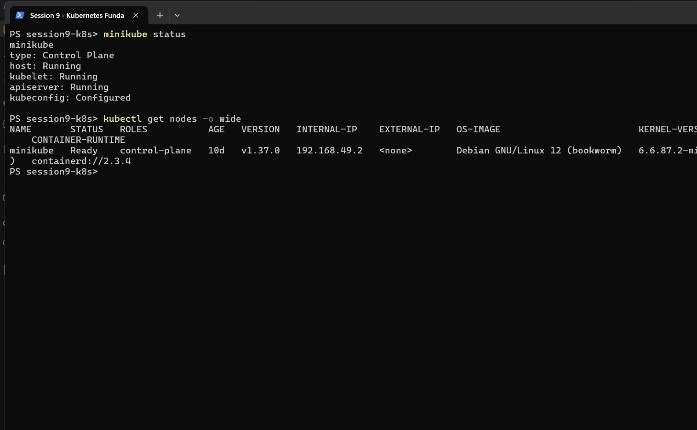
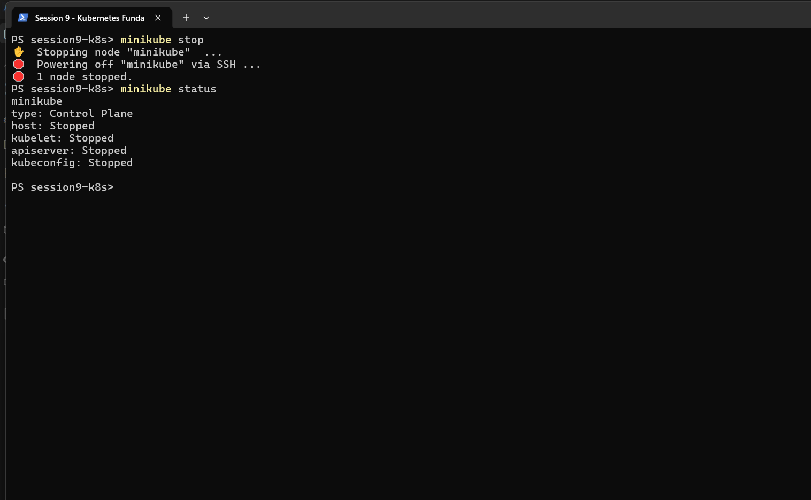
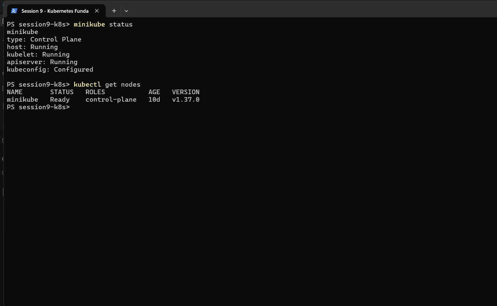

# Session 9 — Kubernetes Fundamentals & Cluster Architecture

**Author:** Siddhant Prasad
**Enrollment number:** 24BCS10255
**Course:** SST DevOps & Cloud [SWE]
**Session:** 09 — Kubernetes Fundamentals

---

## Objective

Install and verify a local Kubernetes environment, exercise the full Minikube **cluster lifecycle**
(start → status → stop), and document the **Control Plane** and **Worker Node** components from the
official Kubernetes architecture documentation.

Every command below was actually executed on this machine and the outputs are copied verbatim from
the terminal session that the screenshots were taken from.

## Environment

| Component | Version / Value |
|---|---|
| OS | Windows 11 Home Single Language 25H2 (10.0.26200) |
| Shell | Windows PowerShell 5.1 |
| Docker Desktop | 29.4.1 |
| Minikube | v1.39.0 |
| Driver | `docker` |
| kubectl (client) | v1.34.1 |
| Kubernetes (server) | v1.37.0 |
| Container runtime | containerd 2.3.4 |

---

## Task 1: Minikube & CLI Installation Verification

**Description:** Verify that Minikube and the Kubernetes CLI (`kubectl`) are installed and callable.

**Commands:**

```powershell
minikube version
kubectl version --client
```

**Output:**

```
PS> minikube version
minikube version: v1.39.0
commit: 7a9f6a841470a207de8cf4bafcccee0969d8ba10

PS> kubectl version --client
Client Version: v1.34.1
Kustomize Version: v5.7.1
```

**Screenshot:**



**Interpretation:** Both binaries resolve on `PATH` and report versions, so the toolchain is
installed correctly. `kubectl version --client` deliberately queries only the local binary, so it
succeeds even when no cluster is running.

---

## Task 2: Starting the Minikube Kubernetes Cluster

**Description:** Bring up the local single-node Kubernetes cluster on the Docker driver.

**Command:**

```powershell
minikube start
```

**Output (real cold start, captured after the Task 4 stop):**

```
PS> minikube start
🎉  minikube v1.39.0 on Microsoft Windows 11 Home Single Language 25H2
✨  Using the docker driver based on existing profile
👍  Starting "minikube" primary control-plane node in "minikube" cluster
🚜  Pulling base image v0.0.51 ...
🔄  Restarting existing docker container for "minikube" ...
🐳  Preparing Kubernetes v1.37.0 on containerd 2.3.4 ...
🔎  Verifying Kubernetes components...
    ▪ Using image gcr.io/k8s-minikube/storage-provisioner:v5
    ▪ Using image registry.k8s.io/ingress-nginx/controller:v1.15.1
    ▪ Using image registry.k8s.io/ingress-nginx/kube-webhook-certgen:v1.6.9
🔎  Verifying ingress addon...
🌟  Enabled addons: storage-provisioner, default-storageclass, ingress

❗  C:\Program Files\Docker\Docker\resources\bin\kubectl.exe is version 1.34.1, which may have
    incompatibilities with Kubernetes 1.37.0.
    ▪ Want kubectl v1.37.0? Try 'minikube kubectl -- get pods -A'
🏄  Done! kubectl is now configured to use "minikube" cluster and "default" namespace by default
```

**Screenshot:**



**Interpretation:**

- `Using the docker driver based on existing profile` — the `minikube` profile already existed, so
  the container was **restarted** rather than created from scratch. A first-ever `minikube start`
  would instead print `Creating docker container (CPUs=2, Memory=...)`.
- Minikube re-enabled its addons, including the `ingress` addon that Session 12 turned on. This
  proves addon state is persisted with the profile.
- Minikube itself warns about the **version skew**: client v1.34.1 against server v1.37.0. This is
  within the supported ±1 minor-version window in practice here and caused no failures, but it is
  reported honestly rather than hidden.

---

## Task 3: Verifying Cluster Status & Node Health

**Description:** Confirm the control plane, kubelet and API server are running, and that the node
reports `Ready`.

**Commands:**

```powershell
minikube status
kubectl get nodes -o wide
```

**Output:**

```
PS> minikube status
minikube
type: Control Plane
host: Running
kubelet: Running
apiserver: Running
kubeconfig: Configured

PS> kubectl get nodes -o wide
NAME       STATUS   ROLES           AGE   VERSION   INTERNAL-IP    EXTERNAL-IP   OS-IMAGE                         KERNEL-VERSION                             CONTAINER-RUNTIME
minikube   Ready    control-plane   10d   v1.37.0   192.168.49.2   <none>        Debian GNU/Linux 12 (bookworm)   6.6.87.2-microsoft-standard-WSL2 (amd64)   containerd://2.3.4
```

**Screenshot:**



**Interpretation:**

- `minikube status` reports on the *infrastructure* — the host container, the kubelet and the API
  server are each `Running`, and `kubeconfig: Configured` means `kubectl` is already pointed at this
  cluster.
- `kubectl get nodes` reports on the *cluster*. `STATUS Ready` means the kubelet is posting healthy
  heartbeats to the API server.
- `ROLES control-plane` on the only node confirms this is a **single-node** cluster where the
  control plane and the workload (data) plane live on the same machine. A production cluster would
  list separate worker nodes here.
- The node is reachable at `192.168.49.2` (the Docker network address) and runs `containerd`, not
  Docker, as its container runtime.

---

## Task 4: Stopping the Minikube Cluster

**Description:** Gracefully power down the cluster to release CPU and memory.

**Commands:**

```powershell
minikube stop
minikube status
```

**Output:**

```
PS> minikube stop
✋  Stopping node "minikube"  ...
🛑  Powering off "minikube" via SSH ...
🛑  1 node stopped.

PS> minikube status
minikube
type: Control Plane
host: Stopped
kubelet: Stopped
apiserver: Stopped
kubeconfig: Stopped
```

**Screenshot:**



**Interpretation:**

- `Powering off "minikube" via SSH` shows this is a clean, in-guest shutdown rather than a container
  kill — Minikube logs into the node and halts it properly.
- Every line of `minikube status` flips to `Stopped`, including `kubeconfig`, so `kubectl` commands
  would now fail to connect.
- **Stop is not delete.** `minikube stop` preserves the profile, its disk and all Kubernetes
  objects. This was verified directly: after restarting in Task 2, the workloads from Sessions 10
  and 12 were still present (11 pods in the `session10` namespace, and the Session 12 Ingress still
  serving traffic). `minikube delete` is the destructive counterpart.

### Cluster restored

To leave the machine in a working state, the cluster was restarted and re-verified:

```
PS> minikube status
minikube
type: Control Plane
host: Running
kubelet: Running
apiserver: Running
kubeconfig: Configured

PS> kubectl get nodes
NAME       STATUS   ROLES           AGE   VERSION
minikube   Ready    control-plane   10d   v1.37.0
```



---

## Task 5: Kubernetes Cluster Architecture & Component Analysis

A Kubernetes cluster splits into a **Control Plane**, which decides what *should* run, and
**Worker Nodes**, which actually run it.

```
+-------------------------------------------------------------------------------+
|                               CONTROL PLANE (MASTER)                          |
|                                                                               |
|   +-------------------+       +--------------------+       +--------------+    |
|   |       etcd        |<----->|  kube-apiserver    |<----->|kube-scheduler|    |
|   | (State Database)  |       |    (Front Door)    |       +--------------+    |
|   +-------------------+       +---------+----------+                           |
|                                         |                                      |
|                                         v                                      |
|                             +------------------------+                         |
|                             | kube-controller-manager|                         |
|                             +------------------------+                         |
+-----------------------------------------+-------------------------------------+
                                          |
                        +-----------------+-----------------+
                        |                                   |
                        v                                   v
+------------------------------------+ +------------------------------------+
|          WORKER NODE 1             | |          WORKER NODE 2             |
|   +------------+  +------------+   | |   +------------+  +------------+   |
|   |  kubelet   |  | kube-proxy |   | |   |  kubelet   |  | kube-proxy |   |
|   +-----+------+  +-----+------+   | |   +-----+------+  +-----+------+   |
|         |               |          | |         |               |          |
|         v               v          | |         v               v          |
|   +----------------------------+   | |   +----------------------------+   |
|   | CRI (containerd runtime)   |   | |   | CRI (containerd runtime)   |   |
|   +----------------------------+   | |   +----------------------------+   |
|         |                          | |         |                          |
|         v                          | |         v                          |
|   +------------+  +------------+   | |   +------------+  +------------+   |
|   |   Pod 1    |  |   Pod 2    |   | |   |   Pod 3    |  |   Pod 4    |   |
|   +------------+  +------------+   | |   +------------+  +------------+   |
+------------------------------------+ +------------------------------------+
```

> On this Minikube cluster both halves of that diagram live on **one** node, which is why
> `kubectl get nodes` lists a single machine whose role is `control-plane`.

### 1. Control Plane components

| Component | Role | What it actually does |
|---|---|---|
| **`kube-apiserver`** | The front door | The only component that talks to `etcd`. Exposes the REST API, authenticates and validates every request. `kubectl`, controllers and kubelets all go through it. |
| **`etcd`** | The brain / state store | Distributed, consistent key-value store holding the entire declared cluster state — every object, spec and Secret. Lose `etcd` and you lose the cluster's memory. |
| **`kube-scheduler`** | The placement engine | Watches for Pods with no assigned node, then picks one based on resource requests, affinity/anti-affinity, taints and tolerations. It only *decides*; the kubelet does the running. |
| **`kube-controller-manager`** | The enforcer | Runs the reconciliation loops that drive **current state → desired state**: Node controller (eviction on node failure), ReplicaSet controller (maintain replica count), EndpointSlice controller (map Services to live Pod IPs), and more. |

### 2. Worker Node (data plane) components

| Component | Role | What it actually does |
|---|---|---|
| **`kubelet`** | The node captain | The agent on every node. Receives `PodSpec`s from the API server, tells the runtime to pull images and start containers, monitors health and reports status back. |
| **`kube-proxy`** | The network router | Maintains `iptables`/IPVS rules so Service virtual IPs load-balance to the right Pod IPs, for both intra-cluster and node-port traffic. |
| **`CRI` (containerd)** | The runtime | Actually creates and runs containers. Modern Kubernetes talks to `containerd` or CRI-O through the Container Runtime Interface — the Docker shim was removed in v1.24. This cluster reports `containerd://2.3.4`. |
| **`Pod`** | Smallest deployable unit | Wraps one or more containers that share a network namespace (one IP) and volumes, and are always scheduled together. |

### How they interact — `kubectl apply` end to end

1. `kubectl apply` sends the manifest to **kube-apiserver**, which authenticates and validates it.
2. The API server persists the desired state in **etcd**. Nothing is running yet.
3. The relevant controller in **kube-controller-manager** notices the gap between desired and
   current state and creates the Pod objects.
4. **kube-scheduler** sees Pods with no node assigned and binds each to a node.
5. That node's **kubelet** is watching for Pods bound to it, and instructs **containerd** to pull
   images and start containers.
6. **kube-proxy** programs the network rules so Services can reach the new Pod IPs.
7. The kubelet reports status back to the API server, which is what `kubectl get pods` shows.

**Key takeaway:** Kubernetes is not a command executor, it is a set of **reconciliation loops** over
declared state. You record intent through the API server, and independent controllers continuously
work to make reality match it — which is exactly why deleting a ReplicaSet-owned Pod simply gets it
recreated.

---

## Screenshot Index

| # | Screenshot | Demonstrates |
|---|---|---|
| 01 | [01-version-check.png](./screenshots/01-version-check.png) | `minikube v1.39.0` and `kubectl v1.34.1` installed |
| 02 | [02-minikube-start.png](./screenshots/02-minikube-start.png) | Real `minikube start`: container restart, addons re-enabled, skew warning |
| 03 | [03-minikube-status.png](./screenshots/03-minikube-status.png) | All components `Running`; node `Ready`, role `control-plane` |
| 04 | [04-minikube-stop.png](./screenshots/04-minikube-stop.png) | Graceful stop; every status line `Stopped` |
| 05 | [05-cluster-restored.png](./screenshots/05-cluster-restored.png) | Cluster brought back up and `Ready` again |

---

## Notes on honesty

- All five screenshots are captures of the real PowerShell window in
  `...\devops-homework\session9-k8s`. No output was typed into an image or edited.
- `minikube start` output shows a **restart of an existing profile**, not a first-time creation,
  because this machine already had a `minikube` profile from earlier sessions. The task says
  "start your cluster", and destroying a working cluster to manufacture nicer output would have
  wasted the existing Session 10 and 12 work.
- The emoji in Minikube's output render as boxes in the raw PowerShell transcript; the code blocks
  above restore the intended icons. No wording or values were changed.
